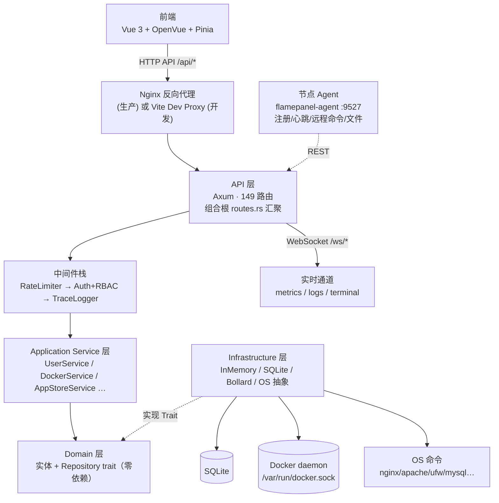
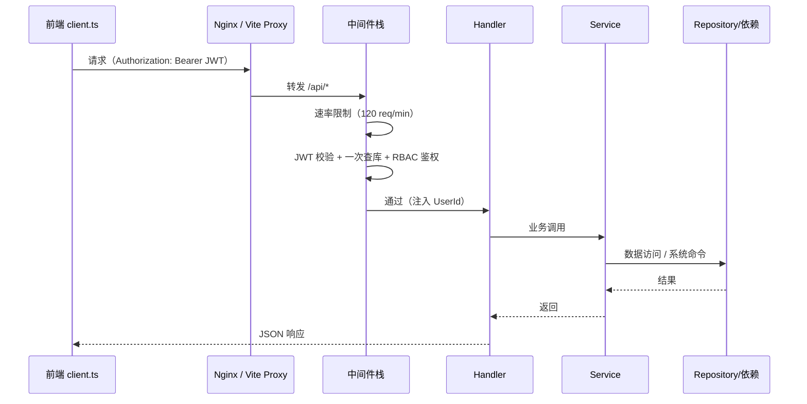
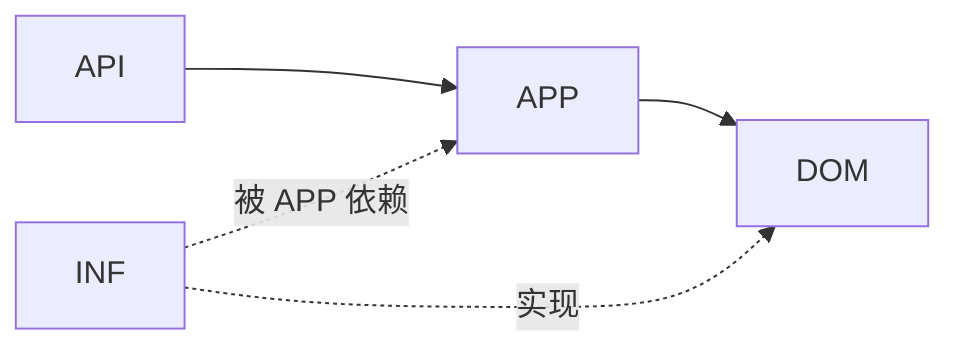
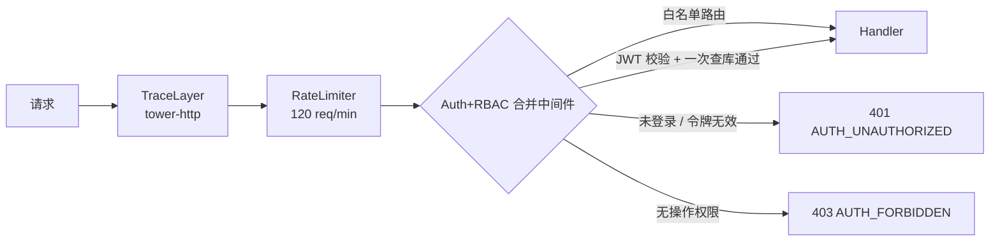

# 01 · 架构设计

> FlamePanel 系统架构、分层设计、核心模块与技术决策说明

## 1. 系统总览

FlamePanel 是一个**自托管的服务器运维管理面板**，采用前后端分离架构：

- **后端**：Rust + Axum，Clean Architecture（六边形架构），负责业务逻辑、系统集成（Docker / Web 引擎 / 数据库 / 防火墙 / 文件系统）与 WebSocket 实时推送。
- **前端**：Vue 3 + OpenVue 单页应用，通过 REST API 与 WebSocket 与后端通信。
- **Agent**：轻量 Rust Agent（可选），部署在纳管节点，负责注册、心跳指标上报、远程命令与文件接口（详见 [11-Agent节点通信协议.md](./11-Agent节点通信协议.md)）。

### 1.1 架构全景图

### 1.2 运行时请求链路

## 2. 后端分层架构

### 2.1 分层职责

| 层 | 目录 | 职责 | 依赖 |
|----|------|------|------|
| Domain | `flame-kernel/src/domain/` | 实体、枚举、Repository trait、种子数据 | 零依赖 |
| Application | `flame-kernel/src/application/` | Service 方法、业务编排、应用商店三模式编排 | domain |
| Infrastructure | `flame-kernel/src/infrastructure/` | InMemory/SQLite 仓库实现、Docker 客户端、OS 抽象、app_store 适配器 | domain |
| API | `flame-kernel/src/api/` | Handler + routes()、中间件、ApiJson 提取器、组合根 | application + domain |
| 系统能力 | `plugin/ webserver/ database/ firewall/ terminal/ event/ resilience/ utils/` | 独立能力模块 | core |

**核心规范**：

- `domain/` 不依赖任何其他层，保证领域逻辑可独立演进。
- **严禁 infrastructure 或 api 绕过 service 直接访问仓库**（中间件 / Handler 一律经 Service 方法）。
- 组合根：`FlameKernel::build_services` 组装 `Services` 聚合，`api/routes.rs` 汇聚各模块 `routes()`。

### 2.2 依赖方向

### 2.3 组合根（Composition Root）

- `FlameKernel::new_with_backend(config, factory)`：接收配置与仓库工厂，构建 `Services` 聚合结构体。
- `RepoFactory`：根据数据库 URL 选择 InMemory 或 SQLite 实现（`infrastructure/factory.rs`）。
- `Services`：聚合所有业务服务（`Arc<T>`），通过 `AppState` 注入 Router。
- 路由组合根 `create_router(state)`：merge 全部 handler 模块的 `routes()` + 全局 fallback。

## 3. 后端模块职责

### 3.1 API 层（`api/`）

| 文件 | 职责 |
|------|------|
| `routes.rs` | 组合根，汇聚 17 个 handler 模块路由，fallback JSON 404 |
| `middleware.rs` | 认证 + RBAC 合并中间件（一次 JWT 校验 + 一次查库） |
| `rate_limiter.rs` | 全局速率限制（默认 120 req/min） |
| `extract.rs` | `ApiJson<T>` 提取器（统一 JSON 解析错误为 BAD_REQUEST） |
| `types.rs` | `AppState` / `Services` / 请求响应类型 / `route_permission()` 权限映射 / 分页工具 |
| `handler/*/mod.rs` | 17 个 handler 模块，各带 `routes()` 路由表 |

**Handler 模块列表**：

| 模块 | 路由前缀 | 端点数 |
|------|----------|--------|
| auth | `/api/auth` | 2 |
| user | `/api/users` | 4 |
| node | `/api/nodes` | 4 |
| website | `/api/websites` | 6 |
| docker | `/api/docker` | 33 |
| plugin | `/api/plugins` | 13 |
| web_server | `/api/web-servers` | 22 |
| settings | `/api/settings` | 3 |
| database | `/api/databases` | 15 |
| app_store | `/api/app-store` | 11 |
| file | `/api/files` | 10 |
| firewall | `/api/firewall` | 11 |
| operation_log | `/api/operation-logs` | 2 |
| log | `/api/logs` | 2 |
| scheduled_task | `/api/scheduled-tasks` | 4 |
| backup | `/api/backups` | 3 |
| ws | `/ws` | 3 |

### 3.2 领域层（`domain/`）

核心实体：`User`、`ServerNode`、`Website`、`WebServerInstance`、`DockerContainer`、`Plugin`、`AppMetadata`、`InstalledApp`、`DatabaseInstance`、`FirewallRule`、`OperationLog`、`LogEntry`、`PanelSetting`、`Permission`、`Role`、`MetricsSnapshot`。

枚举：`AppFormat`（OnePanel/Baota/Flame）、`InstallMode`（Container/Native/Wasm）、`FieldType`（Text/Number/Password/…）、`DatabaseType`（Mysql/MariaDB/Redis）。

种子数据：`default_permissions()`（64 项权限）、`default_roles()`（admin/operator/viewer）、`default_settings()`、`default_firewall_rules()`、`builtin_apps()`。

### 3.3 应用层（`application/`）

| Service | 职责 |
|---------|------|
| `UserService` | 用户 CRUD、密码、认证辅助 |
| `NodeService` | 节点注册与维护 |
| `WebsiteService` | 网站 CRUD、引擎切换 |
| `DockerService` | 容器/镜像/网络/卷/Compose 全生命周期（33 端点，参考 1Panel） |
| `WebServerService` | Web 服务器实例 CRUD、启停、预设应用、原生安装/卸载/systemd 自启 |
| `DatabaseService` | 数据库实例安装/启停/库用户管理 |
| `FirewallService` | 防火墙规则 CRUD/应用/开关 |
| `AppStoreService` | 应用商店三格式/三模式编排 |
| `SettingsService` | 面板 Key-Value 配置 |
| `OperationLogService` | 审计日志 |
| `LogService` | 系统日志 |
| `RoleService` / `PermissionService` | RBAC 权限校验 |

### 3.4 基础设施层（`infrastructure/`）

- **仓库实现**：每个 domain trait 有 `InMemory` 与 `Sqlite` 两套实现（`db.rs` / `sqlite.rs`），通过 `factory.rs` 切换。
- **Docker**：`docker.rs` 基于 Bollard 客户端，覆盖容器/镜像/网络/卷/Compose 管理（含 inspect/rename/pause/kill/prune、网络连接、镜像拉取等）。
- **OS 抽象**：`os.rs` 封装系统命令执行。
- **metrics**：`metrics.rs` 系统指标采集（sysinfo），每 60 秒一轮快照，环形缓冲 60 条。
- **app_store**：三格式适配器（Flame/1Panel/宝塔）+ 变量映射 + 安全扫描。

### 3.5 系统能力模块

| 模块 | 说明 |
|------|------|
| `plugin/` | wasmtime 沙箱、PluginRegistry、WASM 持久化恢复 |
| `webserver/` | 5 引擎配置生成（Nginx/Apache/OLS/OpenResty/Caddy）、性能预设、进程管理、原生控制（`native.rs`：包管理安装/卸载、systemd 自启、版本/端口检测） |
| `database/` | MySQL/MariaDB/Redis 原生安装（apt/yum/apk）与服务管理 |
| `firewall/` | ufw/firewalld/iptables 自动检测与规则应用 |
| `terminal/` | bash 子进程管道，WebSocket 双向 IO |
| `event/` | 事件总线（broadcast）+ 邮件通知处理器（EventHandler → EmailNotifier） |
| `notification/` | SMTP 邮件通知（lettre 异步） |
| `file/` | 本地文件服务 |
| `agent/`（仓库根） | 轻量节点 Agent（注册/心跳/远程命令/文件接口，见 [11-Agent节点通信协议.md](./11-Agent节点通信协议.md)） |
| `resilience/` | Circuit Breaker + Retry + wrapper |
| `utils/` | JWT、bcrypt 密码、参数校验 |

## 4. 前端架构

### 4.1 前端分层

| 目录 | 职责 |
|------|------|
| `api/` | 每个后端模块一个 Axios 封装（auth/docker/files/…） |
| `components/` | Layout / Sidebar / TopBar |
| `stores/` | Pinia（auth 状态） |
| `router/` | 18 条路由（1 登录 + 16 业务视图 + 布局） |
| `locales/` | zh-CN / en-US / ja-JP 三语言 |
| `views/` | 17 个视图页面 |
| `utils/` | 错误提示工具 |
| `types/` | TypeScript 接口（与后端实体对齐） |

### 4.2 前端技术要点

- **按需加载**：OpenVue 组件显式按需引入 + UnoCSS 按需生成，首屏 JS gzip 151KB。
- **ECharts 按需引入**：`echarts/core`，图表包 505KB。
- **Vite 代理**：开发环境 `/api` → `http://localhost:8080`，`/ws` → WebSocket 代理。
- **错误处理**：`client.ts` 拦截器统一规范化错误为 `{code, message, status}`，401 自动跳转登录页；`utils/error.ts` 按错误码查 i18n 文案。

## 5. 中间件栈

**白名单路径**（跳过认证）：

- `GET /health`
- `POST /api/auth/login`
- `WS /ws/*`（metrics / logs / terminal）

## 6. 关键设计决策（ADR）

### ADR-1：为什么用 Clean Architecture + Hexagonal？

- 服务器面板业务复杂度高（多系统集成），分层隔离可保证**领域逻辑可测试、基础设施可替换**。
- InMemory/SQLite 双实现使集成测试无需真实数据库。
- 中间件不再直通仓库（此前两次查库），改为合并认证 + RBAC，消除架构违规。

### ADR-2：统一错误体系

- 全部错误（含中间件 / 404 / JSON 解析失败）返回 `{code, error, message}` JSON。
- 8 个稳定错误码，跨版本不变，前端按码 i18n 提示。
- 5xx 内部错误保留完整错误链（仅记录日志，不泄露客户端）。

### ADR-3：SQLite + InMemory 双模式

- 开发 / 测试默认 InMemory（`sqlite://data/app.db` 触发 SQLite）。
- 生产用 SQLite 持久化，`run_migrations` 启动时自动建表，无外部依赖。

### ADR-4：认证 + RBAC 合并中间件

- 一次 JWT 校验 + 一次用户查询，同时完成身份认证与权限校验（此前两次查库）。
- `route_permission()` 方法 + 路径模式匹配映射 149 路由权限。

### ADR-5：应用商店多格式/多模式

- 三格式（1Panel/宝塔/Flame）通过适配器统一为 `AppMetadata`。
- 三模式（容器/原生/WASM）由 `AppStoreService` 分发编排。
- 安全扫描（SecurityScanner）在安装前校验 compose 风险。

### ADR-6：WASM 插件持久化

- 插件字节码以 base64 存 `plugins` 表，启动时 `restore_wasm_plugins` 从 DB 恢复注册。
- wasmtime 沙箱隔离，生命周期钩子 + 指标追踪。

### ADR-7：事件总线解耦副作用

- 进程内 `broadcast` 事件总线（容量 100），业务 Service 发布 `DomainEvent`，`EventHandler` 异步消费并触发邮件通知/审计。
- 现状：通道已接线（`FlameKernel` 创建订阅者），但业务侧尚未大量 publish，属待深化项（见 [12-事件与通知系统.md](./12-事件与通知系统.md)）。

### ADR-8：轻量 Agent 单向通道

- Agent 采用「注册 + 周期心跳 + 独立 HTTP 接口」的轻量模型，不承载 WS 长连接，降低节点资源占用。
- 面板与 Agent 间用 `AUTH_TOKEN` 头鉴权；生产需 HTTPS/内网加固（见 [11-Agent节点通信协议.md](./11-Agent节点通信协议.md)）。

## 7. 弹性与容错

- **Circuit Breaker**：`resilience/circuit_breaker.rs`，依赖服务异常时熔断。
- **Retry**：`resilience/retry.rs`，可配置重试策略。
- **Docker 降级**：Docker daemon 不可用时自动使用 InMemory 仓库，保证面板核心功能可用。
- **优雅关闭**：SIGTERM / Ctrl+C 信号处理，服务平稳退出。

## 8. 扩展指引

新增一个业务模块（如"定时任务"）的标准步骤：

1. **Domain**：`domain/entity.rs` 加实体，`domain/repository.rs` 加 `#[async_trait]` trait。
2. **Infrastructure**：`infrastructure/db.rs`（InMemory）+ `sqlite.rs`（SQLite + migration）+ `factory.rs` 注册。
3. **Application**：`application/service.rs` 加 Service 方法（或新 Service 文件）。
4. **API**：`api/handler/xxx/mod.rs` 写 Handler + `routes()`；`api/types.rs` 更新 AppState/Services 与权限映射；`api/routes.rs` merge。
5. **测试**：集成测试 + 单元测试。
6. **验证**：`cargo check && cargo test && cargo build`。

> 详细步骤见 [05-后端开发指南.md](./05-后端开发指南.md)。
