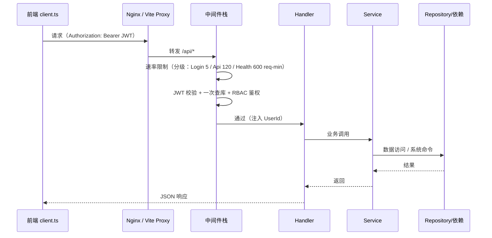
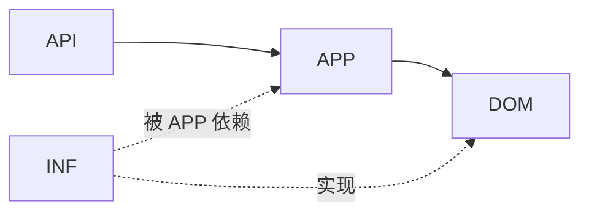
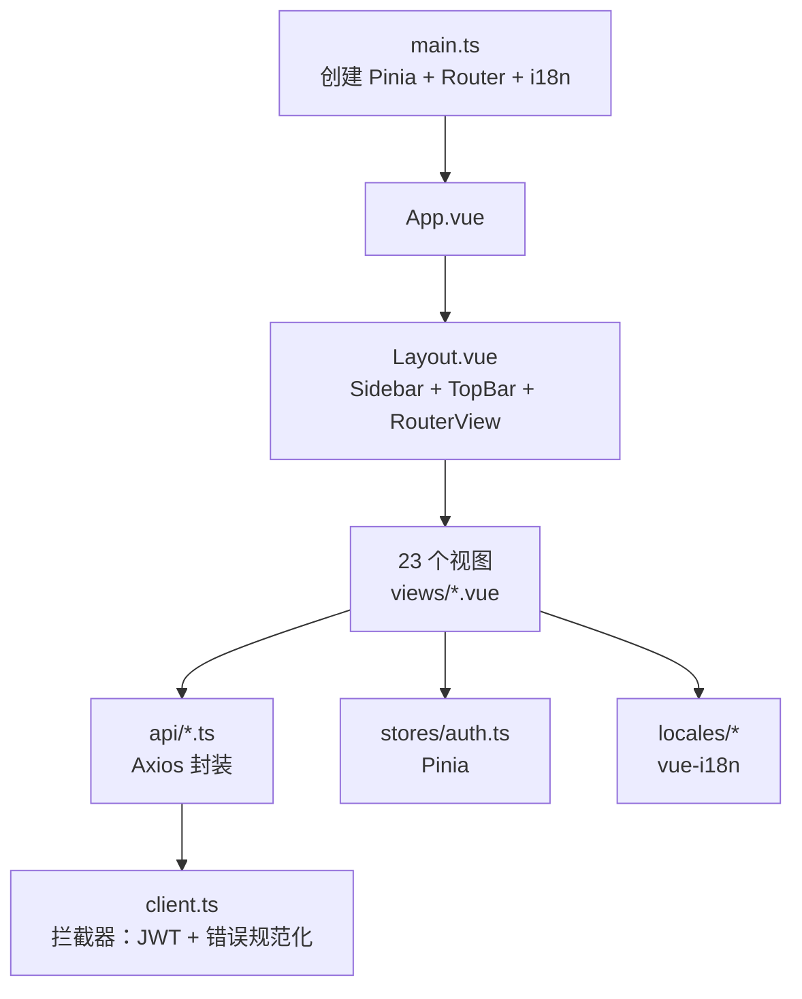
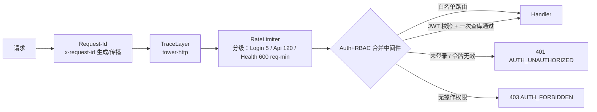

# 01 · 架构设计

> FlamePanel 系统架构、分层设计、核心模块与技术决策说明

## 1. 系统总览

FlamePanel 是一个**自托管的服务器运维管理面板**，采用前后端分离架构：

- **后端**：Rust + Axum，Clean Architecture（六边形架构），负责业务逻辑、系统集成（Docker / Web 引擎 / 数据库 / 防火墙 / 文件系统）与 WebSocket 实时推送。
- **前端**：Vue 3 + OpenVue 单页应用，通过 REST API 与 WebSocket 与后端通信。
- **Agent**：轻量 Rust Agent（可选），部署在纳管节点，负责注册、心跳指标上报、远程命令与文件接口（详见 [11-Agent节点通信协议.md](./11-Agent节点通信协议.md)）。

### 1.1 架构全景图

### 1.2 运行时请求链路

## 2. 后端分层架构

### 2.1 分层职责

| 层 | 目录 | 职责 | 依赖 |
|----|------|------|------|
| Domain | `flame-kernel/src/domain/` | 实体、枚举、Repository trait、DomainError、领域行为方法、种子数据 | 零依赖（不依赖 sqlx/axum/bollard） |
| Application | `flame-kernel/src/application/` | Service 方法、业务编排、应用商店三模式编排、端口定义（app_store_ports.rs） | domain |
| Infrastructure | `flame-kernel/src/infrastructure/` | InMemory/SQLite 仓库实现（db_models.rs 行模型）、Docker 客户端、OS 抽象、app_store 适配器（实现 application 端口） | domain + application 端口 |
| API | `flame-kernel/src/api/` | Handler + routes()、中间件、ApiJson 提取器、组合根 | application + domain |
| 系统能力 | `plugin/ webserver/ database/ firewall/ terminal/ event/ resilience/ utils/` | 独立能力模块 | core |
| 运行时 | `flame-kernel/src/runtime/` | `TaskSupervisor`（CancellationToken + JoinSet 统一后台任务生命周期）、`request_id` 中间件与日志串联 | core |

**核心规范**：

- `domain/` 不依赖任何其他层，保证领域逻辑可独立演进（Stage1 已移除 sqlx FromRow，实体带领域方法）。
- **严禁 infrastructure 或 api 绕过 service 直接访问仓库**（中间件 / Handler 一律经 Service 方法）。
- **application 只依赖 domain 端口 / application 端口**：禁止直接 `use crate::infrastructure::具体类型`（Stage1 已将 app_store 适配器/扫描/变量映射/包管理/服务管理抽象为端口注入）。
- 组合根：`FlameKernel::build_services` 组装 `Services` 聚合，`api/routes.rs` 汇聚各模块 `routes()`。

### 2.2 依赖方向

### 2.3 组合根（Composition Root）

- `FlameKernel::new_with_backend(config, factory)`：接收配置与仓库工厂，构建 `Services` 聚合结构体。
- `RepoFactory`：根据数据库 URL 选择 InMemory 或 SQLite 实现（`infrastructure/factory.rs`）。
- `Services`：聚合所有业务服务（`Arc<T>`），通过 `AppState` 注入 Router。
- 路由组合根 `create_router(state)`：merge 全部 handler 模块的 `routes()` + 全局 fallback。

## 3. 后端模块职责

### 3.1 API 层（`api/`）

| 文件 | 职责 |
|------|------|
| `routes.rs` | 组合根，汇聚 22 个 handler 模块路由，fallback JSON 404 |
| `middleware.rs` | 认证 + RBAC 合并中间件（一次 JWT 校验 + 一次查库）+ 审计写操作 + 用户上下文字段 |
| `rate_limiter.rs` | 分级速率限制（分片 + 分级：Login 5/min、Api 120/min、Health 600/min） |
| `extract.rs` | `ApiJson<T>` 提取器（统一 JSON 解析错误为 BAD_REQUEST） |
| `types.rs` | `AppState` / `Services` / 请求响应类型 / `route_permission()` 权限映射 / 分页工具 |
| `handler/*/mod.rs` | 22 个 handler 模块，各带 `routes()` 路由表 |
| `runtime/request_id.rs` | `x-request-id` 生成/传播中间件 + tracing span 字段（request_id/user_id/username 日志串联） |

**Handler 模块列表**：

| 模块 | 路由前缀 | 端点数 |
|------|----------|--------|
| auth | `/api/auth` | 5（含 login/refresh/change-password/logout） |
| user | `/api/users` | 4 |
| node | `/api/nodes` | 14（含 register/heartbeat/status/metrics/execute/batch-execute/files*/action） |
| website | `/api/websites` | 6 |
| docker | `/api/docker` | 33 |
| plugin | `/api/plugins` | 13 |
| web_server | `/api/web-servers` | 22 |
| settings | `/api/settings` | 4 |
| database | `/api/databases` | 16 |
| app_store | `/api/app-store` | 13 |
| file | `/api/files` | 10 |
| firewall | `/api/firewall` | 11 |
| operation_log | `/api/operation-logs` | 3 |
| log | `/api/logs` | 2 |
| scheduled_task | `/api/scheduled-tasks` | 4 |
| task | `/api/tasks` | 4（统一任务查询/取消/清理） |
| backup | `/api/backups` | 3 |
| health | `/health` + `/api/health` | 1 |
| metrics | `/metrics` + `/api/metrics` | 2 |
| memo | `/api/memos` | 4 |
| outbox | `/api/outbox-events` | 1（事件 Outbox 查询） |
| ws | `/ws` | 3 |

### 3.2 领域层（`domain/`）

核心实体：`User`、`ServerNode`、`Website`、`WebServerInstance`、`DockerContainer`、`Plugin`、`AppMetadata`、`InstalledApp`、`DatabaseInstance`、`FirewallRule`、`OperationLog`、`LogEntry`、`PanelSetting`、`Permission`、`Role`、`MetricsSnapshot`。

错误：`DomainError`（NotFound/Validation/Conflict/Forbidden/RuleViolation），纯业务语义，不依赖 axum；由 `AppError::from(DomainError)` 映射为对外 HTTP 错误。

领域行为方法（Stage1.4 上移，去贫血）：`User::validate_username / mark_password_changed / ensure_can_change_password`，`InstalledApp::can_upgrade_to / record_launch / mark_upgraded / version_cmp`，`ServerNode::is_online`，`AppManifest::to_metadata / to_version`。

枚举：`AppFormat`（OnePanel/Baota/Flame）、`InstallMode`（Container/Native/Wasm）、`FieldType`（Text/Number/Password/…）、`DatabaseType`（Mysql/MariaDB/Redis）。

种子数据：`default_permissions()`（73 项权限）、`default_roles()`（admin/operator/viewer）、`default_settings()`、`default_firewall_rules()`、`builtin_apps()`。

> Stage1 说明：持久化行模型（`FromRow`）已迁至 `infrastructure/db_models.rs`，domain 不再依赖 sqlx；持久化结构与领域实体的映射（`From<XxxRow> for Xxx`）集中在 infrastructure 层。

### 3.3 应用层（`application/`）

| Service | 职责 |
|---------|------|
| `UserService` | 用户 CRUD、密码、认证辅助 |
| `NodeService` | 节点注册与维护 |
| `WebsiteService` | 网站 CRUD、引擎切换 |
| `DockerService` | 容器/镜像/网络/卷/Compose 全生命周期（经 DockerRepositoryFacade 聚合拆分端口） |
| `WebServerService` | Web 服务器实例 CRUD、启停、预设应用、原生安装/卸载/systemd 自启 |
| `DatabaseService` | 数据库实例安装/启停/库用户管理 |
| `FirewallService` | 防火墙规则 CRUD/应用/开关 |
| `AppStoreService` | 应用商店三格式/三模式编排（经端口注入适配器/扫描/变量映射/包管理） |
| `SettingsService` | 面板 Key-Value 配置 |
| `OperationLogService` | 审计日志 |
| `LogService` | 系统日志 |
| `RoleService` / `PermissionService` | RBAC 权限校验 |

端口定义：`application/app_store_ports.rs` 定义了应用商店相关端口（`AppPackageAdapter` / `AppAdapterProvider` / `ComposeSecurityScanner` / `VariableMapper(+Factory)` / `PackageManagerPort` / `ServiceManagerPort`）及扫描结果模型（`ScanFinding` / `ScanResult` / `Severity`）。

### 3.4 基础设施层（`infrastructure/`）

- **仓库实现**：每个 domain trait 有 `InMemory` 与 `Sqlite` 两套实现（`db.rs` / `sqlite.rs`），通过 `factory.rs` 切换。
- **行模型**：`db_models.rs` 集中所有 `#[derive(sqlx::FromRow)]` 持久化结构（`XxxRow`），与领域实体一一映射。
- **Docker**：`docker.rs` 基于 Bollard 客户端，覆盖容器/镜像/网络/卷/Compose 管理（含 inspect/rename/pause/kill/prune、网络连接、镜像拉取等）；分别实现拆分端口 `ContainerRepository` / `NetworkRepository` / `VolumeRepository` / `ImageRepository` / `ComposeRepository`。
- **OS 抽象**：`os.rs` 封装系统命令执行，并实现 `PackageManagerPort` / `ServiceManagerPort`。
- **metrics**：`metrics.rs` 系统指标采集（sysinfo），每 60 秒一轮快照，环形缓冲 60 条。
- **app_store**：三格式适配器（Flame/1Panel/宝塔）+ 变量映射 + 安全扫描，实现 application 端口；`default_ports()` 聚合默认实现供组合根/便捷构造注入。

### 3.5 系统能力模块

| 模块 | 说明 |
|------|------|
| `plugin/` | wasmtime 沙箱、PluginRegistry、WASM 持久化恢复 |
| `webserver/` | 5 引擎配置生成（Nginx/Apache/OLS/OpenResty/Caddy）、性能预设、进程管理、原生控制（`native.rs`：包管理安装/卸载、systemd 自启、版本/端口检测） |
| `database/` | MySQL/MariaDB/Redis 原生安装（apt/yum/apk）与服务管理 |
| `firewall/` | ufw/firewalld/iptables 自动检测与规则应用 |
| `terminal/` | bash 子进程管道，WebSocket 双向 IO；会话强制 cwd 为沙箱工作区并清理危险环境变量 |
| `file/` | 本地文件服务（Stage0 起为沙箱模式：所有路径解析后必须位于 `OP_FILE_ROOT` 白名单内） |
| `event/` | 事件总线（broadcast）+ 邮件通知处理器（EventHandler → EmailNotifier） |
| `notification/` | SMTP 邮件通知（lettre 异步） |
| `file/` | 本地文件服务 |
| `agent/`（仓库根） | 轻量节点 Agent（注册/心跳/远程命令/文件接口，见 [11-Agent节点通信协议.md](./11-Agent节点通信协议.md)） |
| `resilience/` | Circuit Breaker + Retry + wrapper |
| `utils/` | JWT（access 15min + refresh 24h 双令牌、密钥 ≥32 字节启动校验）、bcrypt 密码、参数校验 |
| `infrastructure/sqlite.rs` | SQLite 运行时加固：`configure_sqlite_pragmas`（WAL + busy_timeout + synchronous=NORMAL） |

## 4. 前端架构

### 4.1 前端分层

| 目录 | 职责 |
|------|------|
| `api/` | 每个后端模块一个 Axios 封装（auth/docker/files/…） |
| `components/` | Layout / Sidebar / TopBar |
| `stores/` | Pinia（auth 状态） |
| `router/` | 23 条路由（22 业务视图 + 登录） |
| `locales/` | zh-CN / en-US / ja-JP 三语言 |
| `views/` | 23 个视图页面 |
| `utils/` | 错误提示工具 |
| `types/` | TypeScript 接口（与后端实体对齐） |

### 4.2 前端技术要点

- **按需加载**：OpenVue 组件显式按需引入 + UnoCSS 按需生成，首屏 JS gzip 151KB。
- **ECharts 按需引入**：`echarts/core`，图表包 505KB。
- **Vite 代理**：开发环境 `/api` → `http://localhost:8080`，`/ws` → WebSocket 代理。
- **错误处理**：`client.ts` 拦截器统一规范化错误为 `{code, message, status}`，401 自动跳转登录页；`utils/error.ts` 按错误码查 i18n 文案。

## 5. 中间件栈

> **Request-Id（Stage2）**：最外层中间件生成/沿用 `x-request-id`，写回响应头；同一请求的日志经 `http_request` span 的 `request_id` 字段串联；认证后追加 `auth` 子 span（`user_id` / `username`），审计写操作亦继承 `request_id`。生产可用 `RUST_LOG_FORMAT=json` 输出结构化日志直接接入 Loki/logstash。

**白名单路径**（跳过认证）：

- `GET /health`
- `GET /api/health`
- `GET /api/openapi.json`
- `GET /metrics`（Prometheus 指标，Stage4.3）
- `POST /api/auth/login`
- `POST /api/auth/refresh`
- `POST /api/nodes/register`（Agent 注册，Stage5）
- `POST /api/nodes/heartbeat/*`（Agent 心跳，校验 Agent token）

> **WebSocket 鉴权（Stage4.1）**：`/ws/*` 不再整体白名单。握手必须携带 `?token=<access_token>` 查询参数，认证中间件复用与 REST 相同的 `JwtUtils::verify_access`（同一密钥/类型语义）校验并确认用户存在后才放行；缺失/无效 token 返回统一 JSON 401 `AUTH_UNAUTHORIZED`。前端 `utils/ws.ts` 自动附加当前 token。

## 5.1 运行时与后台任务生命周期（Stage2）

- **TaskSupervisor**（`runtime/supervisor.rs`）：`CancellationToken` + `JoinSet` 统一管理全部长生命周期后台任务——指标采集、定时任务 tick、自动备份、节点离线扫描、应用种子/WASM 恢复、事件订阅。
- 优雅关闭：`Ctrl+C` / `SIGTERM` → `cancel()` 广播取消 → `join_next` 带超时（5s）等待 → 未及时退出任务由 `JoinSet::shutdown()` 强制 abort，杜绝僵尸任务。
- 单个任务返回 `TaskHandle`，可精确 `cancel()` / `abort()` / `cancel_and_join()`。
- **分页下沉**：operation_logs / logs / scheduled_tasks 等大表由 Repository 层 `list_page(limit, offset)` + `count()` 直接 SQL `LIMIT/OFFSET`，Service 不再 `list_all` 后内存切片。

## 6. 关键设计决策（ADR）

### ADR-1：为什么用 Clean Architecture + Hexagonal？

- 服务器面板业务复杂度高（多系统集成），分层隔离可保证**领域逻辑可测试、基础设施可替换**。
- InMemory/SQLite 双实现使集成测试无需真实数据库。
- 中间件不再直通仓库（此前两次查库），改为合并认证 + RBAC，消除架构违规。

### ADR-2：统一错误体系

- 全部错误（含中间件 / 404 / JSON 解析失败）返回 `{code, error, message}` JSON。
- 8 个稳定错误码，跨版本不变，前端按码 i18n 提示。
- 5xx 内部错误保留完整错误链（仅记录日志，不泄露客户端）。

### ADR-3：SQLite + InMemory 双模式

- 开发 / 测试默认 InMemory（`sqlite://data/app.db` 触发 SQLite）。
- 生产用 SQLite 持久化，`run_migrations` 启动时自动建表，无外部依赖。

### ADR-4：认证 + RBAC 合并中间件

- 一次 JWT 校验 + 一次用户查询，同时完成身份认证与权限校验（此前两次查库）。
- `route_permission()` 方法 + 路径模式匹配映射 179 路由权限。

### ADR-5：应用商店多格式/多模式

- 三格式（1Panel/宝塔/Flame）通过适配器统一为 `AppMetadata`。
- 三模式（容器/原生/WASM）由 `AppStoreService` 分发编排。
- 安全扫描（SecurityScanner）在安装前校验 compose 风险。

### ADR-6：WASM 插件持久化

- 插件字节码以 base64 存 `plugins` 表，启动时 `restore_wasm_plugins` 从 DB 恢复注册。
- wasmtime 沙箱隔离，生命周期钩子 + 指标追踪。
- Stage0 强化：每个插件执行设内存上限（`memory_limit_bytes`，`Store::limiter` 限制 linear memory/table）+ fuel/timeout；安装/恢复强制校验 `wasm_hash`，不匹配拒绝加载。

### ADR-6b：JWT access/refresh 双令牌（Stage0.3）

- Access Token 短过期（默认 15 分钟，`typ=access`）；Refresh Token 长过期（默认 24 小时，`typ=refresh`）。
- 认证中间件仅接受 access token；`/api/auth/refresh` 仅接受 refresh token，返回新 access + 轮换 refresh（滑动过期）。
- `OP_JWT_SECRET` 启动时校验 ≥32 字节，否则拒绝启动。

### ADR-7：事件总线解耦副作用

- 进程内 `broadcast` 事件总线（容量 100），业务 Service 发布 `DomainEvent`，`EventHandler` 异步消费并触发通知/审计。
- 通知：`AsyncNotificationChannel` 端口（Stage6）——`EventHandler` 持有 `Vec<Arc<dyn AsyncNotificationChannel>>` 多渠道组合，`EmailChannel` 实现事件→邮件映射；可扩展站内信/Webhook。
- 落库：独立 `event-outbox` 订阅器把每条 `DomainEvent` 持久化到 `outbox_events`（Stage6），保证审计不丢；对外 `GET /api/outbox-events`（`outbox:read`）查询。
- 事件发布已覆盖全部 12 种 `DomainEvent` 变体（含 AppUpgraded/UserLoggedIn/PasswordChanged/WebsiteCreated/NodeHeartbeat 等，见 [12-事件与通知系统.md](./12-事件与通知系统.md)）。

### ADR-8：轻量 Agent 单向通道

- Agent 采用「注册 + 周期心跳 + 独立 HTTP 接口」的轻量模型，不承载 WS 长连接，降低节点资源占用。
- 面板与 Agent 间用 `AUTH_TOKEN` 头鉴权；生产需 HTTPS/内网加固（见 [11-Agent节点通信协议.md](./11-Agent节点通信协议.md)）。

## 7. 弹性与容错

- **Circuit Breaker**：`resilience/circuit_breaker.rs`，依赖服务异常时熔断。
- **Retry**：`resilience/retry.rs`，可配置重试策略。
- **Docker 降级**：Docker daemon 不可用时自动使用 InMemory 仓库，保证面板核心功能可用。
- **优雅关闭**：SIGTERM / Ctrl+C 信号处理 → HTTP server 优雅退出 → `TaskSupervisor::shutdown()` 统一取消全部后台任务（带 5s 超时，超时任务强制 abort）。

## 7.1 Feature Flags（Stage3.1）

- `flame-kernel/Cargo.toml` 定义可选能力：`sqlite`（sqlx）、`docker`（bollard）、`wasm`（wasmtime）、`email`（lettre），`default = ["sqlite", "docker", "wasm", "email"]` 保持全功能。
- 按 feature 隔离的编译边界：
  - `sqlite`：`infrastructure/db_models.rs` + `sqlite.rs`、`BackendKind::Sqlite`、`RepoFactory::new_sqlite`；关闭时回落 in-memory 后端。
  - `docker`：`infrastructure/docker.rs`（bollard 实现）；关闭时 `create_docker_repo` 直接回落 InMemory。
  - `wasm`：`plugin/sandbox.rs` 中 `WasmSandbox`（wasmtime）；`verify_wasm_hash` 提为模块级（仅依赖 sha2），关闭时 `PluginSandbox` 仅管理插件元数据，执行返回稳定错误。
  - `email`：`notification::EmailNotifier`；关闭时 `EventHandler` 不挂邮件通知，事件仅记日志。
- 裁剪部署：`cargo build --release --no-default-features --features sqlite` 得到最小核心二进制；CI 至少编 default + 全 feature。
- 服务器层：Axum 已升级至 0.8（`tokio::net::TcpListener` + `axum::serve`，路由参数 `{param}` 语法）。

## 7.2 OpenAPI 文档（Stage3.3）

- `openapi.rs` 定义 `ApiDoc`（`#[derive(utoipa::OpenApi)]`），编译期聚合核心路由的 `#[utoipa::path]` 注解与 DTO 的 `#[derive(ToSchema)]`，生成 OpenAPI 3.1 JSON。
- 组合根挂载 `GET /api/openapi.json`（免认证白名单），并注入 JWT `BearerAuth` security scheme。
- 已覆盖：auth（login/refresh）、health、users、nodes（含 heartbeat/status）、websites、settings、backups、scheduled-tasks、app-store、metrics 等 28 个端点；DTO 含 User/ServerNode/Website/ScheduledTask/AppMetadata/InstalledApp/LoginRequest/LoginResponse/HealthDetail 等。
- 泛型响应体 `PaginatedResponse<T>` 实现 `utoipa::ToSchema` + `__dev::ComposeSchema`，可在 OpenAPI 中展开引用。
- 新增路由时：handler 加 `#[utoipa::path(...)]`、DTO 加 `#[derive(ToSchema)]`、`openapi.rs` 的 `paths(...)`/`components(schemas(...))` 登记。

## 7.3 声明式权限表（Stage3.4）

- `api/types.rs` 中 `route_permission` 巨型 match 重构为常量表 `ROUTE_PERMISSIONS: &[PermissionRule]`（顺序敏感、首个命中生效，语义与历史一致）。
- `PermissionRule` 组合匹配：`exact` / `prefix` / `suffix` / `contains` / `not_contains` / `not_suffix`，含 const 构造器；`route_permission` 仅 6 行线性查找。
- 新增 handler 时必须在此表登记权限（Checklist 见 05-后端开发指南）。
- 声明化同时修正 3 处历史顺序 bug：app-store 的 install/uninstall 不再被 database 全局后缀规则抢先；scheduled-task 的 toggle 不再被 firewall 规则抢先；database 的 uninstall 正确映射为 delete。

## 7.4 CI 安全审计（Stage3.5）

- `.github/workflows/ci-cd.yml` 新增 `cargo audit` 步骤（安装 cargo-audit 后审计，发现漏洞即阻断）。
- `wasmtime` 升级至 46.x，修复 15 个已知漏洞（含 critical 沙箱逃逸），`cargo audit` 零漏洞。
- 质量门禁：fmt + clippy `-D warnings` + 全量测试 + cargo audit + feature 组合编译。

## 7.5 WebSocket 鉴权（Stage4.1）

- `/ws/*` 握手强制 `?token=<access_token>`，认证中间件统一校验（同一 JWT 密钥/类型语义），注入用户上下文；拒绝未认证握手（统一 JSON 401）。

## 7.6 Prometheus 指标（Stage4.3）

- `GET /metrics`（公开只读）暴露 Prometheus 文本格式（`text/plain; version=0.0.4`）：面板 up/uptime/info + 最近一次 3s 周期快照的 CPU/内存/磁盘/负载/网络指标，供 Prometheus/Grafana 直接抓取。

## 7.7 审计日志导出（Stage4.4）

- `GET /api/operation-logs/export?format=csv|json`（需 `operation_log:read` 权限）导出全部审计日志：CSV 带 UTF-8 BOM（Excel 兼容）+ 字段转义，JSON 为 UTF-8 数组，便于归档与 SIEM 对接。

## 7.8 备份加固（Stage4.5）

- 备份文件权限 `600`（仅属主可读）；恢复前自动创建 `pre-restore-*` 二次备份，防止恢复失败导致数据不可逆丢失。

## 8. 扩展指引

新增一个业务模块（如"定时任务"）的标准步骤：

1. **Domain**：`domain/entity.rs` 加实体，`domain/repository.rs` 加 `#[async_trait]` trait。
2. **Infrastructure**：`infrastructure/db.rs`（InMemory）+ `sqlite.rs`（SQLite + migration）+ `factory.rs` 注册。
3. **Application**：`application/service.rs` 加 Service 方法（或新 Service 文件）。
4. **API**：`api/handler/xxx/mod.rs` 写 Handler + `routes()`；`api/types.rs` 更新 AppState/Services 与权限映射；`api/routes.rs` merge。
5. **测试**：集成测试 + 单元测试。
6. **验证**：`cargo check && cargo test && cargo build`。

> 详细步骤见 [05-后端开发指南.md](./05-后端开发指南.md)。
