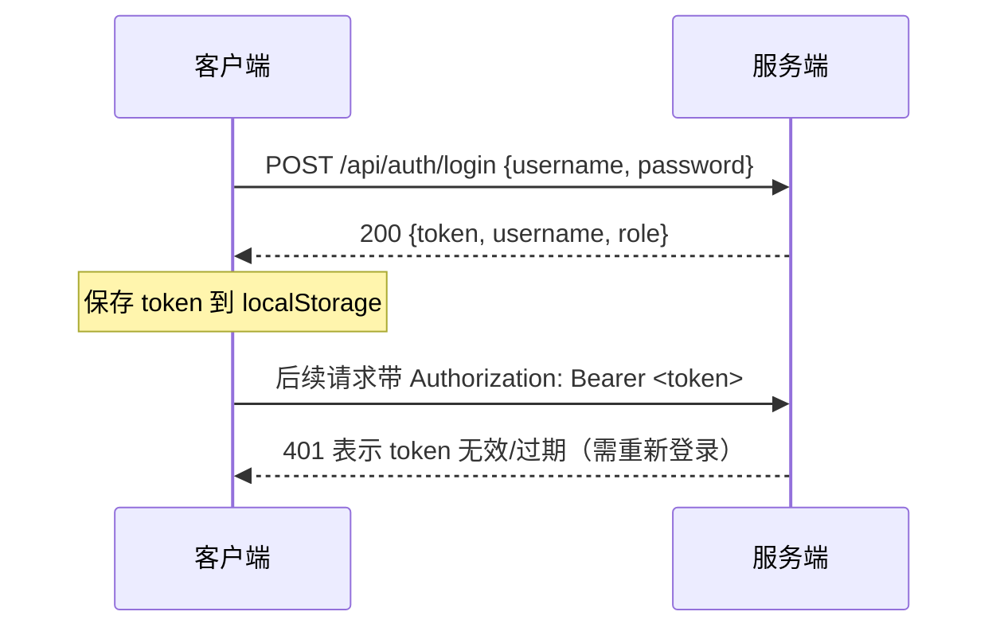

# 02 · API 接口文档

> FlamePanel 全部 REST / WebSocket 接口说明，含认证、错误码、分页与请求/响应示例

## 1. 约定

### 1.1 基础信息

| 项 | 值 |
|----|----|
| Base URL | `http://<host>:<port>/api`（生产经 Nginx，端口 80） |
| 数据格式 | JSON（`Content-Type: application/json`） |
| 认证方式 | `Authorization: Bearer <JWT>` |
| WebSocket | `ws://<host>/ws/metrics`、`/ws/logs`、`/ws/terminal` |

### 1.2 认证流程



### 1.3 统一错误格式

所有错误（含中间件、404、JSON 解析失败）均返回：

```json
{
  "code": 400,
  "error": "BAD_REQUEST",
  "message": "Bad request: Invalid JSON body: ..."
}
```

### 1.4 错误码对照表

| `error` 错误码 | HTTP | 含义 |
|----------------|------|------|
| `AUTH_UNAUTHORIZED` | 401 | 未登录 / 令牌无效 / 令牌过期 |
| `AUTH_FORBIDDEN` | 403 | 无操作权限（RBAC 拒绝） |
| `PASSWORD_CHANGE_REQUIRED` | 403 | 需先修改初始密码（新装面板首次登录） |
| `NOT_FOUND` | 404 | 资源或路由不存在 |
| `BAD_REQUEST` | 400 | 参数错误 / JSON 解析失败 |
| `VALIDATION_ERROR` | 400 | 业务校验失败 |
| `CONFLICT` | 409 | 资源冲突（用户名重复、端口占用） |
| `SERVICE_UNAVAILABLE` | 503 | 依赖服务不可用 |
| `INTERNAL_ERROR` | 500 | 内部错误（完整错误链仅记日志） |

### 1.5 分页

所有列表接口支持统一分页参数：

| 参数 | 类型 | 默认 | 说明 |
|------|------|------|------|
| `page` | int | 1 | 页码（从 1 开始） |
| `page_size` | int | 20 | 每页条数（最大 200） |

响应格式：

```json
{
  "data": [],
  "page": 1,
  "page_size": 20,
  "total": 0,
  "total_pages": 0
}
```

## 2. 健康检查

### `GET /health`

无需认证。返回 `OK`（纯文本）。

**响应**：`200 OK`

### `GET /api/health`

无需认证。详细健康检查（依赖探测 + 版本 + 运行时长）：

```json
{
  "status": "ok",
  "version": "0.1.0",
  "uptime_secs": 86400,
  "checks": {
    "database": { "status": "ok", "detail": null },
    "docker": { "status": "ok", "detail": "5 containers" },
    "disk": { "status": "ok", "detail": "10240 MB free" }
  }
}
```

> `status` 为 `ok`/`degraded`；`docker` 不可用时为 `degraded`（面板仍可用）；`disk` 目录不存在时为 `unknown`（不判失败）。

## 3. 认证模块 `/api/auth`

### `POST /api/auth/login`

用户登录，获取 JWT。

**请求体**：

```json
{ "username": "admin", "password": "admin123" }
```

**响应 200**：

```json
{
  "token": "eyJhbGciOiJIUzI1NiIs...",
  "username": "admin",
  "role": "admin",
  "must_change_password": true
}
```

> `must_change_password=true` 表示首次登录需先改密（改密前除 `/api/auth/*` 外一律 `403 PASSWORD_CHANGE_REQUIRED`）。

**错误**：`401 AUTH_UNAUTHORIZED`（凭据错误）、`403 AUTH_FORBIDDEN`（登录失败锁定，5 次/5 分钟）

### `POST /api/auth/refresh`

刷新 JWT（滑动过期：剩余寿命 <12h 时重置为 24h，否则原样返回）。前端 401 自动调用并重放原请求。

**请求头**：`Authorization: Bearer <token>`

**响应 200**：同 login（`token`/`username`/`role`/`must_change_password`）

**错误**：`401 AUTH_UNAUTHORIZED`（token 无效/缺失）

### `GET /api/auth/me`

获取当前登录用户信息（前端刷新页面恢复身份）。

**响应 200**：

```json
{ "id": 1, "username": "admin", "role": "admin", "must_change_password": false }
```

### `POST /api/auth/change-password`

修改当前用户密码（需登录）。修改成功后自动清除 `must_change_password` 标志。

**请求体**：

```json
{ "old_password": "admin123", "new_password": "NewP@ss123" }
```

**响应 200**：`{}`

## 4. 用户模块 `/api/users`

权限前缀：`user:*`

| 方法 | 路径 | 权限 | 说明 |
|------|------|------|------|
| GET | `/api/users` | user:read | 用户列表（分页） |
| POST | `/api/users` | user:create | 创建用户 |
| PUT | `/api/users/:id` | user:update | 更新用户 |
| DELETE | `/api/users/:id` | user:delete | 删除用户 |

**POST /api/users 请求体**：

```json
{
  "username": "ops",
  "password_hash": "<bcrypt hash>",
  "role": "operator"
}
```

> 注意：`password_hash` 需为 bcrypt 加密后的哈希值（可在服务端用 bcrypt 生成）。

**PUT /api/users/:id 请求体**（`password_hash` 可选，不传则不修改密码）：

```json
{
  "username": "ops2",
  "password_hash": "<新 bcrypt hash>",
  "role": "admin"
}
```

**User 实体字段**：`id`、`username`、`password_hash`、`role`、`created_at`、`must_change_password`

## 5. 节点模块 `/api/nodes`

权限前缀：`node:*`

| 方法 | 路径 | 权限 | 说明 |
|------|------|------|------|
| GET | `/api/nodes` | node:read | 节点列表（分页） |
| POST | `/api/nodes` | node:create | 注册节点（兼容 Agent 平铺格式） |
| PUT | `/api/nodes/:id` | node:update | 更新节点 |
| DELETE | `/api/nodes/:id` | node:delete | 删除节点 |
| POST | `/api/nodes/heartbeat/:id` | 白名单 | Agent 心跳上报（校验 Agent token） |
| GET | `/api/nodes/:id/status` | node:read | 在线状态 |
| GET | `/api/nodes/:id/metrics` | node:read | 指标快照 |

**请求体结构**（POST/PUT，兼容两种格式）：

```json
// 面板/测试格式（嵌套 node）
{ "node": { "name": "web-01", "hostname": "web-01.example.com", "ip_address": "192.168.1.10", "status": "online" } }

// Agent 平铺格式
{ "name": "web-01", "host": "192.168.1.10", "agent_port": 9527, "auth_token": "agent-secret" }
```

**ServerNode 字段**：`id`、`name`、`hostname`、`ip_address`、`status`、`created_at`、`last_heartbeat_at`、`metrics_json`、`auth_token`

### 5.1 节点心跳与在线状态

| 方法 | 路径 | 权限 | 说明 |
|------|------|------|------|
| POST | `/api/nodes/heartbeat/:id` | 白名单（免 JWT，校验 Agent token） | Agent 心跳上报 |
| GET | `/api/nodes/:id/status` | node:read | 在线状态（>30s 无心跳判定 offline） |
| GET | `/api/nodes/:id/metrics` | node:read | 最近指标快照 |

**heartbeat 请求体**：

```json
{ "cpu_usage": 12.3, "memory_usage_percent": 45.6, "disk_usage_percent": 67.8, "load_one": 0.5 }
```

**请求头**：`Authorization: Bearer <agent-token>`（与注册时 `auth_token` 一致；旧 Agent 无 token 时放行并告警）

**响应 200**：`{ "id": 3, "status": "ok", "last_heartbeat_at": "..." }`

**错误**：`401 AUTH_UNAUTHORIZED`（Agent token 不匹配）

**status 响应**：`{ "id": 3, "status": "online" }`

## 6. 网站模块 `/api/websites`

权限前缀：`website:*`

| 方法 | 路径 | 权限 | 说明 |
|------|------|------|------|
| GET | `/api/websites` | website:read | 网站列表（分页） |
| POST | `/api/websites` | website:create | 创建网站 |
| GET | `/api/websites/:id` | website:read | 获取网站详情 |
| PUT | `/api/websites/:id` | website:update | 更新网站 |
| DELETE | `/api/websites/:id` | website:delete | 删除网站 |
| POST | `/api/websites/:id/switch-engine` | website:update | 切换网站 Web 引擎 |

**POST 请求体**：

```json
{
  "website": {
    "name": "my-blog",
    "domain": "blog.example.com",
    "root_path": "/var/www/blog",
    "status": "active",
    "node_id": 1,
    "engine": "nginx",
    "ssl_enabled": false,
    "proxy_enabled": true,
    "proxy_pass": "http://127.0.0.1:3000"
  }
}
```

**switch-engine 请求体**：`{ "engine": "caddy" }`

**Website 字段**：`id`、`name`、`domain`、`root_path`、`status`、`node_id`、`engine`、`ssl_enabled`、`proxy_enabled`、`proxy_pass`、`created_at`

## 7. Docker 模块 `/api/docker`

权限前缀：`docker:*`（动作：read / create / start / stop / update / delete）

### 7.1 容器

| 方法 | 路径 | 权限 | 说明 |
|------|------|------|------|
| GET | `/api/docker/containers` | docker:read | 容器列表（`?node_id=`） |
| GET | `/api/docker/containers/:id` | docker:read | 容器详情（id 或 name） |
| POST | `/api/docker/containers/:id/start` | docker:start | 启动容器 |
| POST | `/api/docker/containers/:id/stop` | docker:stop | 停止容器 |
| POST | `/api/docker/containers/:id/restart` | docker:start | 重启容器 |
| POST | `/api/docker/containers/:id/remove` | docker:delete | 删除容器 |
| GET | `/api/docker/containers/:id/logs` | docker:read | 容器日志（`?tail=100`） |
| GET | `/api/docker/containers/:id/stats` | docker:read | 容器实时统计 |
| GET | `/api/docker/containers/:id/inspect` | docker:read | 容器完整配置详情（JSON） |
| POST | `/api/docker/containers/:id/rename` | docker:update | 重命名容器（`{new_name}`） |
| POST | `/api/docker/containers/:id/pause` | docker:start | 暂停容器 |
| POST | `/api/docker/containers/:id/unpause` | docker:start | 恢复容器 |
| POST | `/api/docker/containers/:id/kill` | docker:start | 强杀容器（SIGKILL） |
| POST | `/api/docker/containers/prune` | docker:delete | 清理已停止容器 |

### 7.2 镜像

| 方法 | 路径 | 权限 | 说明 |
|------|------|------|------|
| GET | `/api/docker/images` | docker:read | 镜像列表 |
| POST | `/api/docker/images/pull` | docker:start | 拉取镜像（`{image}`，如 `nginx:latest`） |
| POST | `/api/docker/images/:id/remove` | docker:delete | 删除镜像 |
| POST | `/api/docker/images/:id/tag` | docker:update | 打标签（`{repo, tag}`） |
| POST | `/api/docker/images/prune` | docker:delete | 清理悬空镜像 |

### 7.3 网络

| 方法 | 路径 | 权限 | 说明 |
|------|------|------|------|
| GET | `/api/docker/networks` | docker:read | 网络列表（含已连接容器与 IP） |
| POST | `/api/docker/networks` | docker:create | 创建网络（`{name, driver?, subnet?}`） |
| POST | `/api/docker/networks/prune` | docker:delete | 清理未使用网络 |
| DELETE | `/api/docker/networks/:id` | docker:delete | 删除网络 |
| POST | `/api/docker/networks/:id/connect` | docker:update | 连接容器（`{container_id}`） |
| POST | `/api/docker/networks/:id/disconnect` | docker:update | 断开容器（`{container_id, force?}`） |

### 7.4 卷

| 方法 | 路径 | 权限 | 说明 |
|------|------|------|------|
| GET | `/api/docker/volumes` | docker:read | 卷列表 |
| POST | `/api/docker/volumes` | docker:create | 创建卷（`{name, driver?}`） |
| POST | `/api/docker/volumes/prune` | docker:delete | 清理未使用卷 |
| DELETE | `/api/docker/volumes/:name` | docker:delete | 删除卷（`?force=true`） |

### 7.5 Compose

| 方法 | 路径 | 权限 | 说明 |
|------|------|------|------|
| GET | `/api/docker/compose` | docker:read | Compose 项目列表（`docker compose ls`） |
| POST | `/api/docker/compose/deploy` | docker:start | Compose 部署 |
| POST | `/api/docker/compose/:project/up` | docker:start | Compose 启动 |
| POST | `/api/docker/compose/:project/down` | docker:stop | Compose 停止 |

**compose/deploy 请求体**：

```json
{
  "project_name": "myapp",
  "compose_yaml": "version: '3'\nservices:\n  app:\n    image: nginx"
}
```

**响应**：`{ "project_name": "myapp", "status": "deployed", "message": "..." }`

## 8. 插件模块 `/api/plugins`

权限前缀：`plugin:*`

| 方法 | 路径 | 权限 | 说明 |
|------|------|------|------|
| GET | `/api/plugins` | plugin:read | 插件列表 |
| POST | `/api/plugins` | plugin:create | 加载 WASM 插件 |
| GET | `/api/plugins/:id` | plugin:read | 插件详情 |
| POST | `/api/plugins/:id` | plugin:delete | 卸载插件 |
| POST | `/api/plugins/:id/enable` | plugin:create | 启用插件 |
| POST | `/api/plugins/:id/disable` | plugin:create | 禁用插件 |
| POST | `/api/plugins/:id/execute/:function` | plugin:execute | 执行插件函数 |
| POST | `/api/plugins/:id/reload` | plugin:create | 热重载插件 |
| GET | `/api/plugins/:id/metrics` | plugin:read | 插件指标 |
| DELETE | `/api/plugins/:id/metrics` | plugin:config | 重置指标 |
| GET | `/api/plugins/:id/settings` | plugin:config | 插件设置列表 |
| POST | `/api/plugins/:id/settings` | plugin:config | 保存插件设置 |
| GET | `/api/plugins/:id/settings/:key` | plugin:config | 读取单个设置 |

**POST /api/plugins（加载插件）请求体**：

```json
{
  "id": "my-plugin",
  "name": "My Plugin",
  "version": "1.0.0",
  "author": "dev",
  "description": "示例插件",
  "wasm_base64": "<WASM 字节码 base64>",
  "memory_limit_bytes": 1048576,
  "timeout_ms": 100
}
```

**POST /api/plugins/:id/execute/:function 请求体**：

```json
{ "args": [1, 2, 3] }
```

**执行响应**：

```json
{
  "output": [42],
  "output_hex": "2a",
  "output_string": "*",
  "execution_ms": 0
}
```

## 9. Web 服务器模块 `/api/web-servers`

权限前缀：`web_server:*`

### 9.1 实例管理

| 方法 | 路径 | 权限 | 说明 |
|------|------|------|------|
| GET | `/api/web-servers/engines` | web_server:read | 支持的引擎列表 |
| GET | `/api/web-servers` | web_server:read | 服务器实例列表（分页） |
| POST | `/api/web-servers` | web_server:create | 创建实例 |
| GET | `/api/web-servers/:id` | web_server:read | 实例详情 |
| PUT | `/api/web-servers/:id` | web_server:update | 更新实例 |
| DELETE | `/api/web-servers/:id` | web_server:delete | 删除实例 |
| POST | `/api/web-servers/:id/start` | web_server:start | 启动 |
| POST | `/api/web-servers/:id/stop` | web_server:stop | 停止 |
| POST | `/api/web-servers/:id/restart` | web_server:start | 重启 |
| POST | `/api/web-servers/:id/reload` | web_server:reload | 重载配置 |
| POST | `/api/web-servers/:id/configtest` | web_server:configtest | 配置测试 |
| GET | `/api/web-servers/:id/config` | web_server:read | 读取配置文件 |
| POST | `/api/web-servers/:id/config` | web_server:update | 更新配置文件 |
| POST | `/api/web-servers/:id/switch-engine` | web_server:update | 切换引擎 |
| POST | `/api/web-servers/:id/preset` | web_server:update | 应用性能预设 |
| GET | `/api/web-servers/presets` | web_server:read | 预设列表（含推荐） |

### 9.2 原生控制（系统包 + systemd）

| 方法 | 路径 | 权限 | 说明 |
|------|------|------|------|
| GET | `/api/web-servers/native/detect` | web_server:read | 检测 5 引擎原生状态（安装/版本/服务/端口） |
| POST | `/api/web-servers/native/install` | web_server:create | 包管理器安装（`{engine, version?}`）并注册实例 |
| POST | `/api/web-servers/native/uninstall` | web_server:delete | 卸载（`{engine}`，含系统包与注册实例） |
| POST | `/api/web-servers/native/autostart` | web_server:update | 开机自启（`{engine, enabled}`） |
| POST | `/api/web-servers/:id/autostart` | web_server:update | 按实例设置开机自启（`{enabled}`） |
| GET | `/api/web-servers/:id/native-status` | web_server:read | 实例原生状态详情 |

**native/detect 响应**（每引擎一项）：

```json
{
  "engine": "nginx",
  "description": "Nginx - 高性能 HTTP 和反向代理服务器",
  "installed": true,
  "package_installed": true,
  "version": "1.27.0",
  "service_name": "nginx",
  "running": true,
  "enabled": true,
  "binary_path": "/usr/sbin/nginx",
  "config_path": "/etc/nginx/nginx.conf",
  "default_port": 80,
  "listening_ports": [80]
}
```

**支持的引擎**：`nginx`、`apache`、`openlitespeed`、`openresty`、`caddy`

**POST /api/web-servers 请求体**：

```json
{
  "engine": "nginx",
  "version": "1.27",
  "port": 80,
  "config_path": "/etc/nginx/nginx.conf",
  "binary_path": "/usr/sbin/nginx"
}
```

**性能预设**：`low` / `medium` / `high` / `ultra`（按资源自动推荐）

## 10. 设置模块 `/api/settings`

权限前缀：`settings:*`

| 方法 | 路径 | 权限 | 说明 |
|------|------|------|------|
| GET | `/api/settings` | settings:read | 设置列表（分页） |
| GET | `/api/settings/:key` | settings:read | 读取单个设置 |
| PUT | `/api/settings` | settings:update | 更新设置 |

**PUT 请求体**：

```json
{ "key": "panel_name", "value": "MyPanel" }
```

**内置设置键**：`panel_name`、`theme`、`language`、`panel_port`、`session_timeout_minutes`、`log_level`、`log_retention_days`、`two_factor_enabled`

## 11. 数据库模块 `/api/databases`

权限前缀：`database:*`

| 方法 | 路径 | 权限 | 说明 |
|------|------|------|------|
| GET | `/api/databases` | database:read | 实例列表（分页） |
| GET | `/api/databases/:id` | database:read | 实例详情 |
| DELETE | `/api/databases/:id` | database:delete | 删除实例 |
| POST | `/api/databases/mysql/install` | database:create | 安装 MySQL |
| POST | `/api/databases/redis/install` | database:create | 安装 Redis |
| POST | `/api/databases/:id/start` | database:start | 启动 |
| POST | `/api/databases/:id/stop` | database:stop | 停止 |
| POST | `/api/databases/:id/restart` | database:start | 重启 |
| GET | `/api/databases/:id/status` | database:read | 状态检查 |
| GET | `/api/databases/:id/databases` | database:read | 数据库列表 |
| POST | `/api/databases/:id/databases` | database:create | 创建数据库 |
| DELETE | `/api/databases/:id/databases/:name` | database:delete | 删除数据库 |
| POST | `/api/databases/:id/users` | database:update | 创建数据库用户 |
| DELETE | `/api/databases/:id/users/:username` | database:update | 删除数据库用户 |
| POST | `/api/databases/:id/uninstall` | database:delete | 卸载数据库 |

**install/mysql 请求体**：

```json
{
  "name": "mysql-main",
  "version": "8.0",
  "port": 3306,
  "root_password": "Root@123"
}
```

**install/redis 请求体**：

```json
{
  "name": "redis-cache",
  "version": "7.4",
  "port": 6379,
  "password": "redis-pass"
}
```

**create database 请求体**：`{ "name": "appdb", "charset": "utf8mb4" }`

**create user 请求体**：`{ "username": "app", "password": "pass", "host": "localhost" }`

## 12. 应用商店模块 `/api/app-store`

权限前缀：`app_store:*`

| 方法 | 路径 | 权限 | 说明 |
|------|------|------|------|
| GET | `/api/app-store/packages` | app_store:read | 应用包列表（`?category=`） |
| POST | `/api/app-store/packages/import` | app_store:create | 导入本地应用包 |
| GET | `/api/app-store/packages/:key` | app_store:read | 应用详情 |
| GET | `/api/app-store/packages/:key/versions/:version` | app_store:read | 版本详情（含表单字段） |
| POST | `/api/app-store/packages/:key/install` | app_store:create | 安装应用 |
| GET | `/api/app-store/installed` | app_store:read | 已安装应用列表 |
| GET | `/api/app-store/installed/:id` | app_store:read | 已安装应用详情 |
| POST | `/api/app-store/installed/:id/upgrade` | app_store:update | 升级应用（`?target_version=`） |
| POST | `/api/app-store/installed/:id/uninstall` | app_store:delete | 卸载应用 |
| GET | `/api/app-store/installed/:id/logs` | app_store:read | 应用日志（`?tail=200`） |
| GET | `/api/app-store/wasm-builtins` | app_store:read | WASM 内置工具 |

**install 请求体**：

```json
{
  "package_key": "wordpress",
  "version": "6.7",
  "mode": "container",
  "name": "my-wp",
  "port": 8081,
  "container_name": "wp-01",
  "values": { "DB_PASSWORD": "secret" },
  "confirm_risky": false
}
```

> `mode`：`container` / `native` / `wasm`；`confirm_risky` 为 true 时允许高风险安全项。

**import 请求体**：`{ "path": "/path/to/app-package" }`

## 13. 文件模块 `/api/files`

权限前缀：`file:*`

| 方法 | 路径 | 权限 | 说明 |
|------|------|------|------|
| GET | `/api/files` | file:read | 目录列表（`?path=/`） |
| GET | `/api/files/read` | file:read | 读取文件（`?path=`） |
| POST | `/api/files/write` | file:write | 写入文件 |
| POST | `/api/files/create-file` | file:write | 创建文件 |
| POST | `/api/files/create-dir` | file:write | 创建目录 |
| DELETE | `/api/files/delete` | file:write | 删除（`?path=&recursive=`） |
| POST | `/api/files/rename` | file:write | 重命名 |
| POST | `/api/files/chmod` | file:write | 修改权限 |
| POST | `/api/files/upload` | file:upload | 上传（`?path=&name=`，body 为原始字节） |
| GET | `/api/files/download` | file:upload | 下载（`?path=`） |

**write 请求体**：`{ "path": "/tmp/a.txt", "content": "hello" }`

**rename 请求体**：`{ "old_path": "/tmp/a.txt", "new_path": "/tmp/b.txt" }`

**chmod 请求体**：`{ "path": "/tmp/a.txt", "mode": "644" }`

## 14. 防火墙模块 `/api/firewall`

权限前缀：`firewall:*`

| 方法 | 路径 | 权限 | 说明 |
|------|------|------|------|
| GET | `/api/firewall/rules` | firewall:read | 规则列表（分页） |
| POST | `/api/firewall/rules` | firewall:create | 创建规则 |
| GET | `/api/firewall/rules/:id` | firewall:read | 规则详情 |
| PUT | `/api/firewall/rules/:id` | firewall:update | 更新规则 |
| DELETE | `/api/firewall/rules/:id` | firewall:delete | 删除规则 |
| POST | `/api/firewall/rules/:id/toggle` | firewall:enable | 启用/禁用规则 |
| POST | `/api/firewall/apply` | firewall:apply | 应用全部规则 |
| GET | `/api/firewall/status` | firewall:read | 后端状态（ufw/firewalld/iptables） |
| POST | `/api/firewall/enable` | firewall:enable | 启用防火墙 |
| POST | `/api/firewall/disable` | firewall:enable | 禁用防火墙 |
| POST | `/api/firewall/reorder` | firewall:update | 规则排序 |

**create 请求体**：

```json
{
  "name": "允许 8080",
  "protocol": "tcp",
  "port": "8080",
  "source": "0.0.0.0/0",
  "action": "allow",
  "priority": 50,
  "direction": "in"
}
```

**toggle 请求体**：`{ "enabled": false }`

**reorder 请求体**：`{ "ids": [3, 2, 1] }`

## 15. 日志模块

### 操作日志 `/api/operation-logs`

权限前缀：`operation_log:*`

| 方法 | 路径 | 权限 | 说明 |
|------|------|------|------|
| GET | `/api/operation-logs` | operation_log:read | 审计日志（分页，`?action=` 按前缀过滤） |
| DELETE | `/api/operation-logs/:id` | operation_log:delete | 删除日志 |

> **审计机制（v0.6.0）**：所有写操作（POST/PUT/DELETE）经中间件自动落库，`action` 格式为 `{METHOD} {path}`（如 `POST /api/users`）；登录成功/失败显式记录为 `LOGIN_SUCCESS` / `LOGIN_FAILED`。示例：`GET /api/operation-logs?action=LOGIN` 仅查登录审计。

### 系统日志 `/api/logs`

权限前缀：`log:*`

| 方法 | 路径 | 权限 | 说明 |
|------|------|------|------|
| GET | `/api/logs` | log:read | 系统日志（分页） |
| DELETE | `/api/logs/:id` | log:delete | 删除日志 |

## 16. 备份模块 `/api/backups`

权限前缀：`backup:*`

| 方法 | 路径 | 权限 | 说明 |
|------|------|------|------|
| GET | `/api/backups` | backup:read | 备份列表 |
| POST | `/api/backups` | backup:create | 创建备份 |
| GET | `/api/backups/:filename` | backup:read | 下载备份文件 |
| DELETE | `/api/backups/:filename` | backup:delete | 删除备份 |
| POST | `/api/backups/:filename/restore` | backup:create | 恢复备份（`{filename}`） |

## 17. 定时任务模块 `/api/scheduled-tasks`

权限前缀：`scheduled_task:*`

| 方法 | 路径 | 权限 | 说明 |
|------|------|------|------|
| GET | `/api/scheduled-tasks` | scheduled_task:read | 任务列表 |
| POST | `/api/scheduled-tasks` | scheduled_task:create | 创建任务 |
| GET | `/api/scheduled-tasks/:id` | scheduled_task:read | 任务详情 |
| PUT | `/api/scheduled-tasks/:id` | scheduled_task:update | 更新任务 |
| DELETE | `/api/scheduled-tasks/:id` | scheduled_task:delete | 删除任务 |
| POST | `/api/scheduled-tasks/:id/run` | scheduled_task:execute | 立即执行 |
| POST | `/api/scheduled-tasks/:id/toggle` | scheduled_task:update | 启用/禁用 |

**创建任务请求体**：

```json
{
  "name": "每日备份",
  "command": "sqlite3 /opt/flamepanel/data/flamepanel.db \".backup '/opt/flamepanel/backups/db-$(date +%Y%m%d).db'\"",
  "schedule": "0 3 * * *",
  "enabled": true
}
```

> `schedule` 为标准 5 字段 cron 表达式（分 时 日 月 周），后端每 30 秒检查一次到期任务。

## 18. 备忘录模块 `/api/memos`

权限前缀：`memo:*`（read/create/update/delete）

| 方法 | 路径 | 权限 | 说明 |
|------|------|------|------|
| GET | `/api/memos` | memo:read | 列表（`?kind=memo\|todo`、`?done=true\|false`） |
| POST | `/api/memos` | memo:create | 创建 `{content, kind}` |
| PUT | `/api/memos/:id` | memo:update | 更新 `{content?, done?}` |
| DELETE | `/api/memos/:id` | memo:delete | 删除 |

## 19. 进程与系统指标 `/api/metrics`

| 方法 | 路径 | 权限 | 说明 |
|------|------|------|------|
| GET | `/api/metrics/processes` | 免认证 | 按 CPU 排序的进程 TOP 5 |

## 20. 应用启动记录

| 方法 | 路径 | 权限 | 说明 |
|------|------|------|------|
| POST | `/api/app-store/installed/:id/launch` | app_store:read | 记录应用启动次数（常用应用排序） |

## 21. 统一任务接口 `/api/tasks`

> 统一 Task 状态机接口（Phase B1 扩展，见 [19-后端架构分析与完善落地手册.md](./19-后端架构分析与完善落地手册.md)）。长耗时操作（应用安装、Web 引擎切换、批量节点操作）通过统一任务状态机追踪进度，前端可在此轮询/查询进度并取消任务。

权限前缀：`task:*`

| 方法 | 路径 | 权限 | 说明 |
|------|------|------|------|
| GET | `/api/tasks` | task:read | 任务列表（`?state=pending\|running\|success\|failed\|cancelled` 过滤） |
| GET | `/api/tasks/:id` | task:read | 任务详情 |
| POST | `/api/tasks/:id/cancel` | task:execute | 取消任务（Pending / Running → Cancelled） |
| POST | `/api/tasks/prune` | task:delete | 清理全部终态任务 |

**任务状态机（五态）**：`pending → running → success | failed | cancelled`（`pending` 亦可直接取消）

```json
{
  "id": 42,
  "kind": "install",
  "name": "安装 Nginx",
  "state": "running",
  "progress": 60,
  "message": "正在拉取镜像…",
  "created_at": "2025-08-14T10:00:00Z",
  "updated_at": "2025-08-14T10:01:00Z"
}
```

`kind` 取值：`install` / `engine_switch` / `batch_node` / `generic`；`state` 取值：`pending` / `running` / `success` / `failed` / `cancelled`；`progress` 为 0–100 整数。

## 22. Outbox 事件接口 `/api/outbox-events`

> 事件落库（Outbox）查询接口（Stage 9，事件驱动一致性，见 [12-事件与通知系统.md](./12-事件与通知系统.md)）。业务事件先写本地 Outbox 表持久化，再异步分发；该接口用于审计与排障查询。

权限：`outbox:read`

| 方法 | 路径 | 权限 | 说明 |
|------|------|------|------|
| GET | `/api/outbox-events` | outbox:read | 分页查询事件落库（`?type=AppInstalled` 按事件类型过滤） |

**OutboxEvent 字段**：`id`、`event_type`（如 `AppInstalled` / `UserLoggedIn`）、`payload`（JSON 结构化载荷）、`published`（是否已送达通知渠道）、`created_at`

```json
{
  "items": [
    {
      "id": 1,
      "event_type": "AppInstalled",
      "payload": "{\"key\":\"nginx\",\"version\":\"1.27\"}",
      "published": false,
      "created_at": "2025-08-14T10:00:00Z"
    }
  ],
  "total": 1
}
```

## 23. WebSocket 接口

| 路径 | 说明 | 消息格式 |
|------|------|----------|
| `/ws/metrics` | 系统指标实时推送 | 见下方 |
| `/ws/logs` | 系统日志实时推送 | 见下方 |
| `/ws/terminal` | Web 终端 | 见下方 |

> WebSocket 无需认证（白名单），直接连接即可。

> ⚠️ **安全提示**：当前 WS 为白名单免认证。若部署在公网，建议后续增加 `?token=` 参数校验或首帧鉴权（见 [13-开发路线图与后续规划.md](./13-开发路线图与后续规划.md) 技术债清单）。

### 23.1 `/ws/metrics`

**服务端 → 客户端**（仅推送，无需发送消息）：

```json
{ "type": "init", "data": [ { "timestamp": 1750000000, "cpu_usage": 12.3, "memory_usage_percent": 45.6, ... } ] }
{ "type": "tick", "data": { "timestamp": 1750000060, "cpu_usage": 15.2, ... } }
```

`init` 为连接时的历史快照（最多 60 条，来自 `MetricsHistory` 环形缓冲），`tick` 为每 3 秒一次的实时快照（`spawn_metrics_collector` 采集间隔 3 秒）。

**MetricsSnapshot 字段**：`timestamp`(毫秒)、`cpu_usage`、`cpu_cores`、`memory_usage_percent`、`memory_total_mb`、`memory_used_mb`、`disk_usage_percent`、`disk_total_gb`、`disk_used_gb`、`load_one`、`load_five`、`load_fifteen`

> 前端订阅方式：`new WebSocket('/ws/metrics')`，监听 `message` 事件后 `JSON.parse`，按 `type` 分支处理 `init`/`tick`。

### 23.2 `/ws/logs`

**服务端 → 客户端**：

```json
{ "type": "init", "data": [ { "id": 1, "source": "system", "level": "info", "message": "...", "metadata": null, "created_at": "..." } ] }
{ "type": "tick", "data": { "id": 2, "source": "system", "level": "warn", "message": "...", "metadata": null, "created_at": "..." } }
```

`init` 为连接时最近的日志列表，`tick` 为实时新增日志（`log_tx` broadcast 通道）。

### 23.3 `/ws/terminal`

**客户端 → 服务端**：

```json
{ "type": "input", "data": "ls -la\r" }
{ "type": "resize", "cols": 120, "rows": 30 }
```

**服务端 → 客户端**：

```json
{ "type": "output", "data": "total 64\r\n..." }
```

- `input`：写入终端（`data` 为字符串，含 `\r` 换行）；`resize`：调整 PTY 尺寸（缺省 80×24）。
- 连接建立时后端创建独立 `TerminalSession`，客户端断开后自动关闭会话并清理。

## 24. 快速调试示例

```bash
# 登录获取 token
TOKEN=$(curl -s -X POST http://localhost:8080/api/auth/login \
  -H 'Content-Type: application/json' \
  -d '{"username":"admin","password":"admin123"}' | jq -r .token)

# 用户列表
curl -s http://localhost:8080/api/users?page=1&page_size=10 \
  -H "Authorization: Bearer $TOKEN"

# 健康检查（无需认证）
curl -s http://localhost:8080/health
```

## 25. 权限速查

| 资源 | 动作 |
|------|------|
| user / node / website / docker / plugin / web_server / database / file / firewall / app_store / settings / memo / operation_log / log / backup / scheduled_task | read / create / update / delete（部分含 start / stop / reload / execute / config / enable / apply 等细粒度动作） |
| outbox | read |
| task | read / execute / delete |

角色：`admin`（全部）、`operator`（除 delete 外全部）、`viewer`（仅 read）。

> 详细权限映射见 [07-权限体系设计.md](./07-权限体系设计.md)。
