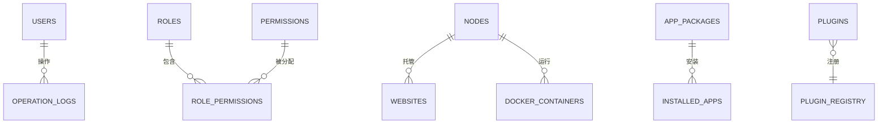
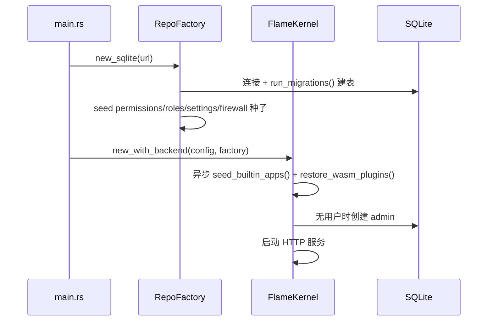

# 03 · 数据库设计

> FlamePanel SQLite 表结构、字段说明、实体关系与迁移机制

## 1. 概览

- **数据库引擎**：SQLite（`sqlx` 0.9 + `runtime-tokio`）
- **双模式**：InMemory（默认开发/测试）与 SQLite（生产）
- **迁移机制**：`infrastructure/sqlite.rs` 的 `run_migrations()` 在启动时自动执行 `CREATE TABLE IF NOT EXISTS`，幂等无副作用
- **时区**：`created_at` / `updated_at` 存储为 UTC 时间字符串

### 1.1 存储模式切换

| 场景 | `OP_DATABASE_URL` | 存储 |
|------|-------------------|------|
| 开发/测试默认 | `sqlite://data/app.db` | InMemory |
| 生产（install.sh） | `sqlite:/opt/flamepanel/data/flamepanel.db?mode=rwc` | SQLite |
| 手动指定 | 任意非默认 URL | SQLite |

> `main.rs` 判断：`config.database.url != "sqlite://data/app.db"` 时启用 SQLite。

## 2. 表结构总览

| 表 | 说明 | 创建位置 |
|----|------|----------|
| `users` | 用户 | sqlite.rs |
| `nodes` | 服务器节点 | sqlite.rs |
| `websites` | 网站 | sqlite.rs |
| `web_servers` | Web 服务器实例 | sqlite.rs |
| `operation_logs` | 操作审计日志 | sqlite.rs |
| `permissions` | 权限定义 | sqlite.rs |
| `roles` | 角色 | sqlite.rs |
| `role_permissions` | 角色-权限关联 | sqlite.rs |
| `logs` | 系统日志 | sqlite.rs |
| `databases` | 数据库实例（MySQL/Redis） | sqlite.rs |
| `panel_settings` | 面板 Key-Value 设置 | sqlite.rs |
| `firewall_rules` | 防火墙规则 | sqlite.rs |
| `app_packages` | 应用商店应用包 | sqlite.rs |
| `installed_apps` | 已安装应用 | sqlite.rs |
| `plugins` | WASM 插件（持久化） | sqlite.rs |
| `outbox_events` | 事件 Outbox（Stage 9，事件落库可重试） | sqlite.rs |
| `scheduled_tasks` | 定时任务 | sqlite.rs |
| `memos` | 备忘录 / TODO | sqlite.rs |
| `tasks` | 统一任务状态机持久化（TaskTracker） | sqlite.rs |

## 3. 表结构详解

### 3.1 `users` — 用户

| 字段 | 类型 | 约束 | 说明 |
|------|------|------|------|
| id | INTEGER | PK AUTOINCREMENT | 主键 |
| username | TEXT | NOT NULL UNIQUE | 用户名 |
| password_hash | TEXT | NOT NULL | bcrypt 密码哈希 |
| role | TEXT | NOT NULL DEFAULT 'user' | 角色名（admin/operator/viewer） |
| created_at | TEXT | NOT NULL | 创建时间 |

### 3.2 `nodes` — 服务器节点

| 字段 | 类型 | 约束 | 说明 |
|------|------|------|------|
| id | INTEGER | PK AUTOINCREMENT | 主键 |
| name | TEXT | NOT NULL | 节点名称 |
| hostname | TEXT | NOT NULL | 主机名 |
| ip_address | TEXT | NOT NULL | IP 地址 |
| status | TEXT | NOT NULL DEFAULT 'unknown' | 状态（online/offline/unknown） |
| created_at | TEXT | NOT NULL | 创建时间 |

### 3.3 `websites` — 网站

| 字段 | 类型 | 约束 | 说明 |
|------|------|------|------|
| id | INTEGER | PK AUTOINCREMENT | 主键 |
| name | TEXT | NOT NULL | 网站名称 |
| domain | TEXT | NOT NULL UNIQUE | 域名（唯一） |
| root_path | TEXT | NOT NULL | 站点根目录 |
| status | TEXT | NOT NULL DEFAULT 'active' | 状态 |
| node_id | INTEGER | NOT NULL DEFAULT 0 | 所属节点 |
| engine | TEXT | NOT NULL DEFAULT 'nginx' | Web 引擎 |
| ssl_enabled | INTEGER | NOT NULL DEFAULT 0 | 是否启用 SSL |
| proxy_enabled | INTEGER | NOT NULL DEFAULT 0 | 是否启用反向代理 |
| proxy_pass | TEXT | 可空 | 代理目标地址 |
| created_at | TEXT | NOT NULL | 创建时间 |

### 3.4 `web_servers` — Web 服务器实例

| 字段 | 类型 | 约束 | 说明 |
|------|------|------|------|
| id | INTEGER | PK AUTOINCREMENT | 主键 |
| engine | TEXT | NOT NULL | 引擎（nginx/apache/…） |
| version | TEXT | 可空 | 版本 |
| status | TEXT | NOT NULL DEFAULT 'stopped' | 状态 |
| config_path | TEXT | NOT NULL DEFAULT '' | 配置文件路径 |
| binary_path | TEXT | 可空 | 二进制路径 |
| port | INTEGER | NOT NULL DEFAULT 80 | 监听端口 |
| created_at | TEXT | NOT NULL | 创建时间 |

### 3.5 `operation_logs` — 操作审计日志

| 字段 | 类型 | 约束 | 说明 |
|------|------|------|------|
| id | INTEGER | PK AUTOINCREMENT | 主键 |
| username | TEXT | NOT NULL | 操作人 |
| action | TEXT | NOT NULL | 动作（如 file_write） |
| target | TEXT | 可空 | 操作目标 |
| ip | TEXT | 可空 | 来源 IP |
| created_at | TEXT | NOT NULL | 时间 |

### 3.6 `permissions` — 权限定义

| 字段 | 类型 | 约束 | 说明 |
|------|------|------|------|
| id | INTEGER | PK AUTOINCREMENT | 主键 |
| resource | TEXT | NOT NULL | 资源（user/node/docker/…） |
| action | TEXT | NOT NULL | 动作（read/create/update/delete/…） |
| description | TEXT | NOT NULL DEFAULT '' | 描述 |

### 3.7 `roles` — 角色

| 字段 | 类型 | 约束 | 说明 |
|------|------|------|------|
| id | INTEGER | PK AUTOINCREMENT | 主键 |
| name | TEXT | NOT NULL UNIQUE | 角色名 |
| description | TEXT | NOT NULL DEFAULT '' | 描述 |

### 3.8 `role_permissions` — 角色-权限关联

| 字段 | 类型 | 约束 | 说明 |
|------|------|------|------|
| role_id | INTEGER | NOT NULL, PK 复合 | 角色 ID |
| permission_id | INTEGER | NOT NULL, PK 复合 | 权限 ID |
| 外键 | — | role_id → roles(id), permission_id → permissions(id) | — |

### 3.9 `logs` — 系统日志

| 字段 | 类型 | 约束 | 说明 |
|------|------|------|------|
| id | INTEGER | PK AUTOINCREMENT | 主键 |
| source | TEXT | NOT NULL | 来源（system/plugin/…） |
| level | TEXT | NOT NULL | 级别（info/warn/error/…） |
| message | TEXT | NOT NULL | 日志内容 |
| metadata | TEXT | 可空 | 元数据（JSON） |
| created_at | TEXT | NOT NULL | 时间 |

### 3.10 `databases` — 数据库实例

| 字段 | 类型 | 约束 | 说明 |
|------|------|------|------|
| id | INTEGER | PK AUTOINCREMENT | 主键 |
| db_type | TEXT | NOT NULL | 类型（mysql/mariadb/redis） |
| name | TEXT | NOT NULL | 实例名称 |
| version | TEXT | NOT NULL DEFAULT '' | 版本 |
| port | INTEGER | NOT NULL DEFAULT 3306 | 端口 |
| status | TEXT | NOT NULL DEFAULT 'stopped' | 状态 |
| install_path | TEXT | NOT NULL DEFAULT '' | 安装路径 |
| data_dir | TEXT | NOT NULL DEFAULT '' | 数据目录 |
| config_file | TEXT | NOT NULL DEFAULT '' | 配置文件 |
| root_user | TEXT | NOT NULL DEFAULT 'root' | 管理员账号 |
| created_at / updated_at | TEXT | NOT NULL | 创建/更新时间 |

### 3.11 `panel_settings` — 面板设置

| 字段 | 类型 | 约束 | 说明 |
|------|------|------|------|
| key | TEXT | PK | 设置键 |
| value | TEXT | NOT NULL DEFAULT '' | 值 |
| description | TEXT | NOT NULL DEFAULT '' | 描述 |
| updated_at | TEXT | NOT NULL | 更新时间 |

**内置设置项**（`domain/entity.rs` 的 `default_settings()`）：

| key | 默认值 | 说明 |
|-----|--------|------|
| panel_name | FlamePanel | 面板名称 |
| theme | light | 主题 |
| language | zh-CN | 界面语言 |
| panel_port | 8080 | 面板端口 |
| session_timeout_minutes | 1440 | 会话超时 |
| log_level | info | 日志级别 |
| log_retention_days | 30 | 日志保留天数 |
| two_factor_enabled | false | 2FA 开关 |

### 3.12 `firewall_rules` — 防火墙规则

| 字段 | 类型 | 约束 | 说明 |
|------|------|------|------|
| id | INTEGER | PK AUTOINCREMENT | 主键 |
| name | TEXT | NOT NULL | 规则名称 |
| description | TEXT | 可空 | 描述 |
| protocol | TEXT | NOT NULL DEFAULT 'any' | 协议（tcp/udp/any） |
| port | TEXT | 可空 | 端口/端口范围 |
| source | TEXT | DEFAULT '0.0.0.0/0' | 来源 |
| destination | TEXT | 可空 | 目标 |
| action | TEXT | NOT NULL DEFAULT 'allow' | 动作（allow/deny） |
| enabled | INTEGER | NOT NULL DEFAULT 1 | 是否启用 |
| priority | INTEGER | NOT NULL DEFAULT 50 | 优先级（小者优先） |
| direction | TEXT | NOT NULL DEFAULT 'in' | 方向（in/out） |
| created_at / updated_at | TEXT | NOT NULL | 创建/更新时间 |

**默认规则**（`default_firewall_rules()`）：SSH(22)、HTTP(80)、HTTPS(443)、面板(8080) 放行 + 拒绝所有入站兜底。

### 3.13 `app_packages` — 应用商店应用包

| 字段 | 类型 | 约束 | 说明 |
|------|------|------|------|
| id | INTEGER | PK AUTOINCREMENT | 主键 |
| key | TEXT | NOT NULL UNIQUE | 应用唯一键 |
| name | TEXT | NOT NULL | 应用名称 |
| category | TEXT | NOT NULL DEFAULT '' | 分类 |
| format | TEXT | NOT NULL | 格式（flame/onepanel/baota） |
| description | TEXT | NOT NULL DEFAULT '' | 描述 |
| logo | TEXT | 可空 | Logo |
| metadata_json | TEXT | NOT NULL | AppMetadata JSON |
| source_path | TEXT | 可空 | 源路径 |
| created_at / updated_at | TEXT | NOT NULL | 创建/更新时间 |

### 3.14 `installed_apps` — 已安装应用

| 字段 | 类型 | 约束 | 说明 |
|------|------|------|------|
| id | INTEGER | PK AUTOINCREMENT | 主键 |
| package_key | TEXT | NOT NULL | 应用键 |
| name | TEXT | NOT NULL | 实例名称 |
| version | TEXT | NOT NULL | 版本 |
| mode | TEXT | NOT NULL DEFAULT 'container' | 安装模式（container/native/wasm） |
| status | TEXT | NOT NULL DEFAULT 'stopped' | 状态 |
| access_url | TEXT | 可空 | 访问地址 |
| install_path | TEXT | NOT NULL DEFAULT '' | 安装路径 |
| container_name | TEXT | 可空 | 容器名 |
| port | INTEGER | 可空 | 端口 |
| params_json | TEXT | NOT NULL DEFAULT '{}' | 安装参数（JSON） |
| created_at / updated_at | TEXT | NOT NULL | 创建/更新时间 |

**索引**：`idx_installed_apps_key ON installed_apps(package_key)`

### 3.15 `plugins` — WASM 插件

| 字段 | 类型 | 约束 | 说明 |
|------|------|------|------|
| id | TEXT | PK | 插件 ID |
| name | TEXT | NOT NULL | 名称 |
| version | TEXT | NOT NULL DEFAULT '1.0.0' | 版本 |
| author | TEXT | NOT NULL DEFAULT '' | 作者 |
| description | TEXT | NOT NULL DEFAULT '' | 描述 |
| wasm_base64 | TEXT | NOT NULL | WASM 字节码（base64） |
| wasm_hash | TEXT | NOT NULL | SHA-256 哈希 |
| enabled | INTEGER | NOT NULL DEFAULT 0 | 是否启用 |
| homepage | TEXT | 可空 | 主页 |
| license | TEXT | 可空 | 许可证 |
| tags | TEXT | NOT NULL DEFAULT '[]' | 标签（JSON 数组） |
| config_schema | TEXT | 可空 | 配置 Schema |
| created_at / updated_at | TEXT | NOT NULL | 创建/更新时间 |

### 3.16 `outbox_events` — 事件 Outbox（Stage 9）

| 字段 | 类型 | 约束 | 说明 |
|------|------|------|------|
| id | INTEGER | PK AUTOINCREMENT | 主键 |
| event_type | TEXT | NOT NULL | 事件类型 |
| payload | TEXT | NOT NULL DEFAULT '{}' | 事件负载（JSON） |
| published | INTEGER | NOT NULL DEFAULT 0 | 是否已投递 |
| created_at | TEXT | NOT NULL | 创建时间 |

> 索引：`idx_outbox_events_type(event_type)`。`OutboxService::record_event` 落库失败自动重试（指数退避，最多 3 次），保证关键审计不丢失（Stage 9）。

### 3.17 `scheduled_tasks` — 定时任务

| 字段 | 类型 | 约束 | 说明 |
|------|------|------|------|
| id | INTEGER | PK AUTOINCREMENT | 主键 |
| name | TEXT | NOT NULL | 任务名称 |
| command | TEXT | NOT NULL | 执行命令 |
| schedule | TEXT | NOT NULL DEFAULT '* * * * *' | cron 表达式 |
| enabled | INTEGER | NOT NULL DEFAULT 1 | 是否启用 |
| last_status | TEXT | NOT NULL DEFAULT 'never' | 上次执行状态 |
| last_output | TEXT | NOT NULL DEFAULT '' | 上次输出 |
| last_run_at / next_run_at | TEXT | 可空 | 上次 / 下次执行时间 |
| created_at / updated_at | TEXT | NOT NULL | 创建/更新时间 |

> 索引：`idx_scheduled_tasks_enabled(enabled)`。

### 3.18 `memos` — 备忘录 / TODO

| 字段 | 类型 | 约束 | 说明 |
|------|------|------|------|
| id | INTEGER | PK AUTOINCREMENT | 主键 |
| content | TEXT | NOT NULL | 内容 |
| kind | TEXT | NOT NULL DEFAULT 'memo' | 类型（memo/todo） |
| done | INTEGER | NOT NULL DEFAULT 0 | 是否完成 |
| created_at / updated_at | TEXT | NOT NULL | 创建/更新时间 |

### 3.19 `tasks` — 统一任务状态机（持久化）

| 字段 | 类型 | 约束 | 说明 |
|------|------|------|------|
| id | INTEGER | PK | 任务 ID（TaskTracker 对应） |
| kind | TEXT | NOT NULL | 任务类型 |
| name | TEXT | NOT NULL | 任务名称 |
| state | TEXT | NOT NULL | 状态（pending/running/success/failed/...） |
| progress | INTEGER | NOT NULL DEFAULT 0 | 进度 0-100 |
| message | TEXT | NOT NULL DEFAULT '' | 消息 |
| created_at / updated_at | TEXT | NOT NULL | 创建/更新时间 |

## 4. 实体关系图



## 5. 数据初始化流程



## 6. 迁移与备份

### 6.1 迁移

- 所有迁移均为 `CREATE TABLE IF NOT EXISTS`，在 `run_migrations()` 中按序执行。
- 新增字段/表时：修改 `run_migrations()`，追加 `ALTER TABLE ... ADD COLUMN` 或新 `CREATE TABLE`（注意幂等）。
- 迁移在启动时自动执行，无需手动 SQL。

### 6.2 备份

```bash
# 停服后直接复制（推荐 SQLite 一致性）
sqlite3 /opt/flamepanel/data/flamepanel.db ".backup '/backup/flamepanel-$(date +%Y%m%d).db'"

# 或运行中复制（简单场景）
cp /opt/flamepanel/data/flamepanel.db /backup/flamepanel-$(date +%Y%m%d).db
```

### 6.3 常见运维

```bash
# 查看表结构
sqlite3 data/app.db ".schema users"

# 清空重来（删除数据库后重启自动重建）
rm -f data/app.db
```

> 开发模式（InMemory）下数据不持久化，重启即清空，适合测试。
