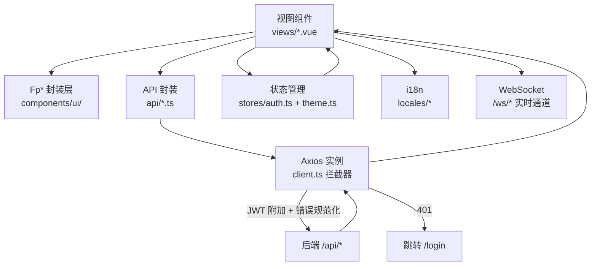
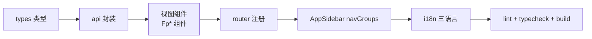

# 04 · 前端开发指南

> FlamePanel 前端（Vue 3 + TypeScript + OpenVue）开发规范与实践

## 1. 技术栈

| 依赖 | 版本 | 用途 |
|------|------|------|
| Vue | ^3.5 | 框架 |
| TypeScript | ^6.0 | 类型系统 |
| OpenVue | ^0.7 (beta) | UI 组件库（PrimeVue v4 社区延续版，80+ 组件） |
| @openvue/themes | ^0.7 (beta) | 主题预设（Aura 派生品牌预设 flame-preset） |
| @openvue/openicons | ^1.0 (beta) | 图标库（`oi oi-xxx` 字体图标） |
| UnoCSS | ^66 | 原子化 CSS（presetWind4 + 主题令牌联动） |
| Pinia | ^3.0 | 状态管理 |
| Vue Router | ^5.0 | 路由 |
| vue-i18n | ^10.0 | 国际化（zh-CN/en-US/ja-JP） |
| Axios | ^1.8 | HTTP 客户端 |
| ECharts | ^6.1 | 仪表盘图表（按需引入，主题令牌自适应） |
| xterm.js | ^5.5 | Web 终端 |
| Vite | ^8.0 | 构建工具 |

> **迁移历史**：v0.7.0 由 Element Plus 全面迁移至 OpenVue。所有组件映射见 §4「组件映射表」，所有界面反馈统一走 Fp* 封装层（§5）。

## 2. 工程结构

```
frontend/
├── index.html
├── vite.config.ts          # 构建 + UnoCSS + 开发代理
├── uno.config.ts           # UnoCSS 主题（--fp-* 令牌映射 tailwind 色板）
├── package.json
├── eslint.config.mjs       # ESLint 扁平配置
├── src/
│   ├── main.ts             # 入口（OpenVue + Toast/Confirm 服务 + 主题 store）
│   ├── App.vue             # 根组件（全局 ConfirmDialog + Toast 挂载）
│   ├── style.css           # 全局基础样式（令牌引用 + 工具类）
│   ├── theme/              # 设计系统
│   │   ├── tokens.css      # 设计令牌（--fp-*，OKLCH 色彩空间）
│   │   ├── flame-preset.ts # OpenVue 品牌主题预设（Aura 派生，桥接 --fp-* → --p-*）
│   │   └── glass.css       # 玻璃/亚克力材质工具类（浮动层专用）
│   ├── components/
│   │   ├── ui/             # Fp* 封装层（唯一允许引入 OpenVue 组件的地方见 §5）
│   │   │   ├── FpButton.vue / FpTable.vue / FpModal.vue / FpCard.vue
│   │   │   ├── FpInput.vue / FpSelect.vue / FpTag.vue / FpEmpty.vue
│   │   │   ├── LayoutContent.vue（页面骨架）/ CopyButton.vue
│   │   │   └── FpToast.ts / FpConfirm.ts
│   │   ├── layout/         # AppSidebar / AppHeader / CommandPalette / AppFooter
│   │   └── Layout.vue      # 整体布局（桌面侧栏 / 移动抽屉 + 页面过渡）
│   ├── stores/             # auth / theme / tabs / appearance（外观偏好）
│   ├── router/             # index.ts（20 条路由）
│   ├── locales/            # zh-CN.ts / en-US.ts / ja-JP.ts
│   ├── types/              # index.ts（与后端实体对齐的接口）
│   ├── utils/              # error.ts（错误提示）/ ws.ts / theme.ts
│   └── views/              # 20 个视图页面
```

## 3. 开发环境

### 3.1 启动

```bash
cd frontend
npm install
npm run dev      # http://localhost:5173
```

### 3.2 Vite 代理（vite.config.ts）

```ts
server: {
  port: 5173,
  proxy: {
    '/api': { target: 'http://localhost:8080', changeOrigin: true },
    '/ws':  { target: 'http://localhost:8080', ws: true }
  }
}
```

### 3.3 常用脚本

| 命令 | 说明 |
|------|------|
| `npm run dev` | 开发服务器 |
| `npm run build` | 类型检查 + 构建（vue-tsc --noEmit && vite build） |
| `npm run preview` | 预览构建产物 |
| `npm run lint` | ESLint 检查 |
| `npm run format` | Prettier 格式化 |

## 4. 组件映射表（Element Plus → OpenVue）

| 场景 | 旧（Element Plus） | 新（OpenVue / Fp*） |
|------|------|------|
| 表格 | `el-table` + `el-table-column` | `FpTable` + `Column`（`#body="{ data }"` 插槽，非 `{ row }`） |
| 按钮 | `el-button` | `FpButton`（`variant="primary\|ghost\|danger\|warning\|link"`，`icon="oi oi-xxx"`） |
| 弹窗 | `el-dialog` | `FpModal`（表单默认 slot，按钮 `#footer` slot） |
| 表单校验 | `el-form` + `rules` | FpInput/FpSelect 的 `:error` + 本地 `validateForm()` |
| 输入框 | `el-input` | `FpInput`（密码 `type="password" toggle-mask`；多行用 `Textarea`） |
| 数字输入 | `el-input-number` | `InputNumber`（`.field-col` + `.field-label` 包裹） |
| 下拉 | `el-select` + `el-option` | `FpSelect`（`:options` + `option-label` + `option-value`） |
| 开关 | `el-switch` | `ToggleSwitch` |
| 标签 | `el-tag` | `FpTag`（severity + 状态呼吸点 dot） |
| 确认 | `ElMessageBox.confirm` | `useFpConfirm().confirmAction()` |
| 提示 | `ElMessage` | `useFpToast()`（success/error/warning/info） |
| 分页 | `el-pagination` | `Paginator`（`:first` `:rows` `:total-records` `@update:first`） |
| 页签 | `el-tabs`/`el-tab-pane` | `Tabs` + `TabList` + `Tab` + `TabPanels` + `TabPanel`（value 成对） |
| 卡片 | `el-card` | 自绘 `.panel` div（令牌化样式） |
| 图标 | `@element-plus/icons-vue` | `<i class="oi oi-xxx">`（openicons，见 node_modules/@openvue/openicons/openicons.css） |
| 加载 | `v-loading` | `FpTable :loading` / `Skeleton` |
| 进度 | `el-progress` | `ProgressBar` |
| 提示气泡 | `el-tooltip` | `v-tooltip="'文案'"` 指令（全局注册） |
| 弹出确认 | `el-popconfirm` | `useFpConfirm().confirmAction()` |

## 5. Fp* 封装层规范

**所有 OpenVue 组件必须通过 `src/components/ui/` 的 Fp* 封装使用，视图层禁止直接 import OpenVue 组件**（`Column`/`Tabs` 等布局性组件除外，见下表）。

| 封装 | 职责 |
|------|------|
| `FpButton` | 8 态交互（hover/active/disabled/loading…）、语义变体、触感缩放 |
| `FpTable` | DataTable 包装：loading 骨架、空态（FpEmpty）、分页、虚拟滚动开关 |
| `FpModal` | 玻璃材质浮动层、统一动画 |
| `FpCard` | Card 封装：标题品牌竖条 + `#extra`/`#footer` 插槽 |
| `LayoutContent` | 页面骨架：`title` + `#toolbar` + reload；所有列表页统一外层 |
| `CopyButton` | 一键复制（clipboard + 成功反馈） |
| `FpInput` / `FpSelect` | FloatLabel 布局、错误态、i18n 透传 |
| `FpTag` | 语义状态色 + 运行状态呼吸点 |
| 提示气泡 | `v-tooltip` 指令（全局注册，Fp* 中无组件封装） |
| `FpToast` | 统一反馈，错误优先展示后端消息（复用 `getErrorMessage`） |
| `FpConfirm` | 危险操作红按钮确认弹窗 |
| `FpEmpty` | 空态：图标 + 标题 + 引导操作 |
| `v-permission` | 权限指令：无权限时禁用（manage）或隐藏（view） |

**直接引入白名单**（布局/表格内嵌组件）：`Column`、`Tabs/TabList/Tab/TabPanels/TabPanel`、`Paginator`、`InputNumber`、`ToggleSwitch`、`Checkbox`、`Textarea`、`Skeleton`、`ProgressBar`、`Breadcrumb`、`Popover`、`Menu`、`Divider`、`SelectButton`、`Slider`、`Steps`、`Descriptions`、`Chip`、`FileUpload`、`InlineMessage`、`RadioButton`、`Avatar`。

### 5.1 反馈示例

```ts
import { useFpToast } from '@/components/ui/FpToast'
import { useFpConfirm } from '@/components/ui/FpConfirm'

const toast = useFpToast()
const { confirmAction } = useFpConfirm()

toast.success(t('common.success'))
toast.error(e, t('common.failed'))        // 自动提取后端错误消息
confirmAction({
  message: t('user.deleteConfirm', { name: row.username }),
  header: t('common.confirmAction'),
  accept: async () => { /* 删除逻辑 */ },
})
```

## 6. 主题与设计令牌

### 6.1 令牌体系（src/theme/tokens.css）

- 前缀 `--fp-*`，全部 OKLCH 色彩空间（感知均匀，明暗切换无跳变）
- 分层：品牌色（火焰橙）→ 表面色（bg-app/elevated/hover/border）→ 文字（primary/secondary/muted）→ 语义色（success/warning/danger/info + soft 变体）→ 间距/圆角/玻璃/布局/动效
- 暗色模式：`.dark` 类覆写（跟随系统或手动，`localStorage['flamepanel.mode']` 持久化）
- **规范**：禁止硬编码 hex / 内联 style，一律引用令牌

### 6.2 OpenVue 品牌预设（src/theme/flame-preset.ts）

- 基于 Aura 预设 `definePreset` 派生，`darkModeSelector: '.dark'`
- 品牌色：火焰橙 scale（50-950），明暗模式分别取 600/400
- 组件表面/文字/表单令牌桥接 `var(--fp-*)`，保证组件与站点语言同源

### 6.3 主题定制（Settings → 主题定制 页签）

- 4 套预设：Flame（暗色优先）/ Aurora（浅色）/ Infinity（高对比紧凑）/ 自定义
- 自定义参数：品牌色 HSL 三轴、玻璃模糊（0-24px）、圆角档位（sharp/standard/rounded）、密度档位（compact/standard/comfortable）
- JSON 配置导出/导入（`flamepanel-theme.json`）
- 状态在 `stores/theme.ts`，通过 `useTheme()` 应用到 `document.documentElement`

### 6.4 玻璃材质（src/theme/glass.css）

- 仅浮动层使用：顶栏（轻玻璃）、Modal/⌘K（重玻璃）
- `prefers-reduced-transparency` 自动回退纯色

## 7. 布局架构

```
┌──────────────┬─────────────────────────────┐
│  AppSidebar  │  AppHeader（轻玻璃 56px）     │
│  实色+细边框   │  折叠按钮·面包屑·⌘K·状态·语言·主题│
│  火焰 Logo    ├─────────────────────────────┤
│  5 组导航     │  router-view（页面切换过渡）   │
│  220/64px    │  20 个视图                    │
├──────────────┴─────────────────────────────┤
│  AppFooter（版本号 + 面板状态）               │
└────────────────────────────────────────────┘
```

- **AppSidebar**：`src/components/layout/AppSidebar.vue`，**二级折叠菜单**（分组可展开/收起 + 彩色语义色分组图标 + 手风琴模式），菜单由路由表 `menuRoutes` 驱动（meta.group 聚合），新增页面只需加路由；折叠态（64px）点击分组图标弹出子菜单浮层；设置 `hide_menu` 隐藏分组、`menu_collapsed` 多端同步折叠状态
- **AppHeader**：实时状态（节点/容器数）、通知中心、语言切换、主题切换、用户菜单
- **AppTabs**：多页签栏（`stores/tabs.ts`），访问过的页面生成可关闭页签，`keep-alive` 缓存页面状态；右键菜单刷新/关闭/关闭其他/关闭全部
- **CommandPalette**：`Ctrl+K` 唤起，菜单搜索 + 跳转 + 快捷命令（主题切换）
- **外观偏好**：`stores/appearance.ts`（多页签/菜单显隐），与后端设置 `open_menu_tabs`/`hide_menu` 双向同步
- **自定义背景**：`stores/theme.ts` 的 `appBackground`/`loginBackground`（data URL），服务端设置持久化；有背景时 `app-bg-enabled` 类触发面板玻璃材质联动
- **移动端**：`<768px` 侧栏转抽屉、`<1200px` 侧栏自动折叠、表格横向滚动、卡片单列

## 8. 页面与路由

| 路由 | 视图 | 说明 |
|------|------|------|
| `/login` | LoginView | 登录（1Panel 式左右分栏：左侧品牌特性区 + 右侧表单，背景预加载，<640px 隐藏品牌区） |
| `/dashboard` | DashboardView | 仪表盘（ECharts 指标 + 令牌自适应调色板） |
| `/users` | UsersView | 用户管理 |
| `/nodes` | NodesView | 节点管理 |
| `/files` | FilesView | 文件管理 |
| `/memos` | MemosView | 备忘录 / 待办 |
| `/databases` | DatabasesView | 数据库管理 |
| `/websites` | WebsitesView | 网站管理（引擎切换） |
| `/docker` | DockerView | Docker 容器管理 |
| `/plugins` | PluginsView | WASM 插件管理 |
| `/app-store` | AppStoreView | 应用商店（卡片网格 + 安装向导） |
| `/operation-logs` | OperationLogsView | 操作审计日志 |
| `/system-logs` | SystemLogsView | 系统日志（WS 实时） |
| `/settings` | SettingsView | 面板设置（常规/安全/备份/主题定制 4 页签） |
| `/firewall` | FirewallView | 防火墙管理 |
| `/web-servers` | WebServersView | Web 服务器（预设/引擎切换） |
| `/terminal` | TerminalView | Web 终端 |
| `/health` | HealthView | 健康检查 |
| `/backups` | BackupView | 数据备份 |
| `/scheduled-tasks` | ScheduledTasksView | 定时任务 |

路由守卫：非登录状态下访问任意页面重定向到 `/login`（见 `router/index.ts` 的 `beforeEach`）。

### 8.3 路由 meta 契约（菜单/面包屑/页签同源）

`router/index.ts` 导出 `menuRoutes` 数组，每个路由带 meta，侧边栏（AppSidebar）、⌘K（CommandPalette）、面包屑（AppHeader）、页签标题（Layout）全部由它生成，**新增页面只需加一条路由**：

```ts
{
  path: '/backups',
  name: 'Backups',
  component: () => import('@/views/BackupView.vue'),
  meta: {
    title: 'nav.backups',   // i18n key
    icon: 'oi-save',        // openicons 类
    group: 'storage',       // 侧边栏分组（main/web/apps/storage/ops/system）
    keepAlive: true,        // 加入页签 keep-alive 缓存
    activeMenu: '/backups', // 详情页归属高亮（可选）
  },
}
```

> 借鉴 1Panel：路由表一份数据驱动导航/菜单/面包屑三处，消除硬编码重复。

### 8.1 前端数据流



### 8.2 新增页面流程



## 9. API 封装规范

### 9.1 基础客户端（client.ts）

```ts
const api = axios.create({ baseURL: '/api', timeout: 15000 })

// 请求拦截：自动附加 JWT
api.interceptors.request.use((config) => {
  const token = localStorage.getItem('token')
  if (token) config.headers.Authorization = `Bearer ${token}`
  return config
})

// 响应拦截：401 刷新重放 + 错误规范化
api.interceptors.response.use(
  (res) => res,
  (err) => { /* 将后端 {code, error, message} 规范化为 {code, message, status} */ },
)
```

### 9.2 新增 API 模块模板

```ts
// api/xxx.ts
import api from './client'
import type { XxxItem, PaginatedResponse } from '@/types'

export function listXxx(params: { page?: number; page_size?: number } = {}) {
  return api.get<PaginatedResponse<XxxItem>>('/xxx', { params })
}

export function createXxx(data: Partial<XxxItem>) {
  return api.post<XxxItem>('/xxx', data)
}
```

> 列表接口分页响应统一 `{ data: T[], total }`；**少数端点直接返回数组**（如 `/plugins`、`/files`、`/app-store/installed`、`/web-servers/engines`），以 api 模块的泛型为准。

### 9.3 分页类型

```ts
export interface PaginatedResponse<T> {
  data: T[]
  page: number
  page_size: number
  total: number
  total_pages: number
}
```

## 10. 错误处理规范

### 10.1 后端错误码

后端 9 个稳定错误码，前端在 `locales/*` 的 `common.error` 下提供文案：

```ts
// locales/zh-CN.ts
common: {
  error: {
    AUTH_UNAUTHORIZED: '未登录或登录已过期',
    AUTH_FORBIDDEN: '没有操作权限',
    NOT_FOUND: '资源不存在',
    BAD_REQUEST: '请求参数错误',
    VALIDATION_ERROR: '参数校验失败',
    CONFLICT: '资源冲突',
    SERVICE_UNAVAILABLE: '服务暂不可用',
    INTERNAL_ERROR: '服务器内部错误',
  }
}
```

### 10.2 使用错误提示工具

```ts
import { getErrorMessage } from '@/utils/error'
import { useFpToast } from '@/components/ui/FpToast'

const toast = useFpToast()

try {
  await listUsers()
} catch (e) {
  toast.error(e, t('common.failed'))   // getErrorMessage 内部处理
}
```

`getErrorMessage` 优先按错误码查 i18n 文案，再回退后端 `message`。

## 11. 国际化（i18n）

- 语言文件：`src/locales/{zh-CN,en-US,ja-JP}.ts`
- 切换器在 AppHeader（`oi-language` 图标菜单），`setLanguage()` 实时生效
- 新增文案需同时维护三种语言文件
- 主题定制相关文案前缀 `settingsTheme.*`

## 12. 性能优化实践

- **OpenVue 按需引入**：视图/组件内显式 import，Tree-shaking 生效；首屏 JS gzip 151KB（预算 <200KB）
- **UnoCSS 按需生成**：仅产出使用到的工具类，令牌联动 tailwind 色板
- **ECharts 按需引入**：`echarts/core` + 仅注册用到的图表；颜色从 `--fp-*` 读取，`MutationObserver` 跟随主题切换
- **路由懒加载**：所有视图 `() => import('@/views/XxxView.vue')`
- **虚拟滚动**：`FpTable :virtual` 开启（万级行）
- **动效约束**：仅 `transform`/`opacity`，`prefers-reduced-motion` 降级
- **构建检查**：`vue-tsc --noEmit` + `npm run lint`

## 13. 新增页面的完整流程

1. **API 封装**：`api/xxx.ts` 调用后端接口，`types/index.ts` 定义接口类型。
2. **视图组件**：`views/XxxView.vue`（FpTable 列表 + FpModal 编辑 + i18n，参照已迁移页面范式）。
3. **路由注册**：`router/index.ts` 添加子路由（懒加载）。
4. **侧边栏**：`components/layout/AppSidebar.vue` 的 `navGroups` 添加菜单项（路径 + i18n key + `oi-` 图标）。
5. **i18n**：三种语言文件补充菜单与文案。
6. **验证**：`npm run lint` + `npx vue-tsc --noEmit` + `npm run build`。

## 14. 与后端联调要点

- 开发时后端 `cargo run`（:8080），前端 `npm run dev`（:5173），Vite 代理自动转发。
- 所有接口需带 `Authorization: Bearer <token>`（拦截器自动处理）。
- 新端点需确认后端 `route_permission()` 已配置权限，否则返回 403。
- WebSocket 无需认证，直接连接 `/ws/*`。
