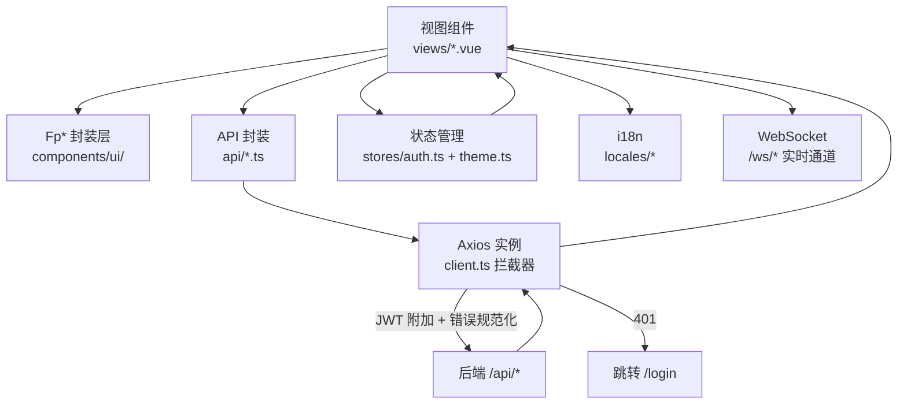
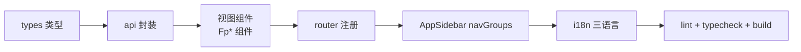

# 04 · 前端开发指南

> FlamePanel 前端（Vue 3 + TypeScript + OpenVue）开发规范与实践

## 1. 技术栈

| 依赖 | 版本 | 用途 |
|------|------|------|
| Vue | ^3.5 | 框架 |
| TypeScript | ^6.0 | 类型系统 |
| OpenVue | ^0.7 (beta) | UI 组件库（PrimeVue v4 社区延续版，80+ 组件） |
| @openvue/themes | ^0.7 (beta) | 主题预设（Aura 派生品牌预设 flame-preset） |
| @openvue/openicons | ^1.0 (beta) | 图标库（`oi oi-xxx` 字体图标） |
| UnoCSS | ^66 | 原子化 CSS（presetWind4 + 主题令牌联动） |
| Pinia | ^3.0 | 状态管理 |
| Vue Router | ^5.0 | 路由 |
| vue-i18n | ^10.0 | 国际化（zh-CN/en-US/ja-JP） |
| Axios | ^1.8 | HTTP 客户端 |
| ECharts | ^6.1 | 仪表盘图表（按需引入，主题令牌自适应） |
| xterm.js | ^5.5 | Web 终端 |
| Vite | ^8.0 | 构建工具 |

> **迁移历史**：v0.7.0 由 Element Plus 全面迁移至 OpenVue。所有组件映射见 §4「组件映射表」，所有界面反馈统一走 Fp* 封装层（§5）。

## 2. 工程结构

```
frontend/
├── index.html
├── vite.config.ts          # 构建 + UnoCSS + 开发代理
├── uno.config.ts           # UnoCSS 主题（--fp-* 令牌映射 tailwind 色板）
├── package.json
├── eslint.config.js        # ESLint 扁平配置（含 M11 views 禁 openvue 规则）
├── src/
│   ├── main.ts             # 入口（OpenVue + Toast/Confirm 服务 + 主题 store）
│   ├── App.vue             # 根组件（全局 ConfirmDialog + Toast 挂载）
│   ├── style.css           # 全局基础样式（令牌引用 + 工具类）
│   ├── theme/              # 设计系统
│   │   ├── tokens.css      # 设计令牌（--fp-*，OKLCH 色彩空间）
│   │   ├── flame-preset.ts # OpenVue 品牌主题预设（Aura 派生，桥接 --fp-* → --p-*）
│   │   └── glass.css       # 玻璃/亚克力材质工具类（浮动层专用）
│   ├── components/
│   │   ├── ui/             # Fp* 封装层（唯一允许引入 OpenVue 组件的地方见 §5，30+ 组件）
│   │   │   ├── FpButton/FpTable/FpModal/FpDrawer/FpTabs/FpStatePanel…
│   │   │   ├── LayoutContent.vue（页面骨架）/ PageToolbar.vue / CopyButton.vue
│   │   │   ├── FpToast.ts / FpConfirm.ts
│   │   │   ├── index.ts（barrel 统一出口）
│   │   │   ├── README.md（组件清单/Props/范式/已登记例外）
│   │   │   └── docs/（每个 Fp 组件一份 props/events/slots API 文档，M8）
│   │   ├── layout/         # AppSidebar / AppHeader / CommandPalette / AppFooter / AppTabs
│   │   └── Layout.vue      # 整体布局（桌面侧栏 / 移动抽屉 + 页面过渡）
│   ├── stores/             # auth / theme / tabs / appearance（外观偏好）
│   ├── composables/        # useApiQuery / useCrudPage / useECharts / usePolling /
│   │                       #   useQueryCache / useSharedWebSocket / useWebSocket
│   ├── router/             # index.ts（22 条路由）
│   ├── locales/            # zh-CN.ts / en-US.ts / ja-JP.ts
│   ├── config/             # commands.ts（⌘K 命令单源配置，M1）
│   ├── types/              # 仅保留后端未覆盖的类型；实体统一从 api/generated 导入（F4.1）
│   ├── api/                # client.ts + 各域模块 + queryKeys.ts + generated/（OpenAPI）+ README.md
│   ├── utils/              # error.ts（错误提示）/ ws.ts / theme.ts
│   └── views/              # 23 个视图页面
```

## 3. 开发环境

### 3.1 启动

```bash
cd frontend
npm install
npm run dev      # http://localhost:5173
```

### 3.2 Vite 代理（vite.config.ts）

```ts
server: {
  port: 5173,
  proxy: {
    '/api': { target: 'http://localhost:8080', changeOrigin: true },
    '/ws':  { target: 'http://localhost:8080', ws: true }
  }
}
```

### 3.3 常用脚本

| 命令 | 说明 |
|------|------|
| `npm run dev` | 开发服务器 |
| `npm run build` | 类型检查 + 构建（vue-tsc --noEmit && vite build） |
| `npm run preview` | 预览构建产物 |
| `npm run lint` | ESLint 检查 |
| `npm run format` | Prettier 格式化 |
| `npm run typecheck` | 仅类型检查（vue-tsc --noEmit，F4.3 新增） |
| `npm run test:unit` | 单元测试（vitest run，F4.3 新增） |
| `npm run analyze` | 构建产物体积分析（vite build --mode analyze，F4.3 新增） |
| `npm run openapi:generate` | 从 openapi.json 重新生成 TS 类型（F4.1 新增） |

## 4. 组件映射表（Element Plus → OpenVue）

| 场景 | 旧（Element Plus） | 新（OpenVue / Fp*） |
|------|------|------|
| 表格 | `el-table` + `el-table-column` | `FpTable` + `Column`（`#body="{ data }"` 插槽，非 `{ row }`） |
| 按钮 | `el-button` | `FpButton`（`variant="primary\|ghost\|danger\|warning\|link"`，`icon="oi oi-xxx"`） |
| 弹窗 | `el-dialog` | `FpModal`（表单默认 slot，按钮 `#footer` slot） |
| 表单校验 | `el-form` + `rules` | FpInput/FpSelect 的 `:error` + 本地 `validateForm()` |
| 输入框 | `el-input` | `FpInput`（密码 `type="password" toggle-mask`；多行用 `Textarea`） |
| 数字输入 | `el-input-number` | `InputNumber`（`.field-col` + `.field-label` 包裹） |
| 下拉 | `el-select` + `el-option` | `FpSelect`（`:options` + `option-label` + `option-value`） |
| 开关 | `el-switch` | `ToggleSwitch` |
| 标签 | `el-tag` | `FpTag`（severity + 状态呼吸点 dot） |
| 确认 | `ElMessageBox.confirm` | `useFpConfirm().confirmAction()` |
| 提示 | `ElMessage` | `useFpToast()`（success/error/warning/info） |
| 分页 | `el-pagination` | `Paginator`（`:first` `:rows` `:total-records` `@update:first`） |
| 页签 | `el-tabs`/`el-tab-pane` | `Tabs` + `TabList` + `Tab` + `TabPanels` + `TabPanel`（value 成对） |
| 卡片 | `el-card` | 自绘 `.panel` div（令牌化样式） |
| 图标 | `@element-plus/icons-vue` | `<i class="oi oi-xxx">`（openicons，见 node_modules/@openvue/openicons/openicons.css） |
| 加载 | `v-loading` | `FpTable :loading` / `Skeleton` |
| 进度 | `el-progress` | `ProgressBar` |
| 提示气泡 | `el-tooltip` | `v-tooltip="'文案'"` 指令（全局注册） |
| 弹出确认 | `el-popconfirm` | `useFpConfirm().confirmAction()` |

## 5. Fp* 封装层规范

**所有 OpenVue 组件必须通过 `src/components/ui/` 的 Fp* 封装使用，视图层禁止直接 import OpenVue 组件**（M11 起由 eslint 强制，见下表）。

| 封装 | 职责 |
|------|------|
| `FpButton` | 8 态交互（hover/active/disabled/loading…）、语义变体、触感缩放 |
| `FpTable` | DataTable 包装：loading 骨架、空态（FpEmpty）、分页、虚拟滚动开关 |
| `FpModal` | 玻璃材质浮动层、统一动画 |
| `FpCard` | Card 封装：标题品牌竖条 + `#extra`/`#footer` 插槽 |
| `LayoutContent` | 页面骨架：`title` + `#toolbar` + reload；所有列表页统一外层 |
| `FpInput` / `FpSelect` / `FpTextarea` / `FpNumber` | FloatLabel 布局、错误态、i18n 透传、`aria-invalid`/`aria-describedby` |
| `FpTag` | 语义状态色 + 运行状态呼吸点 |
| `FpStatePanel` | loading / error(可重试) / empty 统一三态容器（F0.3） |
| `FpTabs` | 声明式页签（`:items` + 命名 slot，F2.2） |
| `FpDrawer` | 侧边抽屉弹层（F2.2） |
| `FpPagination` | 分页条（`total<=pageSize` 自动隐藏） |
| `FpFormField` | 表单字段容器：label + slot + error/hint |
| `FpCheckbox` / `FpSwitch` / `FpSlider` / `FpSelectButton` / `FpRadioGroup` | 表单控件封装 |
| `FpSkeleton` / `FpProgress` / `FpEmpty` / `FpBreadcrumb` / `FpChip` / `FpDivider` / `FpInlineMessage` / `FpCard` / `FpButtonLink` / `FpFileUpload` / `FpColumn` | 通用 UI 封装 |
| `PageToolbar` | 列表页工具栏（搜索/筛选/刷新，M9） |
| `CopyButton` | 一键复制（clipboard + 成功反馈） |
| 提示气泡 | `v-tooltip` 指令（全局注册，Fp* 中无组件封装） |
| `FpToast` | 统一反馈，错误优先展示后端消息（复用 `getErrorMessage`） |
| `FpConfirm` | 危险操作红按钮确认弹窗 |
| `v-permission` | 权限指令：无权限时禁用（manage）或隐藏（view） |

> 完整组件清单（30+ 个）、Props 要点、维护约定与已登记例外见 `src/components/ui/README.md`；每个 Fp 组件的 props/events/slots 详见 `src/components/ui/docs/`（M8）。

**M11 起 views 禁止直接 import OpenVue**：`eslint.config.js` 对 `src/views/**` 启用 `no-restricted-imports`，屏蔽 `openvue` / `openvue/*` 全部底层入口；业务视图**只能**从 `@/components/ui` 的 Fp* 封装消费 UI（`FpColumn`/`FpTabs` 等布局内嵌组件亦已封装为 Fp*）。新增代码若有裸 OpenVue import 将直接 lint 报错（与 `components/ui/README.md`「views 禁止直接 import openvue」约定形成「文档 + 工具」双保障）。

### 5.1 反馈示例

```ts
import { useFpToast } from '@/components/ui/FpToast'
import { useFpConfirm } from '@/components/ui/FpConfirm'

const toast = useFpToast()
const { confirmAction } = useFpConfirm()

toast.success(t('common.success'))
toast.error(e, t('common.failed'))        // 自动提取后端错误消息
confirmAction({
  message: t('user.deleteConfirm', { name: row.username }),
  header: t('common.confirmAction'),
  accept: async () => { /* 删除逻辑 */ },
})
```

## 6. 主题与设计令牌

### 6.1 令牌体系（src/theme/tokens.css）

- 前缀 `--fp-*`，全部 OKLCH 色彩空间（感知均匀，明暗切换无跳变）
- 分层：品牌色（火焰橙）→ 表面色（bg-app/elevated/hover/border）→ 文字（primary/secondary/muted）→ 语义色（success/warning/danger/info + soft 变体）→ 间距/圆角/玻璃/布局/动效
- 暗色模式：`.dark` 类覆写（跟随系统或手动，`localStorage['flamepanel.mode']` 持久化）
- **规范**：禁止硬编码 hex / 内联 style，一律引用令牌

### 6.2 OpenVue 品牌预设（src/theme/flame-preset.ts）

- 基于 Aura 预设 `definePreset` 派生，`darkModeSelector: '.dark'`
- 品牌色：火焰橙 scale（50-950），明暗模式分别取 600/400
- 组件表面/文字/表单令牌桥接 `var(--fp-*)`，保证组件与站点语言同源

### 6.3 主题定制（Settings → 主题定制 页签）

- 4 套预设：Flame（暗色优先）/ Aurora（浅色）/ Infinity（高对比紧凑）/ 自定义
- 自定义参数：品牌色 HSL 三轴、玻璃模糊（0-24px）、圆角档位（sharp/standard/rounded）、密度档位（compact/standard/comfortable）
- JSON 配置导出/导入（`flamepanel-theme.json`）
- 状态在 `stores/theme.ts`，通过 `useTheme()` 应用到 `document.documentElement`

### 6.4 玻璃材质（src/theme/glass.css）

- 仅浮动层使用：顶栏（轻玻璃）、Modal/⌘K（重玻璃）
- `prefers-reduced-transparency` 自动回退纯色

## 7. 布局架构

```
┌──────────────┬─────────────────────────────┐
│  AppSidebar  │  AppHeader（轻玻璃 56px）     │
│  实色+细边框   │  折叠按钮·面包屑·⌘K·状态·语言·主题│
│  火焰 Logo    ├─────────────────────────────┤
│  5 组导航     │  router-view（页面切换过渡）   │
│  220/64px    │  20 个视图                    │
├──────────────┴─────────────────────────────┤
│  AppFooter（版本号 + 面板状态）               │
└────────────────────────────────────────────┘
```

- **AppSidebar**：`src/components/layout/AppSidebar.vue`，**二级折叠菜单**（分组可展开/收起 + 彩色语义色分组图标 + 手风琴模式），菜单由路由表 `menuRoutes` 驱动（meta.group 聚合），新增页面只需加路由；折叠态（64px）点击分组图标弹出子菜单浮层；设置 `hide_menu` 隐藏分组、`menu_collapsed` 多端同步折叠状态
- **AppHeader**：实时状态（节点/容器数）、通知中心、语言切换、主题切换、用户菜单
- **AppTabs**：多页签栏（`stores/tabs.ts`），访问过的页面生成可关闭页签，`keep-alive` 缓存页面状态；右键菜单刷新/关闭/关闭其他/关闭全部
- **CommandPalette**：`Ctrl+K` 唤起，菜单搜索 + 跳转 + 快捷命令（主题切换）
- **外观偏好**：`stores/appearance.ts`（多页签/菜单显隐），与后端设置 `open_menu_tabs`/`hide_menu` 双向同步
- **自定义背景**：`stores/theme.ts` 的 `appBackground`/`loginBackground`（data URL），服务端设置持久化；有背景时 `app-bg-enabled` 类触发面板玻璃材质联动
- **移动端**：`<768px` 侧栏转抽屉、`<1200px` 侧栏自动折叠、表格横向滚动、卡片单列

## 8. 页面与路由

| 路由 | 视图 | 说明 |
|------|------|------|
| `/login` | LoginView | 登录（1Panel 式左右分栏：左侧品牌特性区 + 右侧表单，背景预加载，<640px 隐藏品牌区） |
| `/dashboard` | DashboardView | 仪表盘（ECharts 指标 + 令牌自适应调色板） |
| `/users` | UsersView | 用户管理 |
| `/nodes` | NodesView | 节点管理 |
| `/files` | FilesView | 文件管理 |
| `/memos` | MemosView | 备忘录 / 待办 |
| `/databases` | DatabasesView | 数据库管理 |
| `/websites` | WebsitesView | 网站管理（引擎切换） |
| `/docker` | DockerView | Docker 容器管理 |
| `/plugins` | PluginsView | WASM 插件管理 |
| `/app-store` | AppStoreView | 应用商店（卡片网格 + 安装向导） |
| `/operation-logs` | OperationLogsView | 操作审计日志 |
| `/system-logs` | SystemLogsView | 系统日志（WS 实时） |
| `/settings` | SettingsView | 面板设置（常规/安全/备份/主题定制 4 页签） |
| `/firewall` | FirewallView | 防火墙管理 |
| `/web-servers` | WebServersView | Web 服务器（预设/引擎切换） |
| `/terminal` | TerminalView | Web 终端 |
| `/health` | HealthView | 健康检查 |
| `/backups` | BackupView | 数据备份 |
| `/scheduled-tasks` | ScheduledTasksView | 定时任务 |
| `/tasks` | TasksView | 统一任务中心（生命周期状态机，P1 阶段新增） |
| `/dev/ui` | DevUiView | Fp 组件回归预览页（仅地址访问，不进侧边栏，F4.2 新增） |

路由守卫：非登录状态下访问任意页面重定向到 `/login`（见 `router/index.ts` 的 `beforeEach`）。

### 8.3 路由 meta 契约（菜单/面包屑/页签同源）

`router/index.ts` 导出 `menuRoutes` 数组，每个路由带 meta，侧边栏（AppSidebar）、⌘K（CommandPalette）、面包屑（AppHeader）、页签标题（Layout）全部由它生成，**新增页面只需加一条路由**：

```ts
{
  path: '/backups',
  name: 'Backups',
  component: () => import('@/views/BackupView.vue'),
  meta: {
    title: 'nav.backups',   // i18n key
    icon: 'oi-save',        // openicons 类
    group: 'storage',       // 侧边栏分组（main/web/apps/storage/ops/system）
    keepAlive: true,        // 加入页签 keep-alive 缓存
    activeMenu: '/backups', // 详情页归属高亮（可选）
  },
}
```

> 借鉴 1Panel：路由表一份数据驱动导航/菜单/面包屑三处，消除硬编码重复。

### 8.1 前端数据流



### 8.2 新增页面流程



## 9. API 封装规范

### 9.1 基础客户端（client.ts）

```ts
const api = axios.create({ baseURL: '/api', timeout: 15000 })

// 请求拦截：自动附加 JWT
api.interceptors.request.use((config) => {
  const token = localStorage.getItem('token')
  if (token) config.headers.Authorization = `Bearer ${token}`
  return config
})

// 响应拦截：401 刷新重放 + 错误规范化
api.interceptors.response.use(
  (res) => res,
  (err) => { /* 将后端 {code, error, message} 规范化为 {code, message, status} */ },
)
```

### 9.2 新增 API 模块模板

```ts
// api/xxx.ts
import api from './client'
import type { Page<T> } from '@/api/generated'   // 分页类型统一从 OpenAPI 生成（F4.1）
import type { XxxItem } from '@/api/generated'

export function listXxx(params: { page?: number; page_size?: number } = {}) {
  return api.get<Page<XxxItem>>('/xxx', { params })
}

export function createXxx(data: Partial<XxxItem>) {
  return api.post<XxxItem>('/xxx', data)
}
```

> 列表接口分页响应统一 `{ data: T[], total }`；**少数端点直接返回数组**（如 `/plugins`、`/files`、`/app-store/installed`、`/web-servers/engines`），以 api 模块的泛型为准。
> **类型单源（F4.1）**：后端 OpenAPI 覆盖的实体统一从 `src/api/generated`（openapi-typescript 生成）导入，`@/types` 仅保留后端未覆盖的端点类型。分页统一 `Page<T>`。
> 完整 API 模块文档见 [`src/api/README.md`](../frontend/src/api/README.md)（逐模块函数/方法/路径说明、鉴权与 401 刷新、vue-query 数据层约定、错误码对照表，M6）。

### 9.3 数据获取层（vue-query，F1.1/M2）

核心只读接口统一走 `@tanstack/vue-query` + `useApiQuery` 封装，queryKey 集中管理在 `api/queryKeys.ts`：

```ts
import { useApiQuery } from '@/composables/useApiQuery'
import { queryKeys } from '@/api/queryKeys'

const listQuery = useApiQuery(
  () => queryKeys.xxx.list(params),
  () => listXxx(params),
  { keepPrevious: true, refetchInterval: 10_000 },
)
// data / loading / error / refresh / isFetching
```

- queryKey 走 `api/queryKeys.ts`，同一 key 自动共享缓存；全局 `staleTime 15s`。
- 高频只读接口用 `refetchInterval` 轮询，页签隐藏/页面不可见时自动暂停。
- 分页接口传 `keepPrevious: true`（切页不闪空）。
- 写操作 `useApiMutation` 成功后 `invalidateQueries` / `setQueryData` 保证 UI 与后端一致。

**统一 CRUD 列表页（P4，`useCrudPage`）**：收敛各列表页重复的分页/搜索状态与绑定，配合 `FpPagination`：

```ts
const crud = useCrudPage({ pageSize: 20 })
// <FpPagination :first="crud.first" :rows="crud.pageSize"
//   :total="crud.total" @update:first="crud.onFirst" />
```

**端点级共享 WS（P3-B，`useSharedWebSocket`）**：同端点多订阅者共享底层连接（引用计数 + 订阅分发），`useWebSocket` 是其单端点兼容实现；`useQueryCache` 提供 WS 推送写缓存/失效查询的辅助。

### 9.4 分页类型

```ts
export interface Page<T> {
  data: T[]
  page: number
  page_size: number
  total: number
  total_pages: number
}
```

## 10. 错误处理规范

### 10.1 后端错误码

后端 10 个稳定错误码（Stage 3 限流升级新增 `RATE_LIMITED`；Stage 5 权限元数据化沿用 `AUTH_FORBIDDEN` 默认 403），前端在 `locales/*` 的 `common.error` 下提供文案：

```ts
// locales/zh-CN.ts
common: {
  error: {
    AUTH_UNAUTHORIZED: '未登录或登录已过期',
    AUTH_FORBIDDEN: '没有操作权限',
    PASSWORD_CHANGE_REQUIRED: '首次登录需修改密码',
    NOT_FOUND: '资源不存在',
    BAD_REQUEST: '请求参数错误',
    VALIDATION_ERROR: '参数校验失败',
    CONFLICT: '资源冲突',
    RATE_LIMITED: '请求过于频繁，请稍后再试',
    SERVICE_UNAVAILABLE: '服务暂不可用',
    INTERNAL_ERROR: '服务器内部错误',
  }
}
```

> 完整错误码对照表（含 HTTP 状态、前端附加网络码）见 `src/api/README.md`（M6）。前端断网/超时由 `isNetworkError` 识别，网络错误独立文案（`NETWORK_ERROR`/`TIMEOUT`）。

### 10.2 使用错误提示工具

```ts
import { getErrorMessage } from '@/utils/error'
import { useFpToast } from '@/components/ui/FpToast'

const toast = useFpToast()

try {
  await listUsers()
} catch (e) {
  toast.error(e, t('common.failed'))   // getErrorMessage 内部处理
}
```

`getErrorMessage` 优先按错误码查 i18n 文案，再回退后端 `message`。

## 11. 国际化（i18n）

- 语言文件：`src/locales/{zh-CN,en-US,ja-JP}.ts`
- 切换器在 AppHeader（`oi-language` 图标菜单），`setLanguage()` 实时生效
- 新增文案需同时维护三种语言文件
- 主题定制相关文案前缀 `settingsTheme.*`

## 12. 性能优化实践

- **OpenVue 按需引入**：视图/组件内显式 import，Tree-shaking 生效；首屏 JS gzip 151KB（预算 <200KB）
- **UnoCSS 按需生成**：仅产出使用到的工具类，令牌联动 tailwind 色板
- **ECharts 按需引入**：`echarts/core` + 仅注册用到的图表；颜色从 `--fp-*` 读取，`MutationObserver` 跟随主题切换
- **路由懒加载**：所有视图 `() => import('@/views/XxxView.vue')`
- **虚拟滚动**：`FpTable :virtual` 开启（万级行，Docker/文件/日志/应用商店已启用）
- **vue-query 缓存**：只读接口共享缓存（staleTime 15s / gcTime 5min），同屏多组件同 key 只打一次请求；`keepPreviousData` 切页不闪空；WS 推送经 `setQueryData` 写缓存消除双源
- **Dashboard 图表节流**：1s 节流合并三张图 `setOption`；页面隐藏跳过计算、回前台补刷；`lazyUpdate` 合并渲染（F1.3）
- **构建分包（P1）**：i18n 按语言懒加载，echarts/xterm/openvue manualChunks 分包（P1）
- **动效约束**：仅 `transform`/`opacity`，`prefers-reduced-motion` 降级
- **构建检查**：`vue-tsc --noEmit` + `npm run lint` + `npm run test:unit`（CI 串联）

## 13. 新增页面的完整流程

1. **后端契约**：确认后端 OpenAPI 已覆盖（`openapi.json` 入库），实体类型统一从 `src/api/generated` 导入；后端未覆盖的端点类型才补到 `types/index.ts`（F4.1）。
2. **API 封装**：`api/xxx.ts` 调用后端接口（分页 `Page<T>`）；`api/queryKeys.ts` 注册 queryKey（供 vue-query 缓存/invalidate）。
3. **视图组件**：`views/XxxView.vue`（FpTable/FpModal/FpStatePanel 等 Fp* 组件 + i18n + `useApiQuery`/`useCrudPage`，参照已迁移页面范式）。
4. **路由注册**：`router/index.ts` 添加子路由（懒加载，带 `meta`：title/icon/group/keepAlive/keywords/weight）。**侧边栏、⌘K、面包屑、页签均由路由 `menuRoutes` 派生，无需再改 AppSidebar**（§8.3）。
5. **i18n**：三种语言文件补充菜单与文案。
6. **验证**：`npm run lint` + `npx vue-tsc --noEmit` + `npm run test:unit` + `npm run build`。

## 14. 与后端联调要点

- 开发时后端 `cargo run`（:8080），前端 `npm run dev`（:5173），Vite 代理自动转发。
- 所有接口需带 `Authorization: Bearer <token>`（拦截器自动处理）。
- 新端点需确认后端 `api/permissions.rs` 的 `ROUTE_PERMISSIONS` 已配置权限，否则返回 403（Stage 5 起未声明路径默认拒绝）。
- WebSocket 握手**需带 token**：连接 `/ws/*` 时以 query 参数 `?token=<access_token>` 传递（与 REST 同一 JWT/密钥语义），无 token 或无效将被 401 拒绝。前端 `useWebSocket`/`useSharedWebSocket` 封装已自动附加 token。

## 15. 修复计划与现代化规范（与 Doc/17 衔接）

> 前端的**完整可执行方案**见 [17-重构与现代化落地手册.md](./17-重构与现代化落地手册.md)（第二部分：修复方案 Fix-Plan；第三部分：OpenVue 现代化方案）。本节将两份方案的核心**硬性规则**与**任务队列**提炼到日常开发规范中，所有前端改动必须遵守。

### 15.1 硬性规则（强制）

1. 业务视图**只**通过 `api/*` + composable/store 取数，禁止视图内散落裸 `axios`。
2. **UI 库 = OpenVue**（`openvue` + `@openvue/themes` + `@openvue/openicons`）；业务 `views/` **禁止**直接散落使用底层 OpenVue 组件，统一经 `components/ui/Fp*`（M11 起由 eslint `no-restricted-imports` 强制，views 内裸 `openvue` import 直接报错）。
3. 样式只走 `--fp-*` 令牌 + OpenVue 预设桥接（`flame-preset`），禁止业务内硬编码 `#rrggbb` 色值。
4. 图标单一来源：`@openvue/openicons`，不混用其他图标集。
5. 所有异步列表/详情必须具备 **loading / error / empty** 三态（可用统一组件 `FpTable` / `FpEmpty` / Skeleton）。
6. 带 WebSocket、ECharts、xterm 的页面必须在 `onBeforeUnmount`（及 keep-alive `onDeactivated`）释放资源。
7. 错误展示统一走后端稳定 `error` 码 → `locales` 文案（`getErrorMessage`），未知码回退后端 `message`。
8. 每完成一个子任务：`npm run lint` + `npm run typecheck`（vue-tsc）+ `npm run test:unit` + `npm run build` 通过。

### 15.2 前端修复任务队列（Fix-Plan）

```text
F0 稳定性（P0）
  ☐ F0.1 统一错误与 useAsync/请求层
  ☐ F0.2 ECharts / xterm / WS / 定时器 / 页签销毁
  ☐ F0.3 Loading/Empty/Error 统一上到核心列表页

F1 数据与性能（P1）
  ☑ F1.1 vue-query（或等价）+ WS 写缓存
  ☑ F1.2 Docker/文件/日志虚拟列表
  ☑ F1.3 Dashboard 图表节流

F2 设计系统（P0–P1）
  ☑ F2.1 令牌 + 玻璃降级
  ☑ F2.2 Fp* 加厚与 views 收敛
  ☑ F2.3 主题切换与首屏无闪烁

F3 a11y 与 IA（P1–P2）
  ☑ F3.1 焦点/命令面板/图标按钮
  ☑ F3.2 角色化侧栏与 Dashboard
  ☑ F3.3 平板响应式底线（可后置）

F4 工程化（并行）
  ☑ F4.1 类型收紧 → OpenAPI 生成
  ☑ F4.2 Storybook 或预览页
  ☑ F4.3 vitest + CI typecheck
```

### 15.3 OpenVue 现代化任务队列（Modernization）

```text
P0 — 契约与操作感基线
  ☑ 冻结 OpenVue-only 规范；views 中底层 OpenVue 收敛进 Fp*（F2.2 已落地）
  ☑ 补全 Fp 组件 README（components/ui/README.md，F2.2）
  ☑ 统一列表页范式（工具栏 + FpTable 三态，M4 + useCrudPage）
  ☑ 命令面板：菜单配置单源；关键词中英（M1 命令集中配置已落地）
  ☑ 销毁：终端/图表/WS 在页签关闭时释放（F0.2 useECharts/useWebSocket/usePolling）

P1 — 现代感与自定义
  ☑ 密度三档 + 玻璃开关真正驱动令牌（F2.1 已落地）
  ☑ Dashboard 指标卡可点跳转；顶栏状态可点（M5）
  ☑ 主题 JSON 导入导出回归测试（M3 v2：含外观/语言，可跨浏览器恢复）
  ☑ FpTable 虚拟滚动在 Docker/日志/文件启用（F1.2）
  ☑ 动效与 prefers-reduced-motion / transparency 降级（F2.1 玻璃回退）

P2 — 便利与文档
  ☑ vue-query 覆盖核心只读接口（M2：Users/Websites 已迁移，与 F1.1 的 Nodes/Files/OperationLogs/Dashboard 合计 6 视图）
  ☑ menu.ts / commands.ts 集中配置 + 文档（M1：config/commands.ts 单源）
  ☑ api/README.md + 错误码对照表（M6）
  ☑ 角色化默认侧栏折叠（M7 applyRoleDefaults）
  ☑ Storybook 或 /dev/ui 预览 Fp 组件（维护用，F4.2 已落地）

M 系列后续（已落地）
  ☑ M8 Fp 组件 props/events/slots 文档（components/ui/docs/*）
  ☑ M9 列表工具栏搜索/筛选条（Plugins/Databases/Firewall/ScheduledTasks/Websites/Users）
  ☑ M10 ⌘K 覆盖更多动作命令（切换玻璃、循环密度）
  ☑ M11 eslint 强制 Fp* 边界（views 屏蔽 openvue import）
```

### 15.4 标准页面范式（减少思考）

**A. 资源列表页（Docker / Users / Logs…）**

```text
[标题 + 主操作按钮]
[筛选条：搜索 / 状态下拉 / 刷新]
[FpTable：loading 骨架 | 数据 | empty]
[行操作：最多 3 个显式按钮，其余进「更多」]
```

**B. 详情/编辑**：Modal 或右侧 Drawer（二选一，同模块统一）；表单 `FpInput`/`FpSelect` + 行内错误；底栏取消 + 主按钮（loading）。

**C. 安装/向导（AppStore）**：单 Modal 内 Steps（1 选版本 → 2 填参 → 3 确认风险）；每步校验；失败可回上步；成功 Toast + 跳转已装列表。

**D. Dashboard**：首行关键指标卡（大数字 + 趋势微色）→ 次行图表（节流更新）→ 侧栏今日待办/常用应用；指标卡可点跳转对应模块。

### 15.5 状态机（所有异步 UI 共用）

```text
idle → loading → success
              ↘ error（可 retry → loading）
空列表：success + empty，不是 error
```

### 15.6 材质与密度

- **材质分工**：侧栏实色 + 细边框；顶栏轻玻璃可选；Modal/命令面板/Popover 重玻璃；表格/表单区实色 elevated 保证对比度；`prefers-reduced-transparency` 或设置关闭玻璃 → 实色。
- **密度三档**：comfortable（更大，演示/新用户）/ default（日常）/ compact（更小，专业运维/大列表），由 `theme`/`appearance` store 写 CSS 变量，FpTable/侧栏读取。

### 15.7 API 文档规范（必须清晰）

- **Fp 组件文档**：每个 Fp 一份（`components/ui/README.md` 或旁路 `*.md`），含 Props / Events / Slots / 示例；优先覆盖 FpButton / FpTable / FpModal / FpInput / FpSelect / FpEmpty / FpToast / FpConfirm。
- **前端 API 模块文档**（`src/api/README.md`）：一模块一表（函数 / 方法 / 路径 / 说明），统一错误处理说明。
- **命令与菜单配置文档**：`menu.ts` 字段 `id, route, icon, permission, group, order`；`commands.ts` 字段 `id, titleKey, keywords, run, when?`。
- **与后端契约**：错误码表（前端 `locales` ↔ 后端 `ErrorCode` 对照）；后端 OpenAPI 就绪后用 `openapi-typescript` 生成 `src/api/generated`，业务只依赖生成类型。

### 15.8 统一数据获取层（F1.1 落地规范）

> 对应 Doc/17 §11 阶段 F1.1。核心：**同屏多组件读同一资源只打一次有效请求；切换页签后不可见页停止轮询；WS 与查询单一数据源。**

#### 只读接口 — `useApiQuery`

```ts
import { useApiQuery } from '@/composables/useApiQuery'
import { queryKeys } from '@/api/queryKeys'

const listQuery = useApiQuery<Foo[]>(
  () => queryKeys.foo.list(params),
  () => listFoo(params),
  { keepPrevious: true, refetchInterval: 10_000 },
)
// data / loading / error / refresh / isFetching
```

规则：
- **queryKey 必须走 `api/queryKeys.ts`**，前缀模块名 + 参数；同一 key 自动共享缓存。
- 高频只读接口默认 `staleTime 15s`（全局），同屏多组件共享一份缓存。
- 必须轮询的接口（节点/容器状态）用 `refetchInterval`，页签隐藏（keep-alive 失活）与页面不可见时**自动暂停**，无需手写 visibility 监听。
- 分页接口传 `keepPrevious: true`（`keepPreviousData`），翻页不闪空。

#### 写操作 — `useApiMutation`

```ts
import { useApiMutation } from '@/composables/useApiQuery'

const mutate = useApiMutation<number, { id: string }>(
  ({ id }) => removeFoo(id),
  { invalidates: [queryKeys.foo.all] },
)
await mutate.mutateAsync({ id })
```

写操作成功后**必须** `invalidateQueries` 对应 key（或 `setQueryData`），保证 UI 与后端一致。

#### WebSocket 写缓存 — `useWsCache`

```ts
import { useWsCache } from '@/composables/useWsCache'

const { writeQuery, invalidate } = useWsCache()
// 结构已知：直接写缓存
writeQuery(['metrics', 'history'], history.value)
// 结构未知/批量变化：失效后自动重取
invalidate(['nodes', 'list'])
```

#### 大列表 — `FpTable virtual` 模式

```html
<FpTable :rows="rows" virtual virtual-scroll-height="560px" :paginator="false">
  <Column ... />
</FpTable>
```

启用 `virtual` 后自动 `scrollable` + `scrollHeight` 并关闭分页；操作列与权限指令在虚拟行内完全可用。

#### Dashboard 图表

- WS 推送 → 数据写 `history`/`snap` → **`scheduleCharts()`（1s 节流）**统一刷三图。
- 页面隐藏时跳过图表计算，回前台补刷；`setOption` 一律 `lazyUpdate: true`，主题切换用 `notMerge`。


### 15.9 F2 设计系统落地规范（F2.1–F2.3）

> 对应 Doc/17 §12 阶段 F2。核心目标：**令牌驱动、玻璃态可控、Fp* 成为唯一业务 UI 入口**。

#### 令牌（F2.1）

- 全部设计变量集中在 `src/theme/tokens.css`（`--fp-*`，OKLCH）：颜色（brand/semantic/text/surface）、间距 scale、圆角、**阴影 elevation（--fp-shadow-xs~lg/brand）**、字号/行高、**z-index 层级（--fp-z-*）**、玻璃档位（--fp-glass-blur / --fp-glass-blur-dense）、终端色板（--fp-term-*）。
- **业务代码禁止写死 `#rrggbb` / `rgba()`**。图表用 `cssVar('--fp-…')` 读取；终端/日志底色用 `--fp-bg-terminal`；阴影一律 `var(--fp-shadow-*)`。
- UnoCSS 已桥接令牌：`shadow-xs/sm/md/lg/brand`、`z-header/z-sidebar/z-overlay/z-modal/z-toast`、`glass/glass-heavy/card-panel`。

#### 玻璃降级（F2.1）

- 玻璃总开关：`theme store.glassEnabled`（持久化 `flamepanel.glass`），关闭时 `html.glass-disabled` 全局回退实色。
- 低端设备/`prefers-reduced-transparency` 自动纯色回退（`glass.css` 内媒体查询）。
- 表格/表单密集区默认用 `--fp-glass-blur-dense`（低 blur）保证对比度。

#### Fp* 唯一入口（F2.2）

- **views 禁止直接 `import … from 'openvue/…'`**；一律经 `@/components/ui`（含 barrel `index.ts`）。
- 已补齐：`FpPagination` / `FpFormField` / `FpDrawer` / `FpSkeleton` / `FpTabs`（声明式 `:items` + 命名 slot）及 `FpNumber` / `FpTextarea` / `FpSwitch` / `FpCheckbox` / `FpSlider` / `FpSelectButton` / `FpRadioGroup(+FpRadioOption)` / `FpDivider` / `FpProgress` / `FpBreadcrumb` / `FpFileUpload` / `FpChip` / `FpInlineMessage` / `FpColumn` / `FpButtonLink`。
- `FpTable` 支持 `sortable/sortField/sortOrder`（客户端单列排序）。
- 组件文档：`src/components/ui/README.md`（清单/Props/范式/已登记例外）。
- 已登记例外（views 直接使用底层）：xterm.js（TerminalView）、echarts（DashboardView）。

#### 主题切换与首屏（F2.3）

- `theme store.apply()` 一次性批量写全部 CSS 变量（单次回流）。
- `index.html` 内联脚本在 mount 前同步明暗 + 玻璃开关，避免闪白/闪黑。
- 自定义背景开启时自动按玻璃策略降强度（`glass.css` `.app-bg-enabled`），密集区低 blur。

### 15.10 F3 可访问性与信息架构落地规范（F3.1–F3.3）

> 对应 Doc/17 §13 阶段 F3。核心目标：**键盘可完成主路径、viewer 界面与权限一致、平板可用**。

#### 键盘与焦点（F3.1）

- 全局 `:focus-visible` 焦点样式已在 `style.css`（`outline: 2px solid var(--fp-brand)`），**不得移除**。
- **图标按钮必须带 `aria-label`**（`<FpButton aria-label="…">` / `<button :aria-label="…">`）；有文字标签的按钮不需要。
- 弹层（Dialog）由 OpenVue 提供 focus-trap 与 Esc 关闭；命令面板额外支持 Home/End 首尾移动。
- 表单错误必须可被辅助技术感知：`FpInput / FpSelect / FpTextarea` 已内置 `aria-invalid` + `aria-describedby`（与错误 `id` 关联），业务只传 `:error` 即可。
- 路由切换后焦点移至主内容区标题（`Layout.vue` 中 `sr-only` 元素），便于键盘/SR 用户感知页面变化。
- 命令面板语义：`role=combobox/listbox` + `aria-activedescendant`，新增菜单项必须提供 i18n 占位与 `role=option`。

#### 角色与权限（F3.2）

- **权限矩阵**（`src/directives/permission.ts`）：admin 全量；operator 除 `delete` 外全部（不含 `user:/settings:/operation_log:`）；viewer 仅 `read`。
- **写操作按钮一律加 `v-permission`**（`mode: 'view'` 隐藏，`manage` 置灰）。新增带 `create/update/delete/start/stop/execute` 语义的按钮时，必须补权限指令。
- 菜单按角色过滤：`isMenuHiddenForRole`（viewer/operator 隐藏 `/users`、`/settings` 等管理入口）；角色逻辑集中在 `permission.ts`，业务组件只调用函数。
- Dashboard 等只读场景：viewer 下隐藏/禁用写交互（如待办勾选、应用启动）。

#### 命令面板搜索（F3.2）

- 菜单路由 `meta.weight` 控制排序（数值越大越靠前，高频入口建议 ≥50）。
- `meta.keywords` 提供多语言关键词（中/英/日），与 `locales/*` 同步；搜索同时匹配 `label` 与 `keywords`。
- 新增路由时：`meta: { title, icon, group, weight, keywords: [...] }`。

#### 响应式底线（F3.3）

- 表格容器自带 `overflow-x: auto`（`FpTable` 已内置 + `.p-datatable-wrapper`），业务无需重复添加。
- 断点约定：`<768px` 移动端（侧栏抽屉 + 单列）、`769–1100px` 平板（紧凑间距）、`>1100px` 桌面。
- Dashboard 图表在 `≤1100px` 单列堆叠（已有）。新增复杂面板时按此断点规划。

### 15.11 F4 工程化与类型安全落地规范（F4.1–F4.3）

> 对应 Doc/17 §14 阶段 F4。核心目标：**类型与后端 API 单源同步、Fp 组件可回归预览、CI 覆盖类型与单测**。

#### 类型与 OpenAPI 同步（F4.1）

- **类型单源**：后端已覆盖的实体一律从 `src/api/generated/index.ts`（openapi-typescript 生成）导入，**禁止在 `@/types` 或 api 模块手写重复定义**（避免与后端字段漂移）。
- **生成流程**：
  1. 后端 `GET /api/openapi.json` 快照存放于 `frontend/openapi.json`（已提交，作为离线生成源）。
  2. `cd frontend && npm run openapi:generate` → 重新生成 `src/api/generated/openapi.ts`（`openapi-typescript@^6.7.6`，与项目 TypeScript 6 兼容）。
  3. 若后端新增/修改端点，需同时更新快照 + 重新生成，并在同一 PR 中提交 `openapi.json` 与 `openapi.ts`。
- **分页类型**：统一用 `Page<T>`（generated 导出）替代旧 `PaginatedResponse<T>`。
- **operationId 唯一性**：后端 `#[utoipa::path]` 必须显式 `operation_id = "list_users"` 这类全局唯一命名，避免生成 TS `operations` 类型重复冲突（已在 user/website/node handler 落地）。
- **消灭 `any`**：新增代码禁止 `any`；catch 统一 `catch (e: unknown)` + `getErrorMessage(e, fallback)`。

#### 组件预览页（F4.2）

- **`/dev/ui`**（`src/views/DevUiView.vue`）为组件回归预览页：覆盖 **FpButton（8 态/图标/加载/尺寸）、FpTable+FpColumn+FpPagination、FpModal+FpDrawer、表单控件（Input/Select/Number/Switch/Checkbox）、FpTag、设计令牌色板与阴影**。
- 路由不进侧边栏（`meta.group` 缺省 + 顶层路由），仅开发/维护人员按地址访问。
- 新增 Fp 组件或设计令牌时，**同步在 /dev/ui 对应 Tab 补充预览**，便于目视回归。

#### 工程化脚本与 CI（F4.3）

- `package.json` 已补：
  - `typecheck` → `vue-tsc --noEmit`
  - `test:unit` → `vitest run`
  - `analyze` → `vite build --mode analyze`
  - `openapi:generate` → `openapi-typescript openapi.json -o src/api/generated/openapi.ts`
- **单测位置**：`src/**/__tests__/*.spec.ts`，当前覆盖 `queryKeys` 与 `getErrorMessage/isNetworkError`（含 null 入参崩溃修复的回归）。
- **CI**（`.github/workflows/ci-cd.yml`）：Build → **Typecheck** → **Unit Tests** → Lint → …；`justfile` 新增 `test-unit`，`check-full` 串联。
- **依赖安全**：`npm audit` 当前 **0 vulnerabilities**（`js-yaml` 经 `overrides` 固定到 4.3.1 修复版，见 package.json）。

### 15.12 Modernization M1–M3 落地规范（命令集中配置 / vue-query 覆盖 / 主题导入导出）

> 对应 Doc/17 第三部分 · OpenVue 现代化 P0/P1 队列。核心目标：**命令单源、核心只读接口走统一数据层、外观可跨浏览器恢复**。

#### 命令集中配置（M1）

- **单源**：⌘K 命令统一来自 `src/config/commands.ts`——导航命令由 `buildNavigationCommands()` 从 `menuRoutes` 派生（与侧边栏同源，改菜单只需改路由 meta），动作命令由 `buildActionCommands()` 集中注册。
- **新增命令**：在 `config/commands.ts` 追加一项（`id/label/icon/keywords/run`）即可，**无需改动 CommandPalette 视图**。
- **CommandPalette** 只负责渲染与键盘交互，不内联任何命令定义。

#### vue-query 覆盖核心只读接口（M2）

- 分页列表统一走 `useApiQuery` + `keepPreviousData`（切页不闪空），queryKey 用 `queryKeys.<模块>.list(page, pageSize)`。
- 已迁移视图：`Users`、`Websites`（M2）+ 此前的 `Nodes/Files/OperationLogs/Dashboard`（F1.1）。
- 迁移要点：删掉 `onMounted(fetch)` + `loading/ref` 手工态；`users = computed(() => query.data?.data ?? [])`、`total = computed(...)`、`loading = query.loading`；`fetch()` 收敛为 `query.refresh()`。

#### 主题/外观/语言导入导出（M3）

- 导出文件升级为 **v2 结构**：`{ version, exportedAt, theme:{mode,preset,glass,custom}, appearance:{menuTabs,menuAccordion,hideMenu,menuCollapsed}, language }`，可在另一浏览器完整恢复 UI 状态。
- **兼容 v1**：导入时 `const theme = data.theme ?? data` 兼容旧 `{preset, custom}` 文件。
- 导入应用顺序：mode → glass → preset → custom → appearance → language，全部幂等。

### 15.13 Modernization M8–M10 落地规范（Fp 组件文档 / 列表搜索筛选 / ⌘K 动作命令）

> 对应 Doc/17 OpenVue 现代化剩余高价值项。

#### Fp 组件 API 文档（M8）

- 每个 Fp 组件在 `src/components/ui/docs/<组件>.md` 维护一份 **props/events/slots** 文档（模板见 Doc/17 §22.1）。
- 索引：`docs/README.md`；`components/ui/README.md` 挂「API 文档」入口。
- **维护约定**：新增/修改 Fp 组件 props/events/slots 时，同步更新对应 `docs/*.md`（否则视为文档缺失）。

#### 列表工具栏搜索/筛选条（M9，标准页面范式 §18.2A）

- 资源列表页工具栏范式：`[搜索框][状态/类型/角色下拉] ... [主操作按钮]`，搜索放左、主操作放右。
- **客户端过滤**：全量列表（Plugins/Firewall）用 `computed filteredXxx` 对加载数据过滤；服务端分页列表（Users/Websites/Databases/ScheduledTasks）过滤**当前页**数据，分页与过滤解耦。
- 规范：搜索用 `common.searchPlaceholder` 占位；下拉选项带 `show-clear`；空态沿用 `FpStatePanel`。
- 已落地：Plugins（id/name/author + enabled）、Databases（name/type/port + type）、Firewall（name/desc/port/source + protocol）、ScheduledTasks（name/command + enabled/last_status）、Websites（name/domain/root_path + status）、Users（username + role）。

#### ⌘K 动作命令扩充（M10）

- 在 `config/commands.ts` 的 `buildActionCommands()` 追加动作命令，无需改 CommandPalette。
- 已新增：**切换玻璃材质**（`themeStore.setGlassEnabled`）、**循环密度**（compact→standard→comfortable，`updateCustom({ density })`）。
- 动作用 `id/label/icon/hint/keywords/run` 描述，`hint` 可展示当前状态（如当前密度档）。
