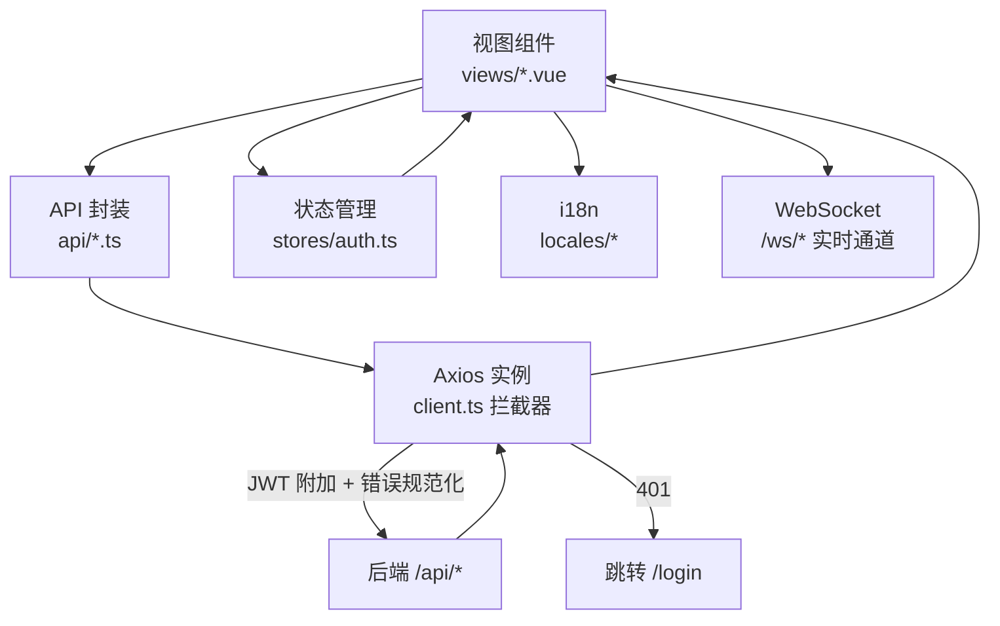
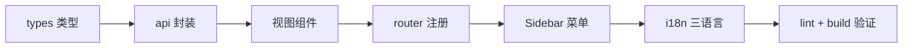

# 04 · 前端开发指南

> FlamePanel 前端（Vue 3 + TypeScript + Element Plus）开发规范与实践

## 1. 技术栈

| 依赖 | 版本 | 用途 |
|------|------|------|
| Vue | ^3.5 | 框架 |
| TypeScript | ^6.0 | 类型系统 |
| Element Plus | ^2.9 | UI 组件库（按需引入） |
| Pinia | ^3.0 | 状态管理 |
| Vue Router | ^5.0 | 路由 |
| vue-i18n | ^10.0 | 国际化（zh-CN/en-US/ja-JP） |
| Axios | ^1.8 | HTTP 客户端 |
| ECharts | ^6.1 | 仪表盘图表（按需引入） |
| xterm.js | ^5.5 | Web 终端 |
| Vite | ^8.0 | 构建工具 |

## 2. 工程结构

```
frontend/
├── index.html
├── vite.config.ts          # 构建 + 开发代理
├── package.json
├── eslint.config.mjs       # ESLint 9 扁平配置
├── src/
│   ├── main.ts             # 入口（Pinia + Router + i18n）
│   ├── App.vue
│   ├── style.css           # CSS 变量令牌体系
│   ├── api/                # 后端 API 封装（每模块一个文件）
│   │   ├── client.ts       # Axios 实例 + 拦截器
│   │   ├── auth.ts / users.ts / nodes.ts / websites.ts / docker.ts
│   │   ├── plugins.ts / webServers.ts / appStore.ts / databases.ts
│   │   ├── files.ts / firewall.ts / settings.ts / logs.ts
│   ├── components/         # Layout.vue / Sidebar.vue / TopBar.vue
│   ├── stores/             # auth.ts（Pinia）
│   ├── router/             # index.ts（18 条路由）
│   ├── locales/            # zh-CN.ts / en-US.ts / ja-JP.ts
│   ├── types/              # index.ts（与后端实体对齐的接口）
│   ├── utils/              # error.ts（错误提示）
│   └── views/              # 17 个视图页面
```

## 3. 开发环境

### 3.1 启动

```bash
cd frontend
npm install
npm run dev      # http://localhost:5173
```

### 3.2 Vite 代理（vite.config.ts）

```ts
server: {
  port: 5173,
  proxy: {
    '/api': { target: 'http://localhost:8080', changeOrigin: true },
    '/ws':  { target: 'http://localhost:8080', ws: true }
  }
}
```

### 3.3 常用脚本

| 命令 | 说明 |
|------|------|
| `npm run dev` | 开发服务器 |
| `npm run build` | 类型检查 + 构建（vue-tsc --noEmit && vite build） |
| `npm run preview` | 预览构建产物 |
| `npm run lint` | ESLint 检查 |
| `npm run format` | Prettier 格式化 |

## 4. 页面与路由

| 路由 | 视图 | 说明 |
|------|------|------|
| `/login` | LoginView | 登录 |
| `/dashboard` | DashboardView | 仪表盘（ECharts 指标） |
| `/users` | UsersView | 用户管理 |
| `/nodes` | NodesView | 节点管理 |
| `/files` | FilesView | 文件管理 |
| `/databases` | DatabasesView | 数据库管理 |
| `/websites` | WebsitesView | 网站管理（引擎切换） |
| `/docker` | DockerView | Docker 容器管理 |
| `/plugins` | PluginsView | WASM 插件管理 |
| `/app-store` | AppStoreView | 应用商店 |
| `/operation-logs` | OperationLogsView | 操作审计日志 |
| `/system-logs` | SystemLogsView | 系统日志 |
| `/settings` | SettingsView | 面板设置 |
| `/firewall` | FirewallView | 防火墙管理 |
| `/web-servers` | WebServersView | Web 服务器（预设/引擎切换） |
| `/terminal` | TerminalView | Web 终端 |
| `/health` | HealthView | 健康检查 |

路由守卫：非登录状态下访问任意页面重定向到 `/login`（见 `router/index.ts` 的 `beforeEach`）。

### 4.1 前端数据流



### 4.2 新增页面流程



## 5. API 封装规范

### 5.1 基础客户端（client.ts）

```ts
const api = axios.create({ baseURL: '/api', timeout: 15000 })

// 请求拦截：自动附加 JWT
api.interceptors.request.use((config) => {
  const token = localStorage.getItem('token')
  if (token) config.headers.Authorization = `Bearer ${token}`
  return config
})

// 响应拦截：401 跳登录 + 错误规范化
api.interceptors.response.use(
  (res) => res,
  (err) => {
    if (err.response?.status === 401) { /* 清除 token，跳转 /login */ }
    // 将后端 {code, error, message} 规范化为 {code, message, status}
  },
)
```

### 5.2 新增 API 模块模板

```ts
// api/xxx.ts
import api from './client'
import type { XxxItem, PaginatedResponse } from '@/types'

export function listXxx(params: { page?: number; page_size?: number } = {}) {
  return api.get<PaginatedResponse<XxxItem>>('/xxx', { params })
}

export function createXxx(data: Partial<XxxItem>) {
  return api.post<XxxItem>('/xxx', data)
}
```

> 所有列表接口使用统一 `PaginatedResponse<T>` 泛型。

### 5.3 分页类型

```ts
export interface PaginatedResponse<T> {
  data: T[]
  page: number
  page_size: number
  total: number
  total_pages: number
}
```

## 6. 错误处理规范

### 6.1 后端错误码

后端 8 个稳定错误码，前端在 `locales/*` 的 `common.error` 下提供文案：

```ts
// locales/zh-CN.ts
common: {
  error: {
    AUTH_UNAUTHORIZED: '未登录或登录已过期',
    AUTH_FORBIDDEN: '没有操作权限',
    NOT_FOUND: '资源不存在',
    BAD_REQUEST: '请求参数错误',
    VALIDATION_ERROR: '参数校验失败',
    CONFLICT: '资源冲突',
    SERVICE_UNAVAILABLE: '服务暂不可用',
    INTERNAL_ERROR: '服务器内部错误',
  }
}
```

### 6.2 使用错误提示工具

```ts
import { getErrorMessage } from '@/utils/error'

try {
  await listUsers()
} catch (e) {
  ElMessage.error(getErrorMessage(e, '加载用户失败'))
}
```

`getErrorMessage` 优先按错误码查 i18n 文案，再回退后端 `message`。

## 7. 国际化（i18n）

- 语言文件：`src/locales/{zh-CN,en-US,ja-JP}.ts`
- 当前语言由 `stores/auth` 或 `panel_settings.language` 控制，`TopBar` 提供切换器。
- 新增文案时需同时维护三种语言文件。
- 切换语言后前端实时更新（`vue-i18n` 的 `locale` 响应式）。

## 8. 主题与样式

- `style.css` 定义 CSS 变量令牌体系：品牌色、间距、圆角、阴影、焦点环、减弱动效。
- 暗色主题跟随系统或手动切换，Element Plus 暗色变量全覆盖。
- **规范**：不使用内联 `style=""`，统一收敛为 CSS 工具类。

## 9. 性能优化实践

- **按需加载 Element Plus**：`unplugin-auto-import` + `unplugin-vue-components` 自动引入，主包 231KB。
- **ECharts 按需引入**：`echarts/core` + 仅注册用到的图表，图表包 505KB。
- **路由懒加载**：所有视图 `() => import('@/views/XxxView.vue')`。
- **构建检查**：`vue-tsc --noEmit` 保证类型正确（不向 src 输出残留 js）。

## 10. 新增页面的完整流程

1. **API 封装**：`api/xxx.ts` 调用后端接口，`types/index.ts` 定义接口类型。
2. **视图组件**：`views/XxxView.vue`（列表 + 分页 + 编辑对话框 + i18n）。
3. **路由注册**：`router/index.ts` 添加子路由。
4. **侧边栏**：`components/Sidebar.vue` 添加菜单项。
5. **i18n**：三种语言文件补充菜单与文案。
6. **验证**：`npm run lint` + `npm run build`。

## 11. 与后端联调要点

- 开发时后端 `cargo run`（:8080），前端 `npm run dev`（:5173），Vite 代理自动转发。
- 所有接口需带 `Authorization: Bearer <token>`（拦截器自动处理）。
- 新端点需确认后端 `route_permission()` 已配置权限，否则返回 403。
- WebSocket 无需认证，直接连接 `/ws/*`。
