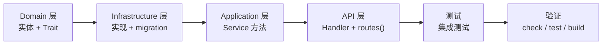

# 05 · 后端开发指南

> FlamePanel Rust 后端（Axum + Clean Architecture）开发规范与实践

## 1. 技术栈

| 依赖 | 版本 | 用途 |
|------|------|------|
| tokio | 1.34+ | 异步运行时 |
| axum | 0.6 | Web 框架（含 ws） |
| sqlx | 0.9 | SQLite 数据库 |
| jsonwebtoken | 9 | JWT 签发/校验 |
| bcrypt | 0.15 | 密码哈希 |
| bollard | 0.18 | Docker API 客户端 |
| wasmtime | 29 | WASM 沙箱 |
| sysinfo | 0.39 | 系统指标采集 |
| tracing / tracing-subscriber | — | 日志 |
| lettre | 0.11 | SMTP 邮件通知 |
| thiserror | 1.0 | 错误定义 |

## 2. 环境准备

```bash
# 依赖（参考 cnb-dev-setup.sh）
rustup toolchain install stable    # ≥ 1.85
cargo install cargo-watch          # 可选，热重载

# 运行后端（默认 0.0.0.0:8080，InMemory）
cd flame-kernel
cargo run

# 使用 SQLite 持久化
OP_DATABASE_URL="sqlite://data/app.db" cargo run
```

## 3. 代码组织

```
flame-kernel/src/
├── main.rs               # 入口：加载配置 → 选择仓库工厂 → 启动
├── lib.rs                # FlameKernel：组合根 + build_services + run()
├── config/               # AppConfig（TOML + 环境变量覆盖）
├── core/                 # AppError + ErrorCode 统一错误
├── domain/               # 实体 + Repository trait + 种子数据
├── application/          # Service 层 + app_store_service
├── infrastructure/       # 仓库实现 + docker + os + metrics + factory
├── api/                  # handler/* + 中间件 + 提取器 + 路由组合根
├── plugin/               # WASM 沙箱 + 注册表
├── webserver/            # 5 引擎 + 性能预设 + 原生控制（native.rs）
├── database/             # MySQL/Redis 原生管理
├── firewall/             # 防火墙管理器
├── terminal/             # Web 终端
├── event/                # 事件总线 + 通知
├── resilience/           # 熔断 + 重试
├── file/                 # 文件服务
├── notification/         # 邮件通知
└── utils/                # JWT / bcrypt / 校验
```

## 4. 分层开发流程

### 4.1 新增功能标准流程



**Step 1：Domain 层**
- `domain/entity.rs` — 添加实体 struct（`#[derive(Debug, Clone, Serialize, Deserialize, FromRow)]`）
- `domain/repository.rs` — 添加 `#[async_trait]` Repository trait

**Step 2：Infrastructure 层**
- `infrastructure/db.rs` — InMemory 实现（`InMemoryXxxRepository`）
- `infrastructure/sqlite.rs` — SQLite 实现（`SqliteXxxRepository`）+ `run_migrations()` 建表
- `infrastructure/factory.rs` — 工厂方法 `create_xxx_repo()`

**Step 3：Application 层**
- `application/service.rs` — 添加 `XxxService` 结构体和方法（或新 Service 文件）

**Step 4：API 层**
- `api/handler/xxx/mod.rs` — Handler 函数 + `pub fn routes() -> Router<AppState>`
- `api/types.rs` — 更新 `AppState` / `Services` + 请求/响应类型 + `route_permission()` 映射
- `api/routes.rs` — `.merge(handler::xxx::routes())`
- 请求体使用 `ApiJson<T>` 提取器

**Step 5：测试**
- `tests/integration_test.rs` — 集成测试

**Step 6：验证**
```bash
cargo check              # 零错误零警告
cargo test               # 全部通过
cargo build              # 编译成功
```

### 4.2 命名规范

| 层面 | 命名 | 示例 |
|------|------|------|
| Entity | 名词 | `User`, `FirewallRule` |
| Repository trait | `{Entity}Repository` | `UserRepository` |
| InMemory 实现 | `InMemory{Entity}Repository` | `InMemoryUserRepository` |
| SQLite 实现 | `Sqlite{Entity}Repository` | `SqliteUserRepository` |
| Service | `{Entity}Service` | `UserService` |
| Handler 函数 | 动词 | `list`, `create`, `get`, `update`, `delete` |
| Handler 模块 | `handler/{entity}/mod.rs` | `handler/user/mod.rs` |

## 5. 组合根（Composition Root）

所有服务在 `FlameKernel::build_services(factory)` 中组装为 `Services` 聚合，再注入 `AppState`：

```rust
// lib.rs 伪代码
fn build_services(factory: &RepoFactory) -> Services {
    let user_repo = factory.create_user_repo();
    let user_service = Arc::new(UserService::new(user_repo));
    // ... 其他服务
    Services { user_service, /* ... */ }
}
```

**规范**：
- 中间件 / Handler 一律经 Service 方法访问数据，严禁直接访问仓库。
- `AppState` 是 `#[derive(Clone)]`，通过 `Arc<T>` 共享服务。

## 6. 错误处理规范

### 6.1 统一错误类型

`core/error.rs` 定义 `AppError` 与 `ErrorCode`：

| ErrorCode | HTTP | 使用场景 |
|-----------|------|----------|
| AUTH_UNAUTHORIZED | 401 | 未登录/令牌无效/密码错误 |
| AUTH_FORBIDDEN | 403 | RBAC 拒绝 |
| NOT_FOUND | 404 | 资源/路由不存在 |
| BAD_REQUEST | 400 | 参数错误/JSON 解析失败 |
| VALIDATION_ERROR | 400 | 业务校验失败 |
| CONFLICT | 409 | 资源冲突 |
| SERVICE_UNAVAILABLE | 503 | 依赖不可用 |
| INTERNAL_ERROR | 500 | 内部错误 |

### 6.2 使用规则

```rust
// 内部错误（保留错误链，5xx 自动 tracing::error 记录）
AppError::internal("上下文")
AppError::internal_with_source("上下文", err)

// 业务错误
AppError::NotFound("User not found")
AppError::Conflict("Username already exists")
AppError::Unauthorized("Invalid credentials")
```

**注意**：5xx 错误完整错误链只记录日志，不泄露客户端。

### 6.3 ApiJson 提取器

```rust
// api/extract.rs 提供 ApiJson<T>，JSON 解析失败统一返回 BAD_REQUEST
pub async fn create(
    State(state): State<AppState>,
    ApiJson(payload): ApiJson<CreateUserRequest>,
) -> Result<Json<User>, AppError> { ... }
```

## 7. 路由与权限

### 7.1 路由注册

每个 handler 模块的 `routes()` 返回 `Router<AppState>`，由 `api/routes.rs` 组合根 merge：

```rust
pub fn create_router(state: AppState) -> Router {
    Router::new()
        .route("/health", get(|| async { "OK" }))
        .merge(auth::routes())
        .merge(user::routes())
        // ... 所有模块
        .fallback(fallback_handler)   // 未知路由 JSON 404
        .with_state(state)
}
```

### 7.2 权限映射

`api/types.rs` 的 `route_permission(method, path)` 返回 `Option<(&'static str, &'static str)>`：

```rust
fn route_permission(method: &Method, path: &str) -> Option<(&'static str, &'static str)> {
    match (method.as_str(), path) {
        ("GET", "/api/users") => Some(("user", "read")),
        ("POST", "/api/users") => Some(("user", "create")),
        // ... 149 路由 / 64 权限组合
    }
}
```

新增端点必须补充权限映射，否则返回 403。

### 7.3 中间件

`api/middleware.rs` 的 `auth_middleware` 完成：
1. 白名单判断（`/health`、`/api/auth/login`、`/ws/*` 放行）
2. 解析 `Authorization: Bearer <token>`，JWT 校验
3. 一次查库获取用户
4. `route_permission()` 匹配 RBAC 校验
5. 注入 `UserId` 扩展

## 8. 分页实现

`api/types.rs` 提供统一分页：

```rust
#[derive(Debug, Deserialize)]
pub struct PaginationParams { pub page: Option<i64>, pub page_size: Option<i64> }

#[derive(Debug, Serialize)]
pub struct PaginatedResponse<T: Serialize> {
    pub data: Vec<T>, pub page: i64, pub page_size: i64, pub total: i64, pub total_pages: i64,
}
```

Service 中用法：

```rust
pub async fn list_users_paginated(&self, params: &PaginationParams) -> Result<PaginatedResponse<User>, AppError> {
    let all = self.repo.list().await?;
    let data = paginate_slice(&all, params);   // 工具函数
    Ok(PaginatedResponse::new(data, all.len() as i64, params))
}
```

## 9. 数据访问

### 9.1 Repository trait 模式

```rust
#[async_trait]
pub trait UserRepository: Send + Sync {
    async fn find_by_id(&self, id: i64) -> Result<Option<User>, AppError>;
    async fn create(&self, username: &str, password_hash: &str, role: &str) -> Result<User, AppError>;
    // ...
}
```

### 9.2 InMemory 与 SQLite 双实现

- InMemory：`infrastructure/db.rs`，用 `Mutex<Vec<T>>` 或 HashMap 存储，适合测试。
- SQLite：`infrastructure/sqlite.rs`，用 sqlx query。
- 工厂：`infrastructure/factory.rs` 根据配置选择实现。

### 9.3 SQLite 连接与迁移

```rust
// infrastructure/sqlite.rs
pub async fn new_pool(url: &str) -> Result<SqlitePool, AppError> {
    let pool = SqlitePool::connect(url).await?;
    run_migrations(&pool).await?;   // 自动建表
    Ok(pool)
}
```

## 10. 测试

### 10.1 测试结构

- 单元测试：各模块 `#[cfg(test)] mod tests`（64 个）
- 集成测试：`tests/integration_test.rs`（98 个）

### 10.2 运行

```bash
cargo test                     # 全部
cargo test -- --nocapture      # 显示输出
cargo test test_name           # 单测
```

### 10.3 集成测试要点

- 使用 `axum-test` 或 `axum::Server` 启动应用。
- 默认 InMemory 仓库，无需真实数据库。
- 测试认证：先登录拿 token，再带 `Authorization` 头请求。

## 11. 构建与发布

### 11.1 编译优化

`Cargo.toml` 的 release profile 已优化（约 18MB stripped）：

```toml
[profile.release]
opt-level = 3
lto = "fat"
codegen-units = 1
panic = "abort"
strip = "symbols"
```

### 11.2 构建

```bash
cargo build --release --package flame-kernel
# 产物：flame-kernel/target/release/flame-kernel
```

### 11.3 代码质量

```bash
cargo check                    # 零警告
cargo clippy -- -D warnings    # lint（just lint）
cargo fmt --check              # 格式化
```

## 12. 常用命令（justfile）

| 命令 | 说明 |
|------|------|
| `just dev` | 后端热重载 |
| `just build` | 完整构建 |
| `just test` | 后端测试 |
| `just check` | 后端 check + 前端 typecheck |
| `just lint` | 前端 ESLint + Clippy |
| `just clean` | 清理构建产物 |

## 13. 常见坑

1. **新端点 403**：忘记在 `route_permission()` 添加权限映射。
2. **JSON 解析 400**：请求体字段与 `Deserialize` 结构不匹配（用 `ApiJson` 而不是 axum 默认 `Json` 提取更友好的错误）。
3. **SQLite 缺列**：新增实体字段时同步更新 `sqlite.rs` 的 SELECT/INSERT 语句与 migration。
4. **InMemory 数据丢失**：重启即清空，需要持久化时配置 SQLite URL。
5. **绕过 Service 访问仓库**：架构规范禁止，中间件/Handler 只能经 Service。

## 14. 事件与 Agent 开发指引

### 14.1 发布领域事件

事件总线已就绪但业务侧尚未接入（见 [12-事件与通知系统.md](./12-事件与通知系统.md)）。接入步骤：

1. `domain/entity.rs` 的 `DomainEvent` 枚举新增变体。
2. Service 构造函数注入 `Arc<EventBus>`（或经 `Services` 聚合传递）。
3. 业务成功后 `event_bus.publish(event).await?`。
4. `event/handler.rs` 增加 `match` 分支消费（通知/审计）。

### 14.2 调用远程 Agent

面板侧调用节点 Agent（见 [11-Agent节点通信协议.md](./11-Agent节点通信协议.md)）：

```rust
// 建议在 Service 中封装（伪代码）
let url = format!("http://{}:{}/exec", node.host, node.agent_port);
let client = reqwest::Client::new();
let resp = client.post(url)
    .header("Authorization", &node.auth_token)
    .json(&ExecRequest { command, timeout_secs })
    .timeout(Duration::from_secs(35))
    .send().await?;
```

- 远程调用必须包裹 `resilience` 的重试 + 熔断。
- 节点 `auth_token` 需持久化到 `nodes` 表（当前缺失，见 [13-开发路线图与后续规划.md](./13-开发路线图与后续规划.md) P0）。
