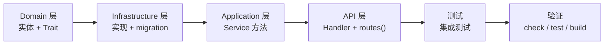

# 05 · 后端开发指南

> FlamePanel Rust 后端（Axum + Clean Architecture）开发规范与实践

## 1. 技术栈

| 依赖 | 版本 | 用途 |
|------|------|------|
| tokio | 1.34+ | 异步运行时 |
| axum | 0.8 | Web 框架（含 ws） |
| sqlx | 0.9 | SQLite 数据库（feature `sqlite`） |
| jsonwebtoken | 9 | JWT 签发/校验 |
| bcrypt | 0.15 | 密码哈希 |
| bollard | 0.18 | Docker API 客户端（feature `docker`） |
| wasmtime | 46 | WASM 沙箱（feature `wasm`；Stage3.5 升级修复安全漏洞） |
| sysinfo | 0.39 | 系统指标采集 |
| tracing / tracing-subscriber | — | 日志 |
| lettre | 0.11 | SMTP 邮件通知（feature `email`） |
| thiserror | 1.0 | 错误定义 |
| utoipa | 5 | OpenAPI 文档生成（Stage3.3） |

> **Feature Flags（Stage3.1）**：`sqlite`/`docker`/`wasm`/`email` 均为可选，`default = ["sqlite", "docker", "wasm", "email"]`（保持全功能）。
> 裁剪时用 `--no-default-features --features sqlite` 等组合；无 `sqlite` 时回落 in-memory 后端，无 `docker` 时回落 InMemory Docker 模拟，无 `wasm` 时插件仅管理元数据，无 `email` 时事件通知降级为日志。
> **安全审计（Stage3.5）**：CI 执行 `cargo audit`，发现漏洞即阻断；本地可用 `cargo install cargo-audit && cargo audit`。

## 2. 环境准备

```bash
# 依赖（参考 cnb-dev-setup.sh）
rustup toolchain install stable    # ≥ 1.85
cargo install cargo-watch          # 可选，热重载

# 运行后端（默认 0.0.0.0:8080，InMemory）
cd flame-kernel
cargo run

# 使用 SQLite 持久化
OP_DATABASE_URL="sqlite://data/app.db" cargo run
```

## 3. 代码组织

```
flame-kernel/src/
├── main.rs               # 入口：加载配置 → 选择仓库工厂 → 启动
├── lib.rs                # FlameKernel：组合根 + build_services + run()
├── config/               # AppConfig（TOML + 环境变量覆盖；含 mysql/redis 配置路径、限流阈值）
├── core/                 # AppError + ErrorCode 统一错误（10 码）
├── domain/               # 实体 + Repository trait + 领域端口（execution_mode）+ 种子数据
├── application/          # Service 层（每域一文件，见下）+ app_store_ports
├── infrastructure/       # 仓库实现 + docker + os + metrics + factory + firewall
├── api/                  # handler/* + 中间件 + 提取器 + 路由组合根 + types/dto/permissions 拆分
├── plugin/               # WASM 沙箱 + 注册表
├── webserver/            # 5 引擎 + 性能预设 + 原生控制（native.rs）
├── database/             # MySQL/Redis 原生管理
├── firewall/             # 防火墙管理器（FirewallManager 下沉基础设施）
├── terminal/             # Web 终端
├── event/                # 事件总线 + Outbox 落库重试 + 通知
├── resilience/           # 熔断 + 重试
├── file/                 # 文件服务
├── notification/         # 邮件通知
└── utils/                # JWT / bcrypt / AuthCache / 校验

#### application/（Service 每域一文件，T8 拆分）

```
user_service.rs  node_service.rs  website_service.rs  docker_service.rs  role_service.rs
web_server_service.rs  settings_service.rs  database_service.rs  firewall_service.rs
scheduled_task_service.rs  task_service.rs  app_store_service.rs  backup_service.rs
misc_service.rs（Memo/OperationLog/Outbox/Log 小服务合并）  service.rs（兼容再导出层）
app_store_ports.rs（DefaultAppStorePorts 聚合端口，T12）  execution_mode.rs（领域端口兼容再导出，T11）
```

#### api/（types 上帝文件拆分，T9）

```
app_state.rs（AppState + Services + 请求上下文 UserId/Username）  dto.rs  permissions.rs（ROUTE_PERMISSIONS）
pagination.rs  types.rs（20 行纯再导出兼容层）  handler/{22 域}/  middleware.rs  extract.rs  routes.rs
```

## 4. 分层开发流程

### 4.1 新增功能标准流程



**Step 1：Domain 层**
- `domain/entity.rs` — 添加实体 struct（`#[derive(Debug, Clone, Serialize, Deserialize)]`；**禁止 FromRow**，持久化行模型放 `infrastructure/db_models.rs`）；领域行为写成实体方法，返回 `Result<_, DomainError>`
- `domain/repository.rs` — 添加 `#[async_trait]` Repository trait（端口，按职责拆分，避免 God Repository）
- 新增业务错误时扩展 `domain/error.rs` 的 `DomainError`

**Step 2：Infrastructure 层**
- `infrastructure/db_models.rs` — 添加 `#[derive(sqlx::FromRow)] XxxRow` + `From<XxxRow> for Xxx` 映射
- `infrastructure/db.rs` — InMemory 实现（`InMemoryXxxRepository`）
- `infrastructure/sqlite.rs` — SQLite 实现（`SqliteXxxRepository`）+ `run_migrations()` 建表；`query_as::<_, XxxRow>` 后 `.map(Xxx::from)`
- `infrastructure/factory.rs` — 工厂方法 `create_xxx_repo()`

**Step 3：Application 层**
- `application/service.rs` — 添加 `XxxService` 结构体和方法（或新 Service 文件），**只依赖 `Arc<dyn Trait>` 端口**
- 若涉及应用商店等外部能力，先在 `application/app_store_ports.rs`（或其他端口模块）定义端口 trait，再在 infrastructure 实现

**Step 4：API 层**
- `api/handler/xxx/mod.rs` — Handler 函数 + `pub fn routes() -> Router<AppState>`
- 请求/响应类型放 `api/dto.rs`；`AppState` / `Services` 更新在 `api/app_state.rs`；新增受保护路由需在 `api/permissions.rs` 的 `ROUTE_PERMISSIONS` 声明权限（Stage 5：未声明即默认 403，并有 `permission_table_covers_all_routes` 测试兜底）；兼容再导出 `api/types.rs`
- `api/routes.rs` — `.merge(handler::xxx::routes())`
- 请求体使用 `ApiJson<T>` 提取器
- OpenAPI：新端点补充 `#[utoipa::path]` 注解（operation_id 唯一，供前端 `openapi-typescript` 生成类型，F4.1）

**Step 5：测试**
- `tests/integration_test.rs` — 集成测试；Service 单测覆盖领域分支

**Step 6：验证**
```bash
cargo check              # 零错误零警告
cargo test               # 全部通过
cargo clippy --all-targets -- -D warnings
cargo fmt -- --check
cargo build              # 编译成功
```

### 4.2 命名规范

| 层面 | 命名 | 示例 |
|------|------|------|
| Entity | 名词 | `User`, `FirewallRule` |
| Repository trait | `{Entity}Repository` | `UserRepository` |
| InMemory 实现 | `InMemory{Entity}Repository` | `InMemoryUserRepository` |
| SQLite 实现 | `Sqlite{Entity}Repository` | `SqliteUserRepository` |
| Service | `{Entity}Service` | `UserService` |
| Handler 函数 | 动词 | `list`, `create`, `get`, `update`, `delete` |
| Handler 模块 | `handler/{entity}/mod.rs` | `handler/user/mod.rs` |

## 5. 组合根（Composition Root）

所有服务在 `FlameKernel::build_services(factory)` 中组装为 `Services` 聚合，再注入 `AppState`：

```rust
// lib.rs 伪代码
fn build_services(factory: &RepoFactory) -> Services {
    let user_repo = factory.create_user_repo();
    let user_service = Arc::new(UserService::new(user_repo));
    // ... 其他服务
    Services { user_service, /* ... */ }
}
```

**规范**：
- 中间件 / Handler 一律经 Service 方法访问数据，严禁直接访问仓库。
- `AppState` 是 `#[derive(Clone)]`，通过 `Arc<T>` 共享服务。

## 6. 错误处理规范

### 6.1 统一错误类型

`core/error.rs` 定义 `AppError` 与 `ErrorCode`；`domain/error.rs` 定义纯业务 `DomainError`（不依赖 axum）。

| ErrorCode | HTTP | 使用场景 |
|-----------|------|----------|
| AUTH_UNAUTHORIZED | 401 | 未登录/令牌无效/密码错误 |
| AUTH_FORBIDDEN | 403 | RBAC 拒绝 / 未声明权限路径默认拒绝 |
| PASSWORD_CHANGE_REQUIRED | 403 | 首次登录需改密 |
| NOT_FOUND | 404 | 资源/路由不存在（sqlx RowNotFound 映射） |
| BAD_REQUEST | 400 | 参数错误/JSON 解析失败 |
| VALIDATION_ERROR | 400 | 业务校验失败 |
| CONFLICT | 409 | 资源冲突 / 唯一约束冲突 |
| RATE_LIMITED | 429 | 限流（登录 5/min、普通 API 120/min、health 600/min） |
| SERVICE_UNAVAILABLE | 503 | 依赖不可用 |
| INTERNAL_ERROR | 500 | 内部错误 |

**DomainError ↔ AppError**：领域层返回 `Result<_, DomainError>`，经 `impl From<DomainError> for AppError` 自动映射（NotFound→404 / Validation→400 / Conflict→409 / Forbidden→403 / RuleViolation→400），对外 JSON 格式 `{code, error, message}` 保持不变。

### 6.2 使用规则

```rust
// 内部错误（保留错误链，5xx 自动 tracing::error 记录）
AppError::internal("上下文")
AppError::internal_with_source("上下文", err)

// 业务错误
AppError::NotFound("User not found")
AppError::Conflict("Username already exists")
AppError::Unauthorized("Invalid credentials")

// 领域层：纯业务错误（不依赖 axum），由 AppError 自动映射
use crate::domain::error::DomainError;
DomainError::not_found("User not found")
DomainError::validation("用户名格式不正确")
```

**注意**：5xx 错误完整错误链只记录日志，不泄露客户端。

### 6.3 ApiJson 提取器

```rust
// api/extract.rs 提供 ApiJson<T>，JSON 解析失败统一返回 BAD_REQUEST
pub async fn create(
    State(state): State<AppState>,
    ApiJson(payload): ApiJson<CreateUserRequest>,
) -> Result<Json<User>, AppError> { ... }
```

## 7. 路由与权限

### 7.1 路由注册

每个 handler 模块的 `routes()` 返回 `Router<AppState>`，由 `api/routes.rs` 组合根 merge：

```rust
pub fn create_router(state: AppState) -> Router {
    Router::new()
        .route("/health", get(|| async { "OK" }))
        .merge(auth::routes())
        .merge(user::routes())
        // ... 所有模块
        .fallback(fallback_handler)   // 未知路由 JSON 404
        .with_state(state)
}
```

### 7.2 权限映射（Stage3.4 声明式，T9 后位于 `api/permissions.rs`）

`api/permissions.rs` 的 `route_permission(method, path)` 返回 `Option<(&'static str, &'static str)>`，基于声明式常量表 `ROUTE_PERMISSIONS: &[PermissionRule]`（顺序敏感，首个命中生效）：

```rust
pub static ROUTE_PERMISSIONS: &[PermissionRule] = &[
    PermissionRule::exact("GET", "/api/users", "user", "read"),
    PermissionRule::exact("POST", "/api/users", "user", "create"),
    PermissionRule::prefix("PUT", "/api/users/", "user", "update"),
    PermissionRule::pre_suf("POST", "/api/plugins/", "/execute/", "plugin", "execute"),
    // ... 全部 179 路由 / 73 权限组合
];
```

`PermissionRule` 支持匹配组合：`exact` / `prefix` / `suffix` / `pre_suf`（前缀+后缀）/ `pre_contains` / `pre_not_contains` / `pre_not_suffix` / `pre_has_not_suf` / `contains` / `contains_not`（均为 const 构造器）。**新增端点必须在此表登记权限，否则返回 403。**

> 历史顺序 bug 已在声明化时修正：app-store install/uninstall 不再被 database 全局后缀规则抢先；scheduled-task toggle 不再被 firewall 规则抢先；database uninstall 正确映射为 delete。

### 7.3 OpenAPI 文档（Stage3.3）

- `GET /api/openapi.json` 返回 OpenAPI 3.1 文档（免认证），由 `openapi.rs` 的 `ApiDoc` 编译期生成。
- 新增端点时同步：handler 加 `#[utoipa::path(...)]`，DTO 加 `#[derive(ToSchema)]`，并在 `openapi.rs` 的 `paths(...)` / `components(schemas(...))` 登记。
- 泛型分页响应 `PaginatedResponse<T>` 已实现 `ToSchema`，可直接作为 `body = PaginatedResponse<Xxx>` 引用。

### 7.4 中间件

`api/middleware.rs` 的 `auth_middleware` 完成：
1. 白名单判断（`/health`、`/api/auth/login`、`/ws/*` 放行）
2. 解析 `Authorization: Bearer <token>`，JWT 校验
3. 一次查库获取用户
4. `route_permission()` 匹配 RBAC 校验
5. 注入 `UserId` 扩展 + `auth` span（`user_id` / `username`）

> **Stage 5（A2）默认拒绝**：RBAC 分支为三态——已声明 → 校验；auth-only 白名单
> （`/api/auth/me`、`/api/auth/change-password`、`/api/auth/logout`，及历史语义的
> `GET /api/databases/{id}` / `GET /api/databases/{id}/databases`）→ 放行；其余未声明
> 受保护路径 → **403**。新增端点若未在 `ROUTE_PERMISSIONS` 登记权限（也不属于 auth-only），
> 将默认被拒绝。可用 `permission_table_covers_all_routes` 单测核对路由是否漏声明。

最外层 `runtime/request_id.rs` 的 `request_id_middleware`：

- 生成/沿用 `x-request-id`（反向代理链路上游 ID 优先），写回响应头；
- 开启 `http_request` span（字段 `request_id`/`method`/`uri`），同一请求日志可串联；
- 审计写操作（`audit_write`）继承 `request_id`，异步落库不阻塞响应。

## 8. 分页实现

`api/pagination.rs`（T9 拆分后）提供统一分页，`api/types.rs` 经再导出兼容：

```rust
#[derive(Debug, Deserialize)]
pub struct PaginationParams { pub page: Option<i64>, pub page_size: Option<i64> }

#[derive(Debug, Serialize)]
pub struct PaginatedResponse<T: Serialize> {
    pub data: Vec<T>, pub page: i64, pub page_size: i64, pub total: i64, pub total_pages: i64,
}
```

**分页下沉（Stage1 起强制，T15 删除 `paginate_slice`）**：大数据量表（`operation_logs` / `logs` / `scheduled_tasks` 等）的 Repository trait 必须提供 `list_page(limit, offset)` 与 `count()`（SQL 层直接 `LIMIT/OFFSET`），Service 调用它们组装 `PaginatedResponse`。`paginate_slice` 已作为死代码移除，**一律走分页下沉，禁止**先 `list_all` 再内存切片。

```rust
// domain/repository.rs
#[async_trait]
pub trait OperationLogRepository: Send + Sync {
    // ...
    async fn list_page(&self, limit: i64, offset: i64, action_prefix: Option<&str>) -> Result<Vec<OperationLog>, AppError>;
    async fn count(&self, action_prefix: Option<&str>) -> Result<i64, AppError>;
}

// application/service.rs
pub async fn list_paginated(&self, params: &PaginationParams, action_filter: Option<&str>) -> Result<PaginatedResponse<OperationLog>, AppError> {
    let prefix = action_filter.filter(|s| !s.is_empty());
    let total = self.log_repo.count(prefix.as_deref()).await?;
    let data = self.log_repo.list_page(params.page_size(), params.offset(), prefix.as_deref()).await?;
    Ok(PaginatedResponse::new(data, total, params))
}
```

**所有列表**（含 users / nodes / websites / settings 等小表）一律走 `list_page`/`count` 分页下沉（T15 已删除 `paginate_slice`，保证 O(page) 而非 O(n)）。

## 9. 数据访问

### 9.1 Repository trait 模式

```rust
#[async_trait]
pub trait UserRepository: Send + Sync {
    async fn find_by_id(&self, id: i64) -> Result<Option<User>, AppError>;
    async fn create(&self, username: &str, password_hash: &str, role: &str) -> Result<User, AppError>;
    // ...
}
```

### 9.2 InMemory 与 SQLite 双实现

- InMemory：`infrastructure/db.rs`，用 `Mutex<Vec<T>>` 或 HashMap 存储，适合测试。
- SQLite：`infrastructure/sqlite.rs`，用 sqlx query。
- 工厂：`infrastructure/factory.rs` 根据配置选择实现。

### 9.3 SQLite 连接与迁移

```rust
// infrastructure/sqlite.rs
pub async fn new_pool(url: &str) -> Result<SqlitePool, AppError> {
    let pool = SqlitePool::connect(url).await?;
    configure_sqlite_pragmas(&pool).await?;  // WAL + busy_timeout=5000 + synchronous=NORMAL
    run_migrations(&pool).await?;            // 自动建表
    Ok(pool)
}
```

> **SQLite 运行时加固（Stage0.5）**：`configure_sqlite_pragmas` 会设置
> `PRAGMA journal_mode=WAL`、`busy_timeout=5000`、`synchronous=NORMAL`，
> 减少并发写锁冲突（`database is locked`）并提升崩溃恢复能力。

## 9.4 安全基线（Stage0）

| 主题 | 规则 |
|------|------|
| 非 root | 默认以 `flamepanel` 系统用户运行（systemd `User=`）；特权操作经受控 `sudo -n` 白名单 |
| 文件沙箱 | 所有文件 API 路径解析后必须落在 `OP_FILE_ROOT` 内；拒绝 `..` 穿越与白名单外符号链接 |
| 终端沙箱 | 会话强制 `cwd` 为 `OP_TERMINAL_CWD`（须在 `OP_FILE_ROOT` 内），并清理 `LD_PRELOAD` 等环境变量 |
| JWT | `OP_JWT_SECRET` 必须 ≥ 32 字节否则拒绝启动；Access（15min）+ Refresh（24h）双令牌；Refresh 接口仅接受 refresh token |
| WASM | 每个插件执行设内存上限（`memory_limit_bytes`）+ fuel/timeout；安装/恢复强制校验 `wasm_hash` |
| SQLite | WAL + busy_timeout=5000 + synchronous=NORMAL |

## 9.5 生产可观测与安全（Stage4）

| 主题 | 规则 |
|------|------|
| WebSocket 鉴权 | `/ws/*` 握手必须携带 `?token=<access_token>`；认证中间件统一校验（与 REST 同密钥/类型语义） |
| HTTPS | `install.sh --tls` 自动生成自签证书（`/opt/flamepanel/tls/`）或使用 `--cert/--key` 自定义证书；nginx 443 + 80 |
| Prometheus | `GET /metrics` 暴露文本格式系统指标（公开只读，无敏感信息） |
| 审计导出 | `GET /api/operation-logs/export?format=csv|json`（需 `operation_log:read`） |
| 备份安全 | 备份文件权限 600；恢复前自动生成 `pre-restore-*` 二次备份 |

## 9.6 事件驱动与通知抽象（Stage6）

| 主题 | 规则 |
|------|------|
| 事件发布 | 业务动作尽量发布 `DomainEvent`（12 种变体全覆盖）；新增领域事件须同时补 `publish` 与 `EventHandler`/通知映射 |
| 通知渠道 | 新增通知方式实现 `AsyncNotificationChannel` 端口并在组合根注入，勿在 `EventHandler` 内硬编码具体通知器 |
| 事件落库 | 每条 `DomainEvent` 由 `event-outbox` 订阅器持久化到 `outbox_events`；查询用 `GET /api/outbox-events`（`outbox:read`） |
| 一致性 | 新增 `DomainEvent` 变体后同步：`EmailChannel::render` 映射（或标记静默）、默认权限种子、OpenAPI schema |

## 10. 测试

### 10.1 测试结构

- 单元测试：各模块 `#[cfg(test)] mod tests`（120+ 个）
- 集成测试：`tests/integration_test.rs`（151 个）+ `tests/stage5_nodes_test.rs`（5 个）
- 另有 Stage 专项测试（分页/缓存/限流/JWT/Outbox 等）与 agent 测试

### 10.2 运行

```bash
cargo test                     # 全部
cargo test -- --nocapture      # 显示输出
cargo test test_name           # 单测
```

### 10.3 集成测试要点

- 使用 `axum::body::to_bytes(res.into_body(), usize::MAX)` 读取响应体（Axum 0.8）；通过 `tower::ServiceExt::oneshot` 直接驱动 Router。
- 默认 InMemory 仓库，无需真实数据库。
- 测试认证：先登录拿 token，再带 `Authorization` 头请求。

## 11. 构建与发布

### 11.1 编译优化

`Cargo.toml` 的 release profile 已优化（约 18MB stripped）：

```toml
[profile.release]
opt-level = 3
lto = "fat"
codegen-units = 1
panic = "abort"
strip = "symbols"
```

### 11.2 构建

```bash
cargo build --release --package flame-kernel
# 产物：flame-kernel/target/release/flame-kernel
```

### 11.3 代码质量

```bash
cargo check                    # 零警告
cargo clippy -- -D warnings    # lint（just lint）
cargo fmt --check              # 格式化
```

## 12. 常用命令（justfile）

| 命令 | 说明 |
|------|------|
| `just dev` | 后端热重载 |
| `just build` | 完整构建 |
| `just test` | 后端测试 |
| `just check` | 后端 check + 前端 typecheck |
| `just lint` | 前端 ESLint + Clippy |
| `just clean` | 清理构建产物 |

## 13. 常见坑

1. **新端点 403**：忘记在 `api/permissions.rs` 的 `ROUTE_PERMISSIONS` 添加权限映射（或未列入 auth-only 白名单，Stage 5 起未声明默认拒绝）。
2. **JSON 解析 400**：请求体字段与 `Deserialize` 结构不匹配（用 `ApiJson` 而不是 axum 默认 `Json` 提取更友好的错误）。
3. **SQLite 缺列**：新增实体字段时同步更新 `sqlite.rs` 的 SELECT/INSERT 语句与 migration。
4. **InMemory 数据丢失**：重启即清空，需要持久化时配置 SQLite URL。
5. **绕过 Service 访问仓库**：架构规范禁止，中间件/Handler 只能经 Service。

## 14. 事件与 Agent 开发指引

### 14.1 发布领域事件

事件总线已就绪但业务侧尚未接入（见 [12-事件与通知系统.md](./12-事件与通知系统.md)）。接入步骤：

1. `domain/entity.rs` 的 `DomainEvent` 枚举新增变体。
2. Service 构造函数注入 `Arc<EventBus>`（或经 `Services` 聚合传递）。
3. 业务成功后 `event_bus.publish(event).await?`。
4. `event/handler.rs` 增加 `match` 分支消费（通知/审计）。

### 14.2 调用远程 Agent

面板侧调用节点 Agent（见 [11-Agent节点通信协议.md](./11-Agent节点通信协议.md)）。Stage5 已封装统一客户端 `infrastructure/agent_client.rs`（`AgentClient`）：

```rust
// NodeService 内封装好的远程调用（含重试 + 熔断）
let result = node_service.remote_execute(node_id, "uptime", Some(30)).await?;
let entries = node_service.remote_list_files(node_id, "/tmp").await?;
let size = node_service.remote_upload_file(node_id, "/tmp/a.txt", content).await?;
let bytes = node_service.remote_download_file(node_id, "/tmp/a.txt").await?;
// 批量并行执行
let results = node_service.batch_execute(&[1, 2, 3], "df -h", Some(30)).await?;
```

- `AgentClient` 使用 `reqwest`，每次远程调用包裹 `resilience` 的 `retry_with_backoff`（2 次重试）+ 节点粒度 `CircuitBreaker`（5 失败熔断 30s）。
- 节点 `auth_token` 与 `agent_port` 已持久化到 `nodes` 表（注册时落库，Stage5）；远程调用携带 `Authorization: Bearer <auth_token>`。
- 前端 `NodesView` 已提供远程命令/远程文件/批量命令弹窗（对应 `POST /api/nodes/{id}/execute`、`/api/nodes/batch-execute`、`/api/nodes/{id}/files*`，权限 `node:execute`）。

## 15. 重构与长期维护落地（与 Doc/17 衔接）

> 后端重构 / 长期维护的**完整可执行手册**见 [17-重构与现代化落地手册.md](./17-重构与现代化落地手册.md)（第一部分：后端 Playbook），本节为落地到日常开发的**强制规范摘要**，所有后端改动必须遵守。

### 15.1 分阶段重构总览

| 阶段 | 主题 | 优先级 | 状态 |
|------|------|--------|------|
| Stage0 | 安全与运行时加固（非 root / 沙箱 / JWT / WASM / SQLite） | P0 | ✅ 已完成（PR #5） |
| Stage1 | 领域纯度与端口治理（DomainError / 去 FromRow / Docker 拆分 / 领域行为 / AppStore 端口注入） | P1 | ✅ 已完成（PR #6） |
| Stage2 | 组合根、生命周期与可观测性（TaskSupervisor / request-id / 分页下沉 / AppState） | P2 | ✅ 已完成（PR #7） |
| Stage3 | 工程化（feature flags / Axum 0.8 / OpenAPI / 权限声明化 / CI audit） | P3 | ✅ 已完成（PR #8、#10、#11） |
| Stage4/5 | 生产可观测与安全 / 多节点远程能力 | — | ✅ 已完成 |

> 各阶段落地细节、验收标准与历史 commit 见 `Doc/17` 第一部分及 `CHANGELOG.md`。新功能迭代不再重复上述已落地阶段，但**必须遵守下述强制规范**。

### 15.2 新增业务模块标准流程（强制）

1. **Domain**：实体、枚举、`Repository` trait、领域方法、`DomainError` 变体（如需）。
2. **Infrastructure**：InMemory + Sqlite 实现、migration（幂等 `add_column_if_missing`）、`RepoFactory` 注册。
3. **Application**：Service，**只**依赖 `Arc<dyn Trait>` 与 EventBus。
4. **API**：DTO、handler、`routes()`、权限注册（`ROUTE_PERMISSIONS`）、审计（写操作默认走中间件）。
5. **测试**：Service 单测 + 至少一条集成测试。
6. **文档**：API 文档 + 权限表 + 架构（若新边界）。

### 15.3 PR / 提交前自检清单

```text
[ ] 依赖方向正确（api → application → domain）
[ ] 无 Handler → Repository 直访
[ ] 无 application → infrastructure 具体类型
[ ] 错误码稳定且前端可映射
[ ] 写操作可被审计
[ ] cargo test --all
[ ] cargo clippy --all-targets -- -D warnings
[ ] 文档已更新（若对外行为变化）
```

### 15.4 禁止清单

- 在 `domain/` 使用 `sqlx::FromRow`、`axum`、`bollard`
- 新增过胖 God Repository
- 全量 `list` 后内存分页（大数据表：operation_logs / logs / scheduled_tasks 等）
- 无 CancellationToken 的长期 `tokio::spawn` 后台循环
- 默认 root 部署文档回退
