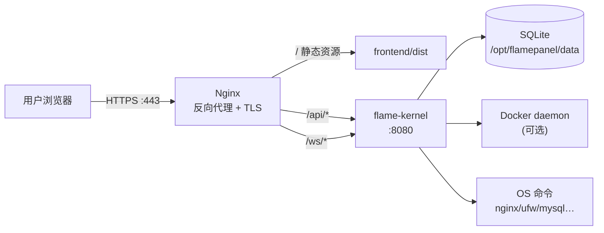

# 06 · 部署运维指南

> FlamePanel 生产部署、环境变量、反向代理、Docker 与日常运维

## 1. 环境要求

| 组件 | 版本 | 说明 |
|------|------|------|
| Linux | 任意主流发行版 | 推荐 Debian/Ubuntu/CentOS |
| 内存 | ≥ 512MB | 推荐 1GB+ |
| 磁盘 | ≥ 1GB | 数据与日志 |
| 网络 | 公网可达 | 面板访问 |
| Docker（可选） | 任意 | 容器管理/应用商店容器模式 |
| root 权限 | 必须 | 防火墙/数据库安装等需要 root |

## 2. 部署方式总览

| 方式 | 适用场景 | 说明 |
|------|----------|------|
| 方式一：install.sh | 推荐生产 | 一键脚本，自动部署二进制 + 前端 + nginx + systemd |
| 方式二：手动 systemd | 定制生产 | 手动编译 + systemd 服务 |
| 方式三：Docker Compose | 容器化环境 | 镜像化部署，前端 nginx + 后端 |
| 方式四：Nginx + 后端 | 已有 TLS 环境 | Nginx 做 TLS 终结与静态资源 |

## 3. 方式一：一键安装（install.sh）

### 3.1 使用

```bash
# 交互式安装
sudo ./install.sh

# 静默安装（全部默认）
sudo ./install.sh -n

# 自定义安装
sudo ./install.sh -u admin -p 'YourP@ss123' -P 9090 -s 'your-jwt-secret'
```

参数说明：

| 参数 | 说明 | 默认 |
|------|------|------|
| `-u` | 管理员用户名 | admin |
| `-p` | 管理员密码 | admin123 |
| `-P` | 面板端口 | 80（nginx 入口） |
| `-s` | JWT 密钥 | 随机生成 |
| `-n` | 静默模式 | — |
| `-h` | 帮助 | — |

### 3.2 脚本行为

1. 安装系统依赖（curl/wget/openssl/nginx）
2. 创建 `/opt/flamepanel/` 目录结构
3. 部署后端二进制（优先本地 `target/release/flame-kernel`，否则 GitHub Releases）+ 前端静态资源
4. 生成 nginx 反向代理配置（80 端口 → API + WS 透传）
5. 创建 systemd 服务（密钥存 `/opt/flamepanel/flamepanel.env`，600 权限）
6. 启动并设置开机自启

### 3.3 验证

```bash
# 健康检查
curl http://<server-ip>/health

# 服务状态
systemctl status flamepanel
```

## 4. 方式二：手动 systemd 部署

```bash
# 1. 编译后端
cd flame-kernel && cargo build --release

# 2. 构建前端
cd frontend && npm ci && npm run build

# 3. 准备目录
sudo mkdir -p /opt/flamepanel/{data,logs,frontend}
sudo cp ../flame-kernel/target/release/flame-kernel /usr/local/bin/flamepanel
sudo cp -r ../frontend/dist /opt/flamepanel/frontend/

# 4. 环境变量文件（600 权限）
sudo tee /opt/flamepanel/flamepanel.env > /dev/null << 'EOF'
OP_PORT=8080
OP_HOST=0.0.0.0
OP_DATABASE_URL=sqlite:/opt/flamepanel/data/flamepanel.db?mode=rwc
OP_JWT_SECRET=your-strong-secret
OP_ADMIN_PASSWORD=YourAdminPass123
EOF
sudo chmod 600 /opt/flamepanel/flamepanel.env

# 5. 创建 systemd 服务
sudo tee /etc/systemd/system/flamepanel.service > /dev/null << 'EOF'
[Unit]
Description=FlamePanel
After=network.target

[Service]
Type=simple
User=root
ExecStart=/usr/local/bin/flamepanel
WorkingDirectory=/opt/flamepanel
EnvironmentFile=/opt/flamepanel/flamepanel.env
Restart=always
RestartSec=5
LimitNOFILE=65535

[Install]
WantedBy=multi-user.target
EOF

# 6. Nginx 反向代理
#    参考 nginx.conf 或运行 install.sh 自动生成
sudo tee /etc/nginx/conf.d/flamepanel.conf > /dev/null << 'EOF'
server {
    listen 80;
    server_name _;
    root /opt/flamepanel/frontend/dist;
    index index.html;

    location / {
        try_files $uri $uri/ /index.html;
    }
    location /api/ {
        proxy_pass http://127.0.0.1:8080;
        proxy_set_header Host $host;
        proxy_set_header X-Real-IP $remote_addr;
        proxy_set_header X-Forwarded-For $proxy_add_x_forwarded_for;
    }
    location /ws/ {
        proxy_pass http://127.0.0.1:8080;
        proxy_http_version 1.1;
        proxy_set_header Upgrade $http_upgrade;
        proxy_set_header Connection "Upgrade";
    }
}
EOF

# 7. 启动
sudo systemctl daemon-reload
sudo systemctl enable --now flamepanel nginx
```

## 5. 方式三：Docker Compose

### 5.1 默认配置（docker-compose.yml）

```yaml
services:
  flamepanel:
    build: .
    ports:
      - "8080:80"
    volumes:
      - ./data:/app/data
      - /var/run/docker.sock:/var/run/docker.sock:ro
    restart: unless-stopped
    environment:
      - OP_PORT=8080
      - OP_JWT_SECRET=your-super-secret-key-change-me-2026
```

### 5.2 使用

```bash
docker compose up -d          # 构建并启动
docker compose logs -f        # 查看日志
docker compose down           # 停止
docker compose build --no-cache  # 重新构建
```

### 5.3 生产建议

```bash
# 修改 JWT 密钥（务必）
export JWT=$(openssl rand -hex 32)

# 覆盖配置启动
JWT_SECRET=$JWT docker compose up -d
```

> 端口映射 `8080:80`：容器内 nginx 提供前端静态资源 + API/WS 代理，主机访问 8080。

## 6. 方式四：Nginx 反向代理 + 后端（TLS）

适用于已有证书的生产环境：

```nginx
server {
    listen 443 ssl;
    server_name panel.example.com;

    ssl_certificate     /etc/ssl/certs/panel.crt;
    ssl_certificate_key /etc/ssl/private/panel.key;

    root /opt/flamepanel/frontend/dist;
    index index.html;

    location / {
        try_files $uri $uri/ /index.html;
    }

    location /api/ {
        proxy_pass http://127.0.0.1:8080;
        proxy_set_header Host $host;
        proxy_set_header X-Real-IP $remote_addr;
        proxy_set_header X-Forwarded-For $proxy_add_x_forwarded_for;
        proxy_set_header X-Forwarded-Proto $scheme;
    }

    location /ws/ {
        proxy_pass http://127.0.0.1:8080;
        proxy_http_version 1.1;
        proxy_set_header Upgrade $http_upgrade;
        proxy_set_header Connection "Upgrade";
    }
}
```

## 7. 环境变量参考

| 变量 | 默认值 | 说明 |
|------|--------|------|
| `OP_PORT` | `8080` | 后端监听端口 |
| `OP_HOST` | `0.0.0.0` | 监听地址 |
| `OP_DATABASE_URL` | `sqlite:data/app.db?mode=rwc` | 数据库连接（非默认值触发 SQLite） |
| `OP_JWT_SECRET` | `flamepanel-secret` | JWT 签名密钥（生产务必修改） |
| `OP_ADMIN_USERNAME` | `admin` | 初始管理员用户名 |
| `OP_ADMIN_PASSWORD` | `admin123` | 初始管理员密码 |
| `OP_SMTP_HOST` | `localhost` | SMTP 服务器 |
| `OP_SMTP_PORT` | `25` | SMTP 端口 |
| `OP_SMTP_USERNAME` | 空 | SMTP 用户名 |
| `OP_SMTP_PASSWORD` | 空 | SMTP 密码 |
| `OP_SMTP_FROM` | `noreply@flamepanel.local` | 发件人 |
| `OP_SMTP_TLS` | `false` | SMTP TLS |
| `RUST_LOG` | `info` | 日志级别 |

> 环境变量优先级高于 `config/app.toml`。

## 8. TOML 配置文件

`config/app.toml`（可选，需放置在后端工作目录）：

```toml
[server]
host = "0.0.0.0"
port = 8080

[database]
url = "sqlite://data/app.db?mode=rwc"

[notifications]
smtp_host = "smtp.example.com"
smtp_port = 587
smtp_username = "user"
smtp_password = "pass"
smtp_from = "noreply@flamepanel.local"
smtp_tls = true

jwt_secret = "your-strong-jwt-secret"
admin_password = "your-admin-password"
```

## 9. 日常运维

### 9.1 服务管理

```bash
# systemd
sudo systemctl start|stop|restart|status flamepanel
sudo systemctl enable flamepanel          # 开机自启
journalctl -u flamepanel -f               # 实时日志
journalctl -u flamepanel -n 100           # 最近 100 条

# Docker
docker compose up -d|down|restart
docker compose logs -f
```

### 9.2 数据库备份与恢复

```bash
# 备份
sqlite3 /opt/flamepanel/data/flamepanel.db ".backup '/backup/flamepanel-$(date +%Y%m%d).db'"

# 恢复
sqlite3 /opt/flamepanel/data/flamepanel.db ".restore '/backup/flamepanel-20260101.db'"
sudo systemctl restart flamepanel
```

### 9.3 升级

```bash
# 方式一：脚本升级（保留数据）
cd /opt/flamepanel && sudo ./install.sh -n

# 方式二：Docker 升级
docker compose pull && docker compose up -d

# 方式三：手动升级
# 1. 编译新版本二进制 + 前端
# 2. 替换 /usr/local/bin/flamepanel 与 /opt/flamepanel/frontend
# 3. systemctl restart flamepanel
```

### 9.4 安全加固清单

- [ ] 修改默认密码（`admin/admin123`）
- [ ] 修改 `OP_JWT_SECRET` 为强随机值（`openssl rand -hex 32`）
- [ ] 面板不直接暴露 8080，经 Nginx 80/443 访问
- [ ] 配置防火墙仅放行必要端口
- [ ] 启用 HTTPS（Let's Encrypt 或自签证书）
- [ ] 定期备份数据库
- [ ] 限制面板访问 IP（Nginx `allow/deny` 或防火墙）
- [ ] 若部署 Agent：为每节点指定强 `AUTH_TOKEN`，Agent 端口（默认 9527）仅监听内网/仅放行面板 IP

## 9.5 Agent 节点部署

在纳管节点部署 `flamepanel-agent`（详见 [11-Agent节点通信协议.md](./11-Agent节点通信协议.md)）：

```bash
# 方式一：源码运行
cd agent
export PANEL_URL=http://<面板IP>:80
export NODE_NAME=node-01
export AUTH_TOKEN=$(openssl rand -hex 32)
cargo run --release

# 方式二：建议使用 systemd（示例）
sudo tee /etc/systemd/system/flamepanel-agent.service > /dev/null <<'EOF'
[Unit]
Description=FlamePanel Agent
After=network-online.target

[Service]
Environment=PANEL_URL=http://<面板IP>:80
Environment=NODE_NAME=node-01
Environment=AGENT_PORT=9527
Environment=AUTH_TOKEN=<强随机令牌>
ExecStart=/usr/local/bin/flamepanel-agent
Restart=always
RestartSec=5

[Install]
WantedBy=multi-user.target
EOF
sudo systemctl daemon-reload && sudo systemctl enable --now flamepanel-agent
```

验证：

```bash
curl http://127.0.0.1:9527/exec \
  -H "Authorization: <AUTH_TOKEN>" \
  -H 'Content-Type: application/json' \
  -d '{"command":"hostname","timeout_secs":5}'
# => {"output":"node-01\n","exit_code":0,"duration_ms":8}
```

## 10. 卸载

### 10.1 systemd 部署

```bash
# 保留数据卸载
sudo ./uninstall.sh

# 完全卸载（删除所有数据）
sudo ./uninstall.sh -p

# 静默卸载
sudo ./uninstall.sh -f
```

### 10.2 Docker 部署

```bash
docker compose down
rm -rf ./data        # 删除数据
```

## 11. CNB 云原生开发环境

`cnb-dev-setup.sh` 在 CNB 云原生开发/构建环境中一键初始化：

```bash
./cnb-dev-setup.sh              # 全量初始化
./cnb-dev-setup.sh --quick      # 快速模式
./cnb-dev-setup.sh --help       # 帮助
```

特性：自动识别 CNB 环境（`CNB=true`）使用平台加速源；本地自动启用 rsproxy.cn / npmmirror.com；幂等可重入。

## 12. 架构图：生产部署拓扑


