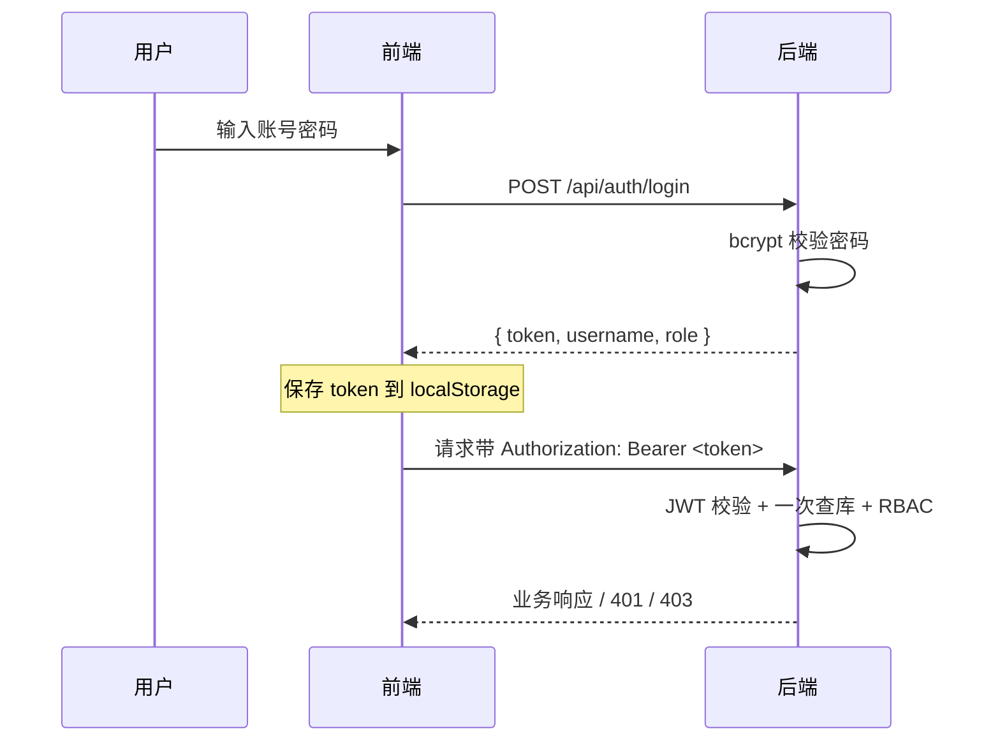
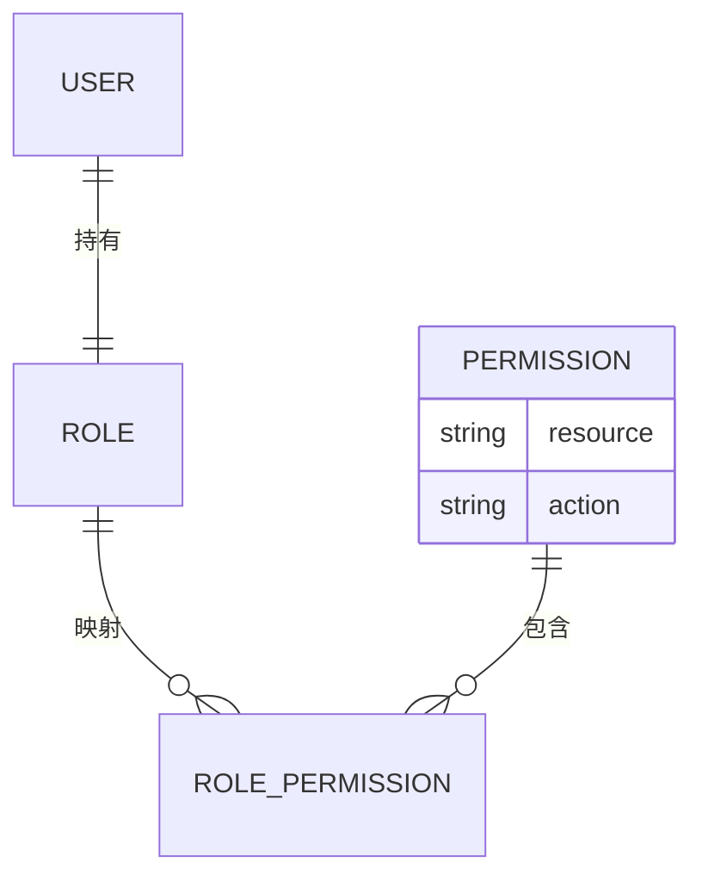
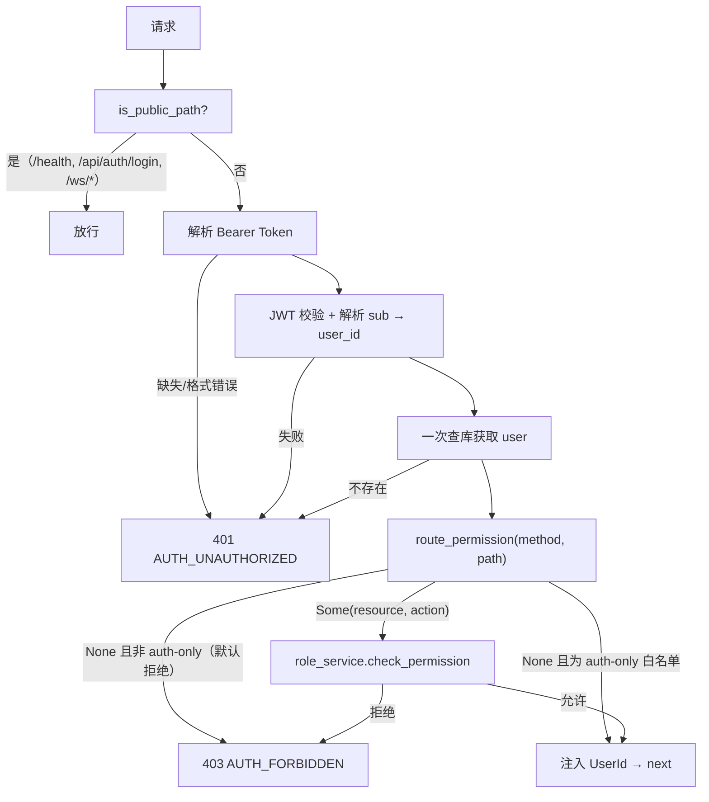

# 07 · 权限体系设计

> FlamePanel JWT 认证 + RBAC 角色权限体系详解

## 1. 认证机制（JWT）

### 1.1 流程



### 1.2 JWT 实现

- 库：`jsonwebtoken` 9
- 密钥：`OP_JWT_SECRET` 环境变量（生产必须修改）
- 有效期：24 小时（`JwtUtils::new(&secret, 24)`）
- Claim：`sub` 为用户 ID

### 1.3 Token 存储与传递

- 前端存储于 `localStorage`（key：`token` / `username` / `role`）
- 请求头：`Authorization: Bearer <token>`
- 401 响应：前端拦截器清除 token 并跳转 `/login`

## 2. RBAC 角色权限模型

### 2.1 模型



三个预置角色：

| 角色 | 权限范围 | 适用场景 |
|------|----------|----------|
| `admin` | 全部权限（含 delete） | 超级管理员 |
| `operator` | 除 delete 外的全部 | 运维操作员 |
| `viewer` | 仅 read | 只读审计 |

### 2.2 权限矩阵（73 项）

| 资源 | read | create | update | delete | 其他 |
|------|:----:|:------:|:------:|:------:|------|
| user | ✅ | ✅ | ✅ | ✅ | — |
| node | ✅ | ✅ | ✅ | ✅ | — |
| website | ✅ | ✅ | ✅ | ✅ | — |
| docker | ✅ | ✅ | ✅ | ✅ | start/stop |
| plugin | ✅ | ✅ | ✅ | ✅ | execute/config |
| web_server | ✅ | ✅ | ✅ | ✅ | start/stop/reload/configtest |
| database | ✅ | ✅ | ✅ | ✅ | start/stop |
| file | ✅ | — | ✅ | ✅ | upload |
| firewall | ✅ | ✅ | ✅ | ✅ | enable/apply |
| app_store | ✅ | ✅ | ✅ | ✅ | — |
| settings | ✅ | — | ✅ | — | — |
| operation_log | ✅ | — | — | ✅ | — |
| log | ✅ | — | — | ✅ | — |
| backup | ✅ | ✅ | — | ✅ | — |
| scheduled_task | ✅ | ✅ | ✅ | ✅ | execute |
| task | ✅ | — | — | ✅ | execute |
| memo | ✅ | ✅ | ✅ | ✅ | — |
| outbox | ✅ | — | — | — | — |

## 3. 认证 + RBAC 合并中间件

### 3.1 架构改进（v0.3.0）

此前：JWT 校验 + 用户查询 + 权限查询 = **两次查库**。
现在：合并为一个中间件，**一次 JWT 校验 + 一次用户查询**完成认证与鉴权。



### 3.2 白名单路径

| 路径 | 说明 |
|------|------|
| `GET /health` | 健康检查 |
| `POST /api/auth/login` | 登录 |
| `WS /ws/*` | WebSocket（metrics/logs/terminal） |

## 4. 路由权限映射

### 4.1 映射函数

`api/types.rs` 的 `route_permission(method, path)` 通过方法 + 路径模式匹配返回 `(resource, action)`：

```rust
fn route_permission(method: &Method, path: &str) -> Option<(&'static str, &'static str)> {
    match (method.as_str(), path.trim_end_matches('/')) {
        ("GET", "/api/users") => Some(("user", "read")),
        ("POST", "/api/users") => Some(("user", "create")),
        ("PUT", p) if p.starts_with("/api/users/") => Some(("user", "update")),
        ("DELETE", p) if p.starts_with("/api/users/") => Some(("user", "delete")),
        // ... 179 路由 / 73 权限组合
        _ => None,
    }
}
```

### 4.2 映射规则要点

- 列表/详情/日志/统计 → `read`
- 创建/导入/安装/启用 → `create`
- 更新/切换引擎/预设/重排 → `update`
- 删除/卸载 → `delete`
- 特定操作（docker start/stop、web_server reload/configtest、plugin execute/config、firewall enable/apply）→ 细粒度动作

### 4.3 权限校验

```rust
let allowed = state.role_service.check_permission(&user.role, resource, action).await?;
if !allowed {
    return Err(AppError::Forbidden(format!("Missing permission: {}:{}", resource, action)));
}
```

`role_permissions(role_name)` 返回角色权限 ID 集合：

- `admin`：全部
- `operator`：`action != "delete"`
- `viewer`：`action == "read"`

## 5. 数据库表

见 [03-数据库设计.md](./03-数据库设计.md)：

- `permissions` — 权限定义（id/resource/action/description）
- `roles` — 角色（id/name/description）
- `role_permissions` — 关联表（role_id/permission_id）

种子数据由 `domain/entity.rs` 的 `default_permissions()` / `default_roles()` / `role_permissions()` 提供。

## 6. 前端权限集成

### 6.1 登录态

- `stores/auth.ts`（Pinia）管理登录状态。
- `localStorage` 存储 token/username/role。
- 路由守卫 `beforeEach`：非登录状态重定向 `/login`。

### 6.2 403 处理

- 后端返回 `AUTH_FORBIDDEN`，前端 `client.ts` 规范化为 `{code, message, status}`。
- `utils/error.ts` 按错误码显示 i18n 文案："没有操作权限"。

### 6.3 角色相关 UI

前端当前未按角色隐藏菜单（admin 可见全部），可按需扩展：根据 `role` 字段过滤 Sidebar 菜单项。

## 7. 扩展新权限的步骤

1. **权限定义**：`domain/entity.rs` 的 `default_permissions()` 添加 `(resource, action, description)`。
2. **路由映射**：`api/types.rs` 的 `route_permission()` 为新端点添加匹配分支。
3. **种子更新**：确认 `default_permissions()` ID 顺序，`role_permissions()` 自动按角色过滤。
4. **前端文案**：`locales/*` 的 `common.error` 如需新增错误码再补充。
5. **测试**：集成测试覆盖 401/403 分支。

## 8. 安全建议

- JWT 密钥使用强随机值：`openssl rand -hex 32`
- 首次安装通过 Setup 向导创建管理员（或配置 `OP_ADMIN_PASSWORD` 无人值守初始化），新装账号强制首次登录改密
- 2FA：面板设置 `two_factor_enabled`（前端接入点，后端已有配置项）
- 会话超时：`session_timeout_minutes`（默认 1440 分钟）
- 速率限制：分级限流（分片结构，Login 5/min、Api 120/min、Health 600/min，`rate_limiter.rs`）
