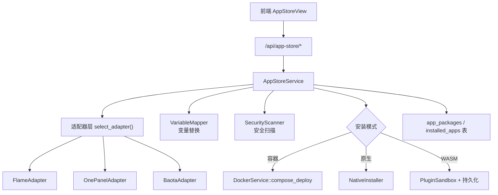
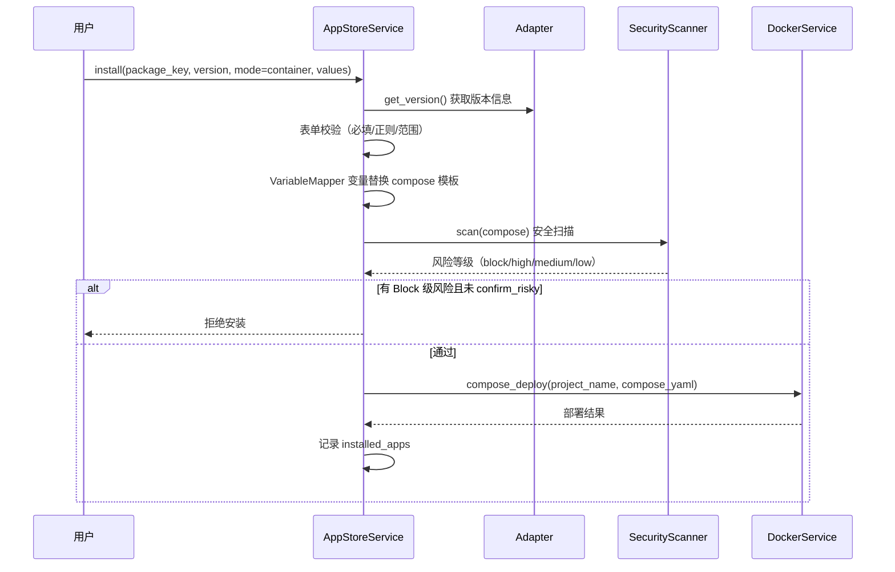
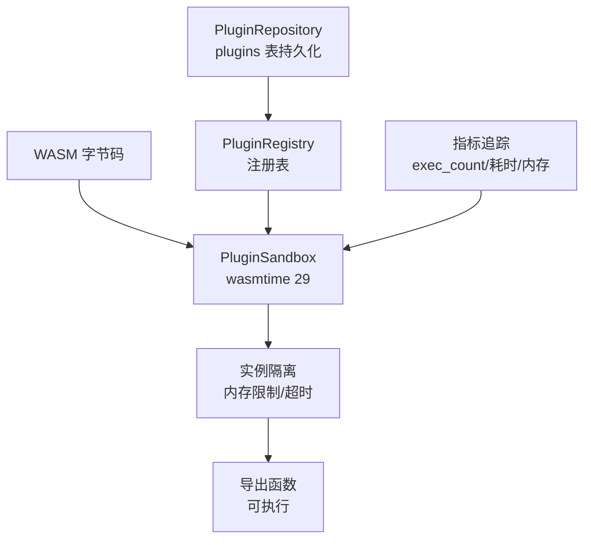

# 08 · 应用商店与插件系统

> FlamePanel 应用商店（三格式/三模式）与 WASM 插件系统详解

## 1. 应用商店概述

应用商店统一支持三种应用包格式和三种安装模式，实现"一次发布，多环境安装"。

### 1.1 应用包格式

| 格式 | 标识 | 来源 | 元数据 |
|------|------|------|--------|
| Flame 内置 | `flame` | 官方内置/导入 | `app.json` + `docker-compose.yml` / `install.sh` / `app.wasm` |
| 1Panel | `onepanel` | 1Panel 生态 | 根 `data.yml` + 版本目录 `data.yml` + `docker-compose.yml` |
| 宝塔 | `baota` | 宝塔生态 | `app.json` + `latest/` 版本目录 + compose |

### 1.2 安装模式

| 模式 | 标识 | 说明 | 编排 |
|------|------|------|------|
| 容器 | `container` | Docker Compose 部署 | compose 模板 → 变量替换 → 安全扫描 → compose_deploy |
| 原生 | `native` | 宿主机安装 | 按分类分派 NativeInstaller（数据库/Web 引擎/通用脚本） |
| WASM | `wasm` | 沙箱插件 | 沙箱加载 → 注册 → 持久化 |

### 1.3 架构



## 2. 核心概念

### 2.1 AppMetadata（应用元数据）

| 字段 | 说明 |
|------|------|
| key | 应用唯一键（如 `wordpress`） |
| name | 应用名称 |
| category | 分类（CMS/DevOps/Web/缓存/监控） |
| short_desc_zh / short_desc_en | 中英文简介 |
| format | 格式（flame/onepanel/baota） |
| modes | 支持的安装模式列表 |
| versions | 可用版本列表 |
| default_version | 默认版本 |
| min_memory_mb | 最低内存要求 |
| architectures | 支持的架构 |

### 2.2 FormField（安装表单字段）

用于前端动态生成安装向导：

| 字段 | 说明 |
|------|------|
| env_key | 环境变量键 |
| label_zh / label_en | 标签 |
| field_type | 类型（text/number/password/select/port/switch/path） |
| default | 默认值 |
| required | 是否必填 |
| pattern / min / max / min_length / max_length | 校验规则 |
| options | 下拉选项 |
| group | 分组 |

### 2.3 AppVersionInfo（版本信息）

| 字段 | 说明 |
|------|------|
| version | 版本号 |
| mode | 安装模式 |
| default_port | 默认端口 |
| form_fields | 表单字段列表 |
| compose_template | Compose 模板 |
| native_scripts | 原生安装脚本步骤（bash 命令） |
| wasm_base64 | WASM 字节码 |
| min_memory_mb | 最低内存 |
| architectures | 架构 |

## 3. 安装流程详解

### 3.1 容器模式



### 3.2 原生模式

按应用分类分派：

| 分类 | 安装器 | 说明 |
|------|--------|------|
| 数据库 | NativeDbManager | 复用 database 模块（MySQL/MariaDB/Redis） |
| Web 引擎 | WebServerService | 复用 webserver 模块（Nginx/Apache/Caddy/OLS/OpenResty） |
| 通用 | install.sh 脚本 | 按 `native_scripts` 顺序执行 bash |

### 3.3 WASM 模式

1. 上传 WASM 字节码（base64）
2. `PluginSandbox` 沙箱加载
3. `PluginRegistry` 注册
4. `PluginRepository` 持久化（`plugins` 表）
5. 内置 WASM 工具从 `wasm-builtins` 端点获取

## 4. 变量映射（VariableMapper）

支持三种占位语法，兼容 1Panel/宝塔：

| 语法 | 示例 |
|------|------|
| `${VAR}` | `${CONTAINER_NAME}` |
| `$VAR` | `$HOST_IP` |
| `{var}` | `{port}` |

内置变量：

| 变量 | 说明 |
|------|------|
| `CONTAINER_NAME` | 容器名 |
| `PANEL_APP_PORT_HTTP` | HTTP 端口 |
| `PANEL_APP_PORT_HTTPS` | HTTPS 端口 |
| `HOST_IP` | 主机 IP |
| `name` / `port` / `data_dir` | 用户输入值 |

未识别变量保留并警告。

## 5. 安全扫描（SecurityScanner）

安装前对 compose 模板进行风险分级：

| 级别 | 检查项 | 处理 |
|------|--------|------|
| Block | `privileged: true` | 拒绝（除非 confirm_risky） |
| High | 敏感目录挂载（/etc、/root）、Docker socket 挂载 | 需确认 |
| Medium | `network_mode: host` | 需确认 |
| Low | 非白名单镜像仓库 | 警告 |

其他强制措施：
- `ensure_restart_policy`：确保 compose 有 `restart` 策略
- 失败自动回滚（compose down + 清理）

## 6. WASM 插件系统

### 6.1 沙箱架构



### 6.2 插件生命周期

| 状态 | 操作 | 说明 |
|------|------|------|
| 加载 | `POST /api/plugins` | 上传 WASM → 沙箱加载 → 注册 → 持久化 |
| 执行 | `POST /api/plugins/:id/execute/:function` | 调用导出函数 |
| 启用/禁用 | `POST /api/plugins/:id/enable\|disable` | 切换状态 |
| 热重载 | `POST /api/plugins/:id/reload` | 更新字节码 |
| 卸载 | `POST /api/plugins/:id` | 从沙箱 + 注册表移除 |
| 启动恢复 | `restore_wasm_plugins` | 启动时从 DB 恢复 |

### 6.3 插件指标

| 指标 | 说明 |
|------|------|
| total_executions | 总执行次数 |
| successful_executions | 成功次数 |
| failed_executions | 失败次数 |
| avg/max/min/last_execution_ms | 执行耗时统计 |
| peak_memory_bytes | 峰值内存 |

### 6.4 内置 WASM 工具

`GET /api/app-store/wasm-builtins` 返回内置工具元数据。示例 `wasm-hello`：真实 WASM 字节码，`run()` 返回 42。

### 6.5 开发一个 WASM 插件

```bash
# 1. 用 Rust/Wat 编写插件，编译为 WASM
# 2. 导出需要执行的函数（如 run(args: Vec<i32>) -> Vec<i32>）
# 3. 将字节码 base64 编码
# 4. 通过 POST /api/plugins 加载
```

> 沙箱支持内存限制（`memory_limit_bytes`）与超时（`timeout_ms`）配置。

## 7. 内置应用

`domain/entity.rs` 的 `builtin_apps()` 提供 5 个内置应用（Compose 模板）：

| key | 名称 | 分类 | 默认端口 |
|-----|------|------|----------|
| wordpress | WordPress | CMS / 博客 | 8081 |
| portainer | Portainer | DevOps / 工具 | 9443 |
| nginx | Nginx | Web / 反向代理 | 8083 |
| redis | Redis 缓存 | 缓存 / 消息队列 | 6379 |
| uptime-kuma | Uptime Kuma | 监控 / 告警 | 8084 |

启动时 `seed_builtin_apps()` 幂等写入 `app_packages` 表。

## 8. API 端点

| 端点 | 说明 |
|------|------|
| `GET /api/app-store/packages` | 应用包列表（`?category=`） |
| `GET /api/app-store/packages/:key` | 应用详情 |
| `GET /api/app-store/packages/:key/versions/:version` | 版本详情（表单字段） |
| `POST /api/app-store/packages/:key/install` | 安装 |
| `POST /api/app-store/packages/import` | 导入本地包 |
| `GET /api/app-store/installed` | 已安装列表 |
| `GET /api/app-store/installed/:id` | 已安装详情 |
| `POST /api/app-store/installed/:id/upgrade` | 升级 |
| `POST /api/app-store/installed/:id/uninstall` | 卸载 |
| `GET /api/app-store/installed/:id/logs` | 应用日志 |
| `GET /api/app-store/wasm-builtins` | WASM 内置工具 |

权限：`app_store:read` / `app_store:create` / `app_store:update` / `app_store:delete`

## 9. 前端集成

`AppStoreView.vue` 三个 Tab：

| Tab | 说明 |
|-----|------|
| 商店 | 应用卡片 + 分类筛选 + 安装向导（选版本 → 动态表单 → 安全扫描 → 确认） |
| 已安装 | 应用列表（状态/日志/升级/卸载） |
| WASM 工具 | 内置 WASM 工具展示 |

`api/appStore.ts` 封装全部端点，`types/index.ts` 定义接口。

## 10. 数据库表

| 表 | 说明 |
|----|------|
| `app_packages` | 应用包元数据 |
| `installed_apps` | 已安装应用记录 |
| `plugins` | WASM 插件持久化 |

详见 [03-数据库设计.md](./03-数据库设计.md)。

## 11. 开发一个新应用包

1. **创建目录**（Flame 格式）：

```
apps/myapp/
├── app.json          # key/name/category/desc/version/mode/icon
├── docker-compose.yml  # 或 install.sh / app.wasm
└── versions/
    └── 1.0.0/
        └── data.yml  # formFields 定义
```

2. **导入**：`POST /api/app-store/packages/import` body `{"path": "/path/to/apps/myapp"}`
3. **验证**：商店 Tab 可见 → 安装测试

## 12. Web 引擎统一（关联）

应用商店与 Web 引擎系统协同：

- **性能预设**：`low` / `medium` / `high` / `ultra`，按 CPU/内存自动推荐
- **引擎切换**：网站与 Web 服务器实例支持 `switch-engine` 端点
- **预设应用**：`POST /api/web-servers/:id/preset` 重新生成全局配置

> 详见 [02-API接口文档.md](./02-API接口文档.md) Web 服务器章节。
