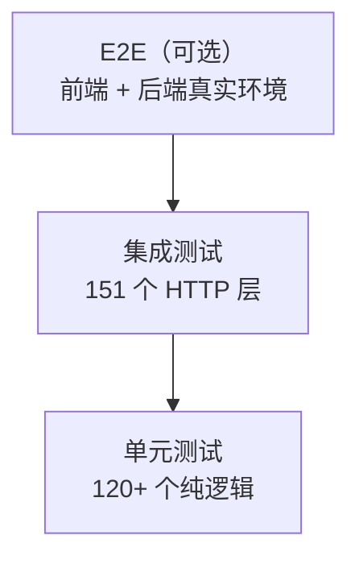

# 09 · 测试指南

> FlamePanel 测试策略、编写规范与运行命令

## 1. 测试概览

当前基线：**295 个测试全部通过（156 集成 + 139 单元 + Stage/Agent 专项）**

| 类型 | 位置 | 数量 | 说明 |
|------|------|------|------|
| 单元测试 | 各模块 `#[cfg(test)]` | 139 | 纯逻辑测试（无需 IO/网络），含分页/缓存/限流/JWT/Outbox 等 Stage 专项 |
| 集成测试 | `flame-kernel/tests/integration_test.rs` | 151 | 启动完整应用，走 HTTP 层 |
| 多节点测试 | `flame-kernel/tests/stage5_nodes_test.rs` | 5 | Agent 心跳/远程命令/批量执行 |
| Agent 测试 | `agent/` | 3+ | 节点 Agent 单元测试 |

## 2. 运行命令

```bash
# 全部测试
cargo test --package flame-kernel

# 仅集成测试
cargo test --test integration_test

# 仅单元测试
cargo test --lib

# 显示输出
cargo test -- --nocapture

# 单个测试
cargo test test_name

# 前端检查
cd frontend && npm run lint
cd frontend && npm run build     # 含 vue-tsc 类型检查
```

一键命令：`just test`、`just lint`、`just check`

## 3. 单元测试规范

### 3.1 位置

放在被测模块内部：

```rust
#[cfg(test)]
mod tests {
    use super::*;

    #[test]
    fn test_something() {
        // arrange
        // act
        // assert
    }
}
```

### 3.2 覆盖重点

- 工具函数：JWT、密码哈希、参数校验
- 枚举转换：`AppFormat::from_str`、`InstallMode::from_str` 等
- 分页工具：`paginate_slice`、`PaginatedResponse::new`
- 领域逻辑：权限角色计算 `role_permissions`、默认种子
- 弹性组件：Circuit Breaker / Retry
- WASM 沙箱：插件加载/执行/指标（`wat` 编译测试字节码）

### 3.3 示例

```rust
#[test]
fn test_paginate_slice() {
    let items = vec![1, 2, 3, 4, 5];
    let params = PaginationParams { page: Some(2), page_size: Some(2) };
    assert_eq!(paginate_slice(&items, &params), vec![3, 4]);
}
```

## 4. 集成测试规范

### 4.1 位置

`flame-kernel/tests/integration_test.rs`。

### 4.2 启动方式

使用 `axum-test`（dev-dependency）启动应用，默认 InMemory 仓库：

```rust
use axum_test::TestServer;
use flame_kernel::config::AppConfig;
use flame_kernel::FlameKernel;

async fn setup() -> TestServer {
    let config = AppConfig::default();
    let kernel = FlameKernel::new(config);
    let app = flame_kernel::api::routes::create_router(kernel.app_state.clone());
    let app = flame_kernel::api::middleware::add_middleware(app, kernel.app_state);
    TestServer::new(app).unwrap()
}
```

### 4.3 认证测试

```rust
#[tokio::test]
async fn test_auth_flow() {
    let server = setup().await;

    // 登录
    let res = server.post("/api/auth/login")
        .json(&serde_json::json!({"username": "admin", "password": "admin123"}))
        .await;
    assert_eq!(res.status_code(), 200);
    let body: serde_json::Value = res.json();
    let token = body["token"].as_str().unwrap();

    // 带 token 请求
    let res = server.get("/api/users")
        .authorization_bearer(token)
        .await;
    assert_eq!(res.status_code(), 200);
}
```

### 4.4 覆盖重点

- 认证：登录成功/失败、401 未登录、403 无权限、404 全局 JSON
- 各模块 CRUD：用户/节点/网站/数据库/防火墙
- Docker（mock 或 InMemory 降级）
- 应用商店：列表/安装/卸载/404
- WASM：安装与启动恢复
- 错误格式断言：`{code, error, message}` 结构
- 分页响应结构

### 4.5 dev-dependencies

```toml
[dev-dependencies]
axum-test = "14"
tower = { version = "0.4", features = ["util"] }
hyper = { version = "0.14", features = ["full"] }
wat = "1"   # 编译 WASM 测试字节码
```

## 5. 测试金字塔建议



- **单元测试**数量应最多（纯逻辑快而稳）。
- **集成测试**覆盖关键用户路径（认证、CRUD、错误格式）。
- 核心模块（应用商店、WASM）需同时有单元 + 集成覆盖。

## 6. CI/CD

项目 CI（`.cnb.yml` / GitHub Actions）：
- 后端：`cargo check` + `cargo test`
- 前端：`npm ci` + `npm run lint` + `npm run build`

> 当前 `.cnb.yml` 仅包含 GitHub 上游同步任务，**尚未配置 PR 触发 CI**。建议新增 `on: pull_request` 阶段（见 [14-开发协作与发布流程.md](./14-开发协作与发布流程.md) §4）。

本地提交前验证：

```bash
cargo check                    # 零警告
cargo test                     # 全部通过
cargo clippy -- -D warnings    # lint
cd frontend && npm run lint    # ESLint
cd frontend && npm run build   # 类型 + 构建
```

## 7. 编写测试 checklist

- [ ] 测试命名清晰（`test_<模块>_<行为>`）
- [ ] 覆盖成功路径与失败分支（404/401/403/400）
- [ ] 断言统一错误 JSON 结构
- [ ] 不依赖真实系统服务（Docker/数据库）——用 InMemory 或 mock
- [ ] 测试可并行（无共享可变状态）
- [ ] 运行 `cargo test` 全量通过
