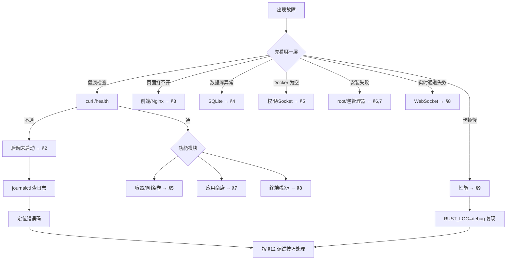

# 10 · 故障排查手册

> FlamePanel 常见问题诊断与解决方法

## 1. 诊断工具速查

| 场景 | 命令 |
|------|------|
| 后端健康 | `curl http://localhost:8080/health` |
| 后端日志 | `journalctl -u flamepanel -f` 或 `docker compose logs -f` |
| 端口监听 | `ss -tlnp \| grep 8080` |
| 数据库 | `sqlite3 /opt/flamepanel/data/flamepanel.db ".tables"` |
| 前端构建 | `cd frontend && npm run build` |
| 调试日志 | `RUST_LOG=debug /usr/local/bin/flamepanel` |

## 1.1 诊断决策总览



## 2. 后端无法启动

### 症状

`systemctl start flamepanel` 失败或 `cargo run` 报错退出。

### 排查步骤

```bash
# 1. 查看服务状态与日志
sudo journalctl -u flamepanel -n 100

# 2. 检查端口占用
ss -tlnp | grep 8080
lsof -i :8080

# 3. 前台运行看详细错误
cd /opt/flamepanel && RUST_LOG=debug /usr/local/bin/flamepanel

# 4. 检查数据库权限
ls -la /opt/flamepanel/data/
chown -R root:root /opt/flamepanel/data
```

### 常见原因

| 原因 | 解决 |
|------|------|
| 端口被占用 | 改 `OP_PORT` 或停掉占用进程 |
| 数据库目录无权限 | `chmod 755 /opt/flamepanel`，目录可写 |
| 环境变量文件权限过松 | `chmod 600 /opt/flamepanel/flamepanel.env` |
| 二进制与系统库不匹配 | 重新编译或使用对应发行版产物 |

## 3. 前端无法访问 / 无法连接后端

### 症状

- 打开页面空白 / 一直 loading
- 登录提示网络错误
- API 请求 502/504

### 排查

```bash
# 1. 后端是否在跑
curl http://localhost:8080/health

# 2. Nginx 是否在跑
systemctl status nginx
nginx -t

# 3. 浏览器控制台检查网络请求
#   - 请求是否到 /api/*
#   - 是否 401（token 过期）
#   - 是否 CORS 错误（生产一般同源无此问题）
```

### 常见原因

| 原因 | 解决 |
|------|------|
| 后端未启动 | 启动 flamepanel 服务 |
| Nginx 配置错误 | `nginx -t` 检查后 `systemctl reload nginx` |
| 前端 dist 缺失 | 重新构建并拷贝 `frontend/dist` |
| Vite 代理未指向后端 | 检查 `vite.config.ts` proxy |
| 浏览器缓存旧前端 | 硬刷新 Ctrl+Shift+R |

## 4. 数据库相关

### 症状

- 登录后用户/设置丢失
- 启动报 `database is locked` / `no such table`

### 解决

```bash
# 检查数据库文件
ls -la /opt/flamepanel/data/
sqlite3 /opt/flamepanel/data/flamepanel.db ".tables"

# database is locked（并发写冲突）
#   确保只有一个进程连接；检查是否有 sqlite 进程
ps aux | grep flamepanel

# 表缺失 → 删除重建（会丢失数据，慎用）
# 先备份
cp /opt/flamepanel/data/flamepanel.db /backup/flamepanel-$(date +%Y%m%d).db
rm -f /opt/flamepanel/data/flamepanel.db
systemctl restart flamepanel   # 启动时自动重建
```

## 5. Docker 管理功能不可用

### 症状

Docker 页面报错、容器列表为空。

### 排查

```bash
# 1. Docker daemon 是否运行
docker ps

# 2. 面板是否有 socket 权限
#    systemd 部署需 root 运行（面板需要 /var/run/docker.sock）
#    Docker 部署需挂载 socket
ls -la /var/run/docker.sock
```

### 说明

- 面板无 Docker 权限时**自动降级为 InMemory**，容器功能不可用但面板其他功能正常。
- Docker 部署需 `-v /var/run/docker.sock:/var/run/docker.sock:ro`（compose 已配置）。

## 6. 防火墙 / 数据库安装需要 root

### 症状

- 防火墙规则应用失败
- MySQL/Redis 安装失败

### 解决

- 面板必须以 root 运行（`systemd` unit 中 `User=root`）。
- 检查 sudo 权限与 `apt/yum` 可用性。
- 日志查看具体错误：`journalctl -u flamepanel -f`。

## 7. 应用商店安装失败

### 排查

```bash
# 1. 查看应用日志
GET /api/app-store/installed/:id/logs

# 2. 检查安全扫描拦截（privileged/host 网络/敏感挂载）
#    需要 confirm_risky: true 或在应用包中去掉高风险项

# 3. 检查镜像仓库可达性（国内环境可能需加速镜像）

# 4. 查看 Compose 部署日志
docker compose -f /opt/flamepanel/apps/<project>/docker-compose.yml ps
```

## 8. WebSocket（终端/实时指标）不工作

### 症状

- 终端连接后无输出
- 仪表盘指标不刷新

### 排查

```bash
# 1. Nginx 是否正确透传 Upgrade 头
#    需要 proxy_http_version 1.1 + Upgrade/Connection 头
# 2. 浏览器 Network 检查 ws:// 连接是否成功
# 3. 确认后端启动时 metrics collector 在跑（RUST_LOG=debug）
```

### 常见原因

| 原因 | 解决 |
|------|------|
| Nginx 缺少 WS 透传配置 | 按 nginx.conf 补 `/ws/` 配置 |
| 前端代理未开启 ws | vite.config.ts proxy 加 `ws: true` |
| 终端无 bash | 安装 bash（`apt install bash`） |

## 9. 性能问题

### 症状

- 面板响应慢
- 高负载下崩溃

### 优化

```bash
# 1. 开启 release 构建（已优化 18MB）
cargo build --release --package flame-kernel

# 2. 检查资源
top / free -m / df -h

# 3. 日志级别调低
OP_PORT=8080 RUST_LOG=warn /usr/local/bin/flamepanel

# 4. 数据库优化（SQLite WAL）
sqlite3 /opt/flamepanel/data/flamepanel.db "PRAGMA journal_mode=WAL;"
```

## 10. 忘记密码 / 重置

```bash
# 方式一：删除数据库重建（会丢数据）
rm -f /opt/flamepanel/data/flamepanel.db
systemctl restart flamepanel
# 默认凭据重新生效：admin / <OP_ADMIN_PASSWORD 或 admin123>

# 方式二：通过 SQL 更新密码哈希（需先生成 bcrypt）
# 用 bcrypt 工具生成 hash 后：
sqlite3 /opt/flamepanel/data/flamepanel.db \
  "UPDATE users SET password_hash='<bcrypt-hash>' WHERE username='admin';"
systemctl restart flamepanel
```

## 11. 备份与恢复

```bash
# 备份（推荐 sqlite backup 保证一致性）
sqlite3 /opt/flamepanel/data/flamepanel.db ".backup '/backup/flamepanel.db'"

# 恢复
sqlite3 /opt/flamepanel/data/flamepanel.db ".restore '/backup/flamepanel.db'"
systemctl restart flamepanel
```

## 12. 调试技巧

### 12.1 开启详细日志

```bash
RUST_LOG=flame_kernel=debug,tower_http=debug /usr/local/bin/flamepanel
```

### 12.2 用 curl 调试 API

```bash
TOKEN=$(curl -s -X POST localhost:8080/api/auth/login \
  -H 'Content-Type: application/json' \
  -d '{"username":"admin","password":"admin123"}' | jq -r .token)

# 查看具体错误响应
curl -sv -H "Authorization: Bearer $TOKEN" localhost:8080/api/users
```

### 12.3 查看统一错误格式

所有错误均为 JSON：

```json
{ "code": 404, "error": "NOT_FOUND", "message": "Route /xxx not found" }
```

## 13. 升级排障清单

升级前：
- [ ] 备份数据库
- [ ] 备份配置文件（`flamepanel.env`）
- [ ] 记录当前版本

升级后：
- [ ] 检查服务状态与健康
- [ ] 检查数据库迁移是否成功（新表是否存在）
- [ ] 验证登录与关键功能

回滚：
- [ ] 恢复旧二进制 + 前端 dist
- [ ] 恢复数据库备份
- [ ] 重启服务
