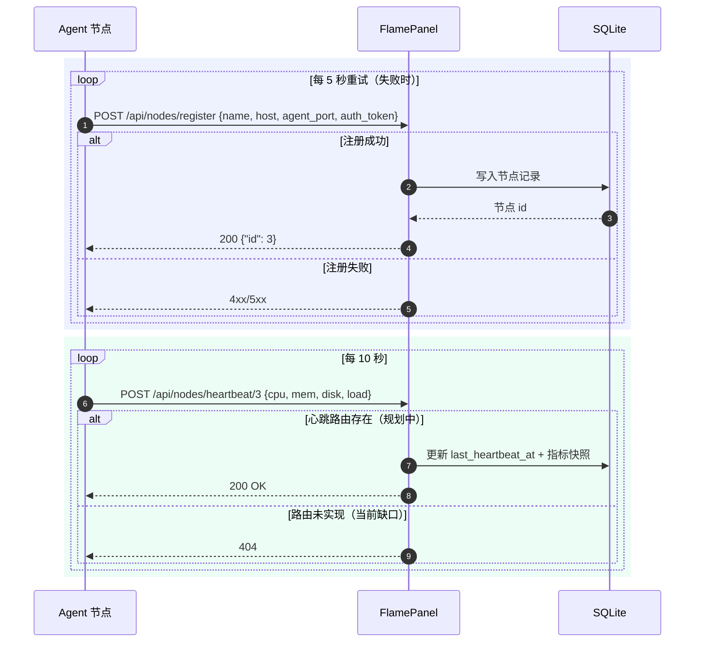

# 11 · Agent 节点通信协议

> FlamePanel Agent（`flamepanel-agent`）与面板核心之间的完整通信协议、安全模型与扩展指南

## 1. 概述

`agent/` 是 FlamePanel 的轻量节点代理（Rust + Axum 0.8 + reqwest 0.12 + sysinfo 0.39），部署在被纳管的服务器节点上，负责：

1. **注册与心跳**：启动时向面板注册节点，随后每 10 秒上报一次系统指标。
2. **命令执行**：面板侧可通过 Agent HTTP 接口在节点上执行任意 shell 命令（`/exec`）。
3. **文件访问**：提供节点文件系统列表、下载、上传能力。

```
┌──────────────┐   REST(HTTPS)    ┌────────────────┐
│  FlamePanel  │◄────────────────►│ flamepanel-agent │
│  面板核心     │  注册/心跳/命令   │ 节点 Agent (9527) │
│  :8080       │                  │  :9527          │
└──────────────┘                  └────────────────┘
```

> 当前版本定位：Agent 为**单向数据上报 + 远程执行**的轻量通道，不承载 WebSocket 长连接（面板侧实时通道由 `/ws/*` 承担）。

## 2. Agent 配置

Agent 全部配置通过环境变量注入：

| 环境变量 | 默认值 | 说明 |
|----------|--------|------|
| `PANEL_URL` | `http://127.0.0.1:8080` | 面板地址（注册/心跳目标） |
| `NODE_NAME` | 系统主机名 | 节点显示名称 |
| `NODE_HOST` | 本机内网 IP（探测） | 节点地址，上报给面板 |
| `AGENT_PORT` | `9527` | Agent HTTP 服务监听端口 |
| `AUTH_TOKEN` | 随机生成 | Agent 接口鉴权令牌（`/exec`、`/files/*`） |

启动命令：

```bash
PANEL_URL=http://your-panel:8080 \
NODE_NAME=node-01 \
NODE_HOST=10.0.0.2 \
AGENT_PORT=9527 \
AUTH_TOKEN=your-secret-token \
cargo run --manifest-path agent/Cargo.toml
```

> ⚠️ **安全提醒**：`AUTH_TOKEN` 默认随机生成，但在生产环境务必显式指定强随机令牌，且 Agent 与面板之间应通过 HTTPS（Nginx/TLS）或内网隔离保护，避免令牌明文泄露。

## 3. 与面板的通信流程



### 3.1 注册（启动时）

Agent 启动后**循环重试**（间隔 5 秒）向面板注册：

```
POST {PANEL_URL}/api/nodes/register
Content-Type: application/json
X-Bootstrap-Token: <面板引导令牌>       # 可选但建议：与面板 OP_BOOTSTRAP_TOKEN 一致
Authorization: Bearer <AUTH_TOKEN>

{
  "name": "node-01",
  "host": "10.0.0.2",
  "agent_port": 9527,
  "auth_token": "your-secret-token"
}
```

- 成功：返回 `200`，响应体为节点 `id`（`{"id": 3}`），Agent 保存该 ID 用于后续心跳。
- 失败：打印错误日志，5 秒后重试，直到注册成功才进入后续流程。

> 对应面板实现：`POST /api/nodes/register`（公开路由但受 **Bootstrap Token 防护**——需携带 `X-Bootstrap-Token` 头且与面板 `OP_BOOTSTRAP_TOKEN`/配置 `bootstrap_token` 常量时间比较一致，缺失或错误返回 `401`；未配置时面板启动生成随机令牌并打印一次）。Agent 通过环境变量 `BOOTSTRAP_TOKEN` 配置该令牌（留空则不携带，适用于未启用引导令牌的旧面板）。
> Stage5 已落地：Agent 注册时携带的 `auth_token` 与 `agent_port` 会持久化到 `nodes` 表（幂等迁移补列），面板后续远程调用携带 `Authorization: Bearer <auth_token>` 完成 Agent 侧鉴权。

### 3.2 心跳（周期上报）

注册成功后，Agent 每 10 秒上报一次系统指标：

```
POST {PANEL_URL}/api/nodes/heartbeat/{node_id}
Content-Type: application/json

{
  "cpu_usage": 12.3,
  "memory_usage_percent": 45.6,
  "disk_usage_percent": 67.8,
  "load_one": 0.45
}
```

> 对应面板实现：`POST /api/nodes/heartbeat/{id}`（公开白名单免 JWT，但校验 Agent token——`Authorization: Bearer <auth_token>` 与库中节点 token 常量时间比较，无效返回 401；兼容旧 Agent：库中无 token 时放行）。心跳记录 `last_heartbeat_at` 与最新指标快照，节点在线状态由前端惰性判定。

### 3.3 指标采集逻辑（Agent 侧）

`collect_metrics(&mut sys)` 使用 `sysinfo` 采集：

| 指标 | 来源 | 说明 |
|------|------|------|
| `cpu_usage` | `sys.global_cpu_usage()` | 全核平均 CPU 使用率（0-100） |
| `memory_usage_percent` | 内存 used/total | 百分比 |
| `disk_usage_percent` | 所有磁盘总和 used/total | 跨磁盘聚合 |
| `load_one` | `System::load_average()` | 1 分钟负载 |

## 4. Agent 本地 HTTP 接口（供面板调用）

Agent 监听 `0.0.0.0:{AGENT_PORT}`，所有接口均需 `Authorization` 头携带与 `AUTH_TOKEN` 一致的令牌，否则返回 `401`。

### 4.1 `POST /exec` — 执行命令

**请求**：

```json
{
  "command": "uptime && free -m",
  "timeout_secs": 30
}
```

| 字段 | 类型 | 默认 | 说明 |
|------|------|------|------|
| `command` | string | 必填 | shell 命令（POSIX `sh -c`，Windows 为 `cmd /C`） |
| `timeout_secs` | uint | 30 | 超时秒数，超时返回 `Command timed out` |

**响应 200**：

```json
{
  "output": " 10:20:30 up 3 days,  1:02,  1 user,  load average: 0.00, 0.01, 0.05\n...",
  "exit_code": 0,
  "duration_ms": 42
}
```

- `output`：stdout + stderr 合并输出（UTF-8 丢失转义处理）。
- `exit_code`：进程退出码；执行错误为 `-1`，超时为 `-1`（output 为 `Command timed out`）。

**鉴权失败**：

```json
{ "error": "Unauthorized" }   // HTTP 401
```

### 4.2 `GET /files/list?path=/tmp` — 列目录

**请求**：`GET /files/list?path=<绝对路径>`（`path` 缺省为 `.`）

**响应 200**：

```json
[
  { "name": "test.log", "is_dir": false, "size": 1024, "modified": "1750000000" },
  { "name": "app",      "is_dir": true,  "size": 4096, "modified": "1750000100" }
]
```

- 目录排在文件前，同类型按名称字典序。
- `modified` 为 Unix 秒级时间戳字符串。

### 4.3 `GET /files/download?path=/etc/hosts` — 下载文件

**请求**：`GET /files/download?path=<绝对路径>`

**响应**：
- `200`：文件原始字节流（`application/octet-stream`）。
- `404`：路径不是文件 → `{ "error": "File not found" }`。
- `500`：读取失败 → `{ "error": "Read error: ..." }`。

### 4.4 `POST /files/upload?path=/tmp/x.txt` — 上传文件

**请求**：`POST /files/upload?path=<目标绝对路径>`，body 为原始文件字节（`application/octet-stream`）。

**响应 200**：

```json
{ "message": "ok", "size": 12345 }
```

- 会自动创建目标父目录。

## 5. 安全模型

| 层面 | 现状 | 风险与建议 |
|------|------|------------|
| 面板 → Agent 鉴权 | 单一 `AUTH_TOKEN` 明文头比对 | 建议升级为 JWT / mTLS；令牌经 `PANEL_URL` 所在内网分发 |
| Agent 注册令牌 | Stage5 已持久化到 `nodes.auth_token`（注册时落库），面板远程调用携带 `Bearer <auth_token>` 校验；建议后续补充注册时令牌唯一性校验 |
| 命令执行 | 任意 shell 命令 | **高危**。建议增加命令白名单/黑名单、审计日志、操作人绑定 |
| 传输加密 | 明文 HTTP | 生产必须走 HTTPS / VPN / WireGuard 内网 |
| 端口暴露 | `0.0.0.0:9527` | 建议仅监听内网地址 `127.0.0.1` 或指定网卡 |
| 文件访问 | 任意路径读写 | 建议限制在节点 `allowed_paths` 配置内（防目录穿越） |

## 6. 与现有面板模块的关系

| 面板模块 | 与 Agent 的关系 |
|----------|-----------------|
| `node` handler | `POST /api/nodes/register` 承接 Agent 注册（`CreateNodeRequest` 平铺格式 + auth_token + agent_port）；`/api/nodes/{id}/execute`、`/api/nodes/{id}/files*` 远程调用（Stage5） |
| `file` handler | 面板本地文件操作；Agent `/files/*` 是**远程节点**文件操作的对应能力（Stage5 已在面板前端集成：节点文件弹窗） |
| `terminal` | 面板本地 bash WebSocket 终端；Agent `/exec` 可视为远程命令的同步版本 |
| `ws/metrics` | 面板**本机**指标推送；节点指标需 Agent 心跳 + 面板落库后才可汇聚展示 |
| `event` 总线 | 建议在 Agent 注册/心跳/掉线时发布 `DomainEvent`，驱动通知（见 12 文档） |

## 7. 扩展指南

### 7.1 新增 Agent 能力端点

标准步骤（与后端六步流程对齐）：

1. **协议定义**：在 `agent/src/main.rs` 增加 `#[derive(Deserialize)]` 请求结构体 + `#[derive(Serialize)]` 响应结构体。
2. **实现 handler**：参考 `exec_endpoint`，先做 `check_auth(headers)` 鉴权。
3. **注册路由**：`agent_routes()` 中 `.route("/xxx", post/ get(xxx_endpoint))`。
4. **面板侧调用**：面板 `application` 新增 Service 方法（reqwest 调用 `http://{node.host}:{node.agent_port}/xxx`，携带 `Authorization: AUTH_TOKEN`）。
5. **超时与重试**：复用 `resilience/retry.rs` + `circuit_breaker.rs` 包裹远程调用，避免面板阻塞。
6. **权限映射**：`api/types.rs` 的 `route_permission()` 增加对应资源/动作。

### 7.2 建议的能力矩阵（路线图）

| 能力 | 接口 | 优先级 |
|------|------|--------|
| 节点在线状态 | 面板心跳落库 + 超时判定 | P0 |
| 远程命令审计 | `/exec` 操作日志 + 操作人 | P0 |
| 远程终端（WS） | Agent WS 隧道 或 复用 `/exec` 流式 | P1 |
| 节点文件管理 | 面板前端集成 `/files/*` | P1 |
| 批量命令 | 多节点并行 `/exec` | P2 |
| 节点进程/服务管理 | `/process/list`、`/service/restart` | P2 |
