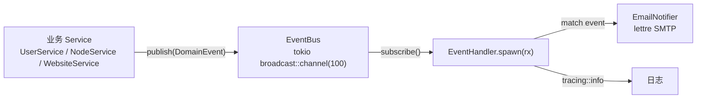

# 12 · 事件与通知系统

> FlamePanel 事件驱动架构（EventBus + EventHandler + 邮件通知）的实现细节与扩展指南

## 1. 架构总览

FlamePanel 内置一个轻量**进程内事件总线**，用于解耦"业务动作"与"副作用处理"（如发通知、审计、联动）。



- **EventBus**：`tokio::sync::broadcast` 多播通道，容量 100。
- **EventHandler**：订阅者任务，`tokio::spawn` 常驻，逐条消费事件。
- **EmailNotifier**：`lettre 0.11` 异步 SMTP 客户端。

## 2. 事件定义（DomainEvent）

`flame-kernel/src/domain/entity.rs`：

```rust
#[derive(Debug, Clone, Serialize, Deserialize)]
pub enum DomainEvent {
    UserCreated    { user_id: i64, username: String },
    NodeRegistered { node_id: i64, node_name: String },
    WebsiteCreated { website_id: i64, domain: String },
}
```

当前共 **3 个事件**。新增事件步骤：

1. `DomainEvent` 枚举新增变体（携带结构化字段，而非字符串拼接）。
2. 业务 Service 在对应操作成功后 `event_bus.publish(event).await`。
3. `EventHandler::handle_notification` 增加 `match` 分支。

## 3. EventBus 实现

```rust
pub struct EventBus {
    tx: broadcast::Sender<DomainEvent>,
}

impl EventBus {
    pub fn new(capacity: usize) -> Self { ... }         // 容量 100
    pub async fn publish(&self, event: DomainEvent) -> Result<(), AppError> { ... }
    pub fn subscribe(&self) -> broadcast::Receiver<DomainEvent> { ... }
}
```

要点：

- **多播**：多个订阅者均可收到同一事件（`broadcast` 特性，未来可扩展多消费者）。
- **背压**：若订阅者消费慢于生产，`broadcast` 会按容量丢最旧事件（Lagged 错误），消费端需容错。
- **不阻塞**：`publish` 为异步发送，不等待订阅者处理完成。

## 4. EventHandler（订阅消费端）

```rust
pub struct EventHandler {
    notifier: Option<Arc<EmailNotifier>>,
}

impl EventHandler {
    pub fn new() -> Self { Self { notifier: None } }
    pub fn with_email(mut self, notifier: Arc<EmailNotifier>) -> Self { ... }
    pub fn spawn(self, mut rx: broadcast::Receiver<DomainEvent>) {
        tokio::spawn(async move {
            while let Ok(event) = rx.recv().await {
                tracing::info!("Event received: {:?}", event);
                if let Some(ref notifier) = self.notifier {
                    if let Err(e) = Self::handle_notification(notifier, &event).await {
                        tracing::error!("Notification failed ...");
                    }
                }
            }
        });
    }
}
```

当前通知规则：

| 事件 | 通知行为 |
|------|----------|
| `UserCreated` | 发邮件给 `admin@flamepanel.local`，主题 `User Created: {username}` |
| `NodeRegistered` | 发邮件给 `admin@flamepanel.local`，主题 `Node Registered: {node_name}` |
| `WebsiteCreated` | 静默（`_ => {}`） |

## 5. 邮件通知（EmailNotifier）

`flame-kernel/src/notification/mod.rs`，基于 `lettre 0.11`：

- `SmtpConfig`：`host` / `port` / `username` / `password` / `from` / `use_tls`。
- 使用 `AsyncSmtpTransport::<Tokio1Executor>::relay(host)` + credentials + port 构建。
- 邮件为 `TEXT_PLAIN`，发送失败返回 `AppError::internal`。

**SMTP 配置来源**（`config/app.toml` + 环境变量覆盖）：

| 环境变量 | 默认 |
|----------|------|
| `OP_SMTP_HOST` | `localhost` |
| `OP_SMTP_PORT` | `25` |
| `OP_SMTP_USERNAME` | 空 |
| `OP_SMTP_PASSWORD` | 空 |
| `OP_SMTP_FROM` | `noreply@flamepanel.local` |
| `OP_SMTP_TLS` | `false` |

配置示例（`config/app.toml`）：

```toml
[notifications]
smtp_host = "smtp.example.com"
smtp_port = 465
smtp_username = "panel@example.com"
smtp_password = "xxxx"
smtp_from = "panel@example.com"
smtp_tls = true
```

## 6. 组合根接线（lib.rs）

```rust
let event_bus = EventBus::new(100);
let rx = event_bus.subscribe();
let notifier = Arc::new(EmailNotifier::new(smtp_config));
EventHandler::new().with_email(notifier).spawn(rx);
// ...
Self { config, event_bus, plugin_registry, app_state }
```

`event_bus` 存入 `FlameKernel`，业务 Service 通过 `FlameKernel` 持有引用发布事件。

> ⚠️ **当前实现说明**：事件总线已接线并在组合根创建订阅者，但业务 Service 中**尚未有实际 publish 调用**（`grep publish` 仅在 `event/bus.rs` 命中）。即"通道已就绪、发布端未接入"，是明确的深化切入点。

## 7. 扩展指南

### 7.1 发布事件的标准姿势

在业务 Service 成功操作后发布（不要放在失败路径）：

```rust
pub async fn create_user(&self, username: &str, hash: &str, role: &str) -> Result<i64, AppError> {
    let id = self.user_repo.create(...).await?;
    self.event_bus.publish(DomainEvent::UserCreated { user_id: id, username: username.into() }).await?;
    Ok(id)
}
```

> 注意：当前 Service 结构未注入 `event_bus`。建议通过 `Services` 聚合或构造函数注入，避免 Handler 直接发布。

### 7.2 新增事件类型模板

```rust
// 1. domain/entity.rs
pub enum DomainEvent {
    // ...
    AppInstalled { app_key: String, mode: String, user_id: i64 },
}

// 2. application/app_store_service.rs 安装成功后
self.event_bus.publish(DomainEvent::AppInstalled { ... }).await?;

// 3. event/handler.rs
DomainEvent::AppInstalled { app_key, mode, .. } => {
    notifier.send(recipient, &format!("App Installed: {app_key}"), &format!("{app_key} installed via {mode}")).await?
}
```

### 7.3 建议的事件集（路线图）

| 事件 | 触发点 | 建议消费者 |
|------|--------|------------|
| `AppInstalled` | 应用商店安装成功 | 邮件、操作审计 |
| `AppUninstalled` | 卸载成功 | 操作审计 |
| `WebsiteEngineSwitched` | 引擎切换 | 审计、告警 |
| `FirewallRuleApplied` | 防火墙规则生效 | 审计、告警 |
| `NodeHeartbeatTimeout` | 心跳超时（需先实现心跳） | 邮件告警、状态标记 |
| `BackupCompleted/Failed` | 备份任务（未来功能） | 邮件、审计 |
| `CertificateExpiring` | 证书即将过期（未来功能） | 邮件告警 |

### 7.4 幂等与可靠性建议

- `broadcast` 在进程重启后丢失未消费事件 → 对**审计类**需求建议同时落库 `operation_logs`（当前操作日志已独立实现）。
- 邮件发送失败已在 `EventHandler` 捕获并 `tracing::error`，不会影响主流程。
- 未来若需持久化事件，可引入 Outbox 模式：业务事务内写 `event_outbox` 表 + 后台投递。
