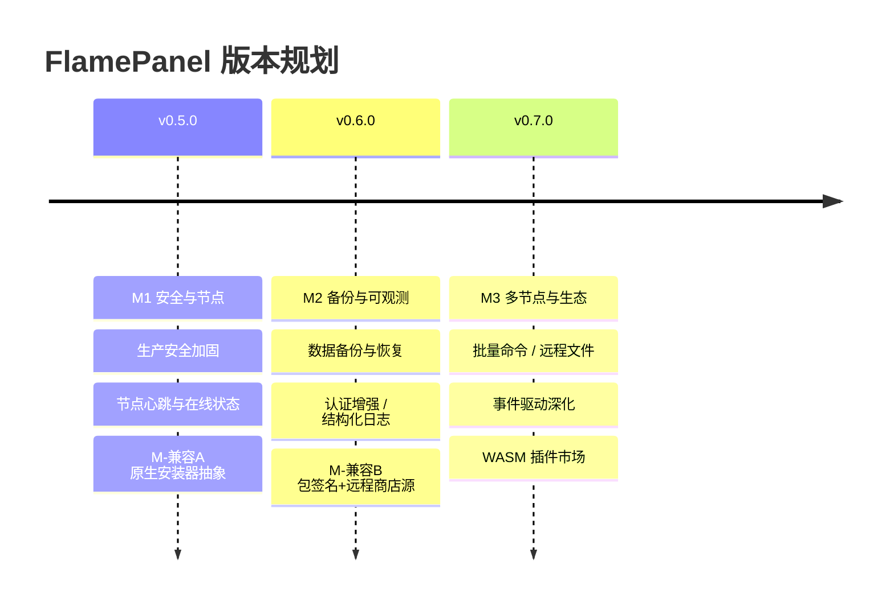

# 13 · 开发路线图与后续规划

> 基于当前源码与文档体系的深度分析，给出 FlamePanel 后续开发路线、优先级与实施建议

## 1. 项目现状盘点（2026-08）

| 维度 | 现状 |
|------|------|
| 后端 | Rust + Axum 0.6，Clean Architecture，17 个 handler，149 REST + 3 WS 路由 |
| 前端 | Vue 3.5 + Element Plus，18 路由 / 17 视图，三语言 i18n |
| 数据库 | SQLite + InMemory 双模式，15 张表，启动迁移 |
| 测试 | 162 个（98 集成 + 64 单元）全部通过 |
| 部署 | install.sh / systemd / Docker / Nginx 四种方式 |
| 文档 | Doc/ 17 份（16 篇正文 + 1 份 README 导航；本文档为第 13 篇）+ 根 README |

**总体评价**：核心能力（应用商店三格式/三模式、Web 引擎统一层 + 原生控制、Docker 全生命周期管理（参考 1Panel）、WASM 沙箱、RBAC）已完成且质量较高；但在**生产可用性**（节点心跳、认证增强、数据备份、前端联调、可观测性）上仍有明显缺口，是下一阶段重点。

## 2. 优先级总览（P0/P1/P2）

| 优先级 | 主题 | 说明 |
|--------|------|------|
| **P0** | 生产安全加固 | JWT 过期刷新、默认密码强制修改、Agent 令牌校验、HTTPS |
| **P0** | 节点心跳与在线状态 | Agent 心跳落库、面板在线判定、前端节点状态展示 |
| **P0** | 数据备份与恢复 | SQLite 自动备份、前端一键备份/恢复、导入导出 |
| **P1** | 认证增强 | 刷新令牌、验证码、登录失败锁定、操作日志补全 |
| **P1** | 前端功能联调 | 前端未覆盖 API 的视图补全、WebSocket 断线重连 |
| **P1** | 可观测性 | 结构化日志、指标面板、健康检查增强、审计 |
| **P2** | 多节点能力 | Agent 批量命令、远程文件管理、远程终端 |
| **P2** | 事件驱动深化 | DomainEvent 全面接入（见 12 文档） |
| **P2** | 高可用 | Docker 编排完善、WASM 插件生态、应用商店在线源 |

## 3. P0 详细规划

### 3.1 生产安全加固

**现状**：JWT 24 小时无刷新；默认密码 `admin123`；`OP_JWT_SECRET` 默认 `flamepanel-secret`。

**建议任务**：

- [ ] 登录接口增加"默认密码强制修改"标志（`users` 表加 `must_change_password` 字段）。
- [ ] JWT 增加 `exp` 校验 + `POST /api/auth/refresh` 刷新令牌（滑动过期）。
- [ ] `install.sh` 安装后强制提示修改默认密码。
- [ ] 登录失败次数限制（Redis 不可用时内存计数 + 延迟）。
- [ ] 生产环境默认启用 HTTPS 重定向（Nginx 配置模板）。

**验收标准**：全新安装后首次登录必须改密；token 过期后前端自动刷新不打断会话；暴力破解可被拦截。

### 3.2 节点心跳与在线状态

**现状**：Agent 已实现心跳上报，但面板 `node` 模块**无心跳路由**，节点状态无法呈现。

**建议任务**：

- [ ] `nodes` 表增加 `last_heartbeat_at`、`status`（online/offline）、`metrics_json`（最近指标快照）字段。
- [ ] 新增 `POST /api/nodes/heartbeat/:id`：更新 `last_heartbeat_at` + 写入指标快照；发布 `DomainEvent::NodeHeartbeat`。
- [ ] 新增 `GET /api/nodes/:id/status`：基于 `last_heartbeat_at` 与超时阈值（如 30 秒）返回 online/offline。
- [ ] 后端后台任务：定期扫描离线节点并标记（或惰性判定）。
- [ ] 前端 `NodesView.vue`：节点卡片显示在线状态、CPU/内存/磁盘实时指标、心跳时间。
- [ ] 失败回退：节点指标也可轮询 `GET /api/nodes/:id/metrics` 兜底。

**验收标准**：Agent 启动后 10 秒内节点显示 online；kill 掉 Agent 后 30 秒内自动转 offline；面板页面可查看节点实时指标曲线。

### 3.3 数据备份与恢复

**现状**：SQLite 单文件 `/opt/flamepanel/data/flamepanel.db`，无备份机制。

**建议任务**：

- [ ] 后端：`backup` 模块，提供：
  - `POST /api/settings/backup` — 触发备份（SQLite 在线备份 API `VACUUM INTO` 或文件拷贝 + 锁）。
  - `GET /api/settings/backups` — 备份列表（时间、大小、位置）。
  - `POST /api/settings/backups/:id/restore` — 恢复（先停机 → 覆盖 → 重启）。
  - `DELETE /api/settings/backups/:id` — 删除。
- [ ] 自动备份：`settings` 表加 `auto_backup_enabled` / `auto_backup_interval_hours` / `backup_retention` 配置。
- [ ] 前端 `SettingsView.vue` 增加"数据备份"页签：立即备份、自动备份开关、恢复确认弹窗。
- [ ] 安全：备份文件权限 600；恢复前自动二次备份当前库。

**验收标准**：可手动/定时备份；可恢复到指定时间点；前端有明确的危险操作确认与进度反馈。

## 4. P1 详细规划

### 4.1 认证增强

- [ ] `POST /api/auth/refresh` 刷新令牌；前端 `client.ts` 拦截 401 自动刷新重放（队列）。
- [ ] 登录页图形验证码（可选，先做频率限制）。
- [ ] `operation_logs` 补全登录成功/失败、权限变更、密钥操作审计。
- [ ] 前端登录页支持"记住我"（本地持久化 token 有效期选择）。

### 4.2 前端功能联调

**现状**：`api/*.ts` 覆盖 12 个模块，但部分 API 无对应视图（如 `operation_logs` 已有视图但 `app_store` 的 WASM 内置工具、`websites` 的引擎切换表单等可再深化）。

- [ ] 全量核对 02 文档 149 路由与前端 `api/*.ts` 的覆盖率，列出 gap 表。
- [ ] `FilesView.vue` 增加上传/下载/编辑器；`FirewallView.vue` 增加规则编辑表单。
- [ ] WebSocket 断线自动重连（指数退避）+ 页面状态提示。
- [ ] 前端加载态/错误态统一组件化（Skeleton + Empty + ErrorBoundary）。

### 4.3 可观测性

- [ ] `RUST_LOG` 结构化日志（`tracing-subscriber` JSON layer）。
- [ ] `/metrics` 端点暴露 Prometheus 格式（面板自身 + 节点聚合）。
- [ ] `/health` 增强：依赖检查（DB、Docker、磁盘水位）。
- [ ] 审计日志导出：`GET /api/operation-logs/export`（CSV/JSON）。

## 5. P2 详细规划

### 5.1 多节点能力

- [ ] 面板侧 NodeService 增加 `execute(node_id, command)`、`list_files(node_id, path)` 等远程调用（reqwest + 重试/熔断）。
- [ ] `nodes` 表持久化 Agent 的 `auth_token`，面板调用时携带校验。
- [ ] 前端 `NodesView` 增加"远程命令"弹窗与"节点文件"页签。
- [ ] 批量命令：多选节点并行执行，结果聚合展示。

### 5.2 事件驱动深化

- [ ] 业务 Service 全面接入 `event_bus`（见 12 文档 7.1），发布 `AppInstalled`、`AppUninstalled`、`FirewallRuleApplied`、`WebsiteEngineSwitched` 等事件。
- [ ] 通知渠道抽象：`NotificationChannel` trait（Email / Webhook / 站内信）。
- [ ] 事件落库（Outbox）保证审计不丢。

### 5.3 高可用与生态

- [ ] `docker-compose.yml` 增加健康检查、重启策略、数据卷持久化、`flamepanel-agent` 可选服务。
- [ ] 应用商店在线源：`app_packages` 支持远程仓库（Git 或 HTTP 索引）拉取。
- [ ] WASM 插件 SDK 文档 + 示例插件仓库 + 插件市场入口（SDK 入门见 [15-应用商店SDK开发指南.md](./15-应用商店SDK开发指南.md) 第 5 节）。
- [ ] 备份异地存储（SFTP/S3/MinIO）。

### 5.4 应用商店兼容性深化（对接 1Panel / 原生软件）

> 详细迁移清单与差异见 [16-1Panel与原生软件兼容性开发指导.md](./16-1Panel与原生软件兼容性开发指导.md)。

- [ ] **P1 原生安装器抽象（NativeInstaller trait）**：将 `app_store_service.rs` 中 `install_native` 的 `match key` 重构为 trait 注册表，支持第三方自定义原生软件注册 install/uninstall/status/start/stop。
- [ ] **P1 Compose 生命周期钩子**：`AppVersionInfo` 增加 `hooks`（pre/post install/upgrade/uninstall），补上 1Panel `scripts/*.sh` 在容器模式不执行的 gap。
- [ ] **P2 应用包签名与可信来源**：`app.json` 支持 Ed25519 签名，import 时验签；来源白名单。
- [ ] **P2 远程商店源**：以 1Panel 官方仓库为远程源镜像，懒加载索引 + 验签。
- [ ] **P2 原生生命周期 UI**：已安装页展示数据库/Web 引擎原生实例的 start/stop/status/healthcheck。

## 6. 里程碑建议

| 里程碑 | 范围 | 预计工作量 | 版本建议 |
|--------|------|------------|----------|
| M1 安全与节点 | P0 全部 | 2-3 周 | v0.5.0 |
| M2 备份与可观测 | P1 全部 | 2 周 | v0.6.0 |
| M3 多节点与生态 | P2 | 3-4 周 | v0.7.0 |
| M-兼容A | 原生安装器抽象 + compose hooks + 迁移验证 3~5 个 1Panel 包 | 1-2 周 | v0.5.0（并入 M1） |
| M-兼容B | 包签名 + 远程商店源（1Panel 生态镜像） | 2 周 | v0.6.0（并入 M2） |

每个里程碑应包含：功能代码 + 单元/集成测试 + 前端联调 + 文档更新 + 升级脚本（含 SQLite 迁移）。

### 6.1 里程碑时间线

## 7. 技术债与风险清单

| 风险/债 | 位置 | 建议 |
|---------|------|------|
| Agent `auth_token` 未持久化校验 | `node` 模块 | 见 P0-3.2 |
| 心跳路由缺失 | `node` 模块 | 见 P0-3.2 |
| 事件总线已接线未发布 | `application/*` | 见 P2-5.2 |
| 前端覆盖率 gap | `frontend/src/views` | 见 P1-4.2 |
| 无备份/恢复 | 数据层 | 见 P0-3.3 |
| WebSocket 无鉴权（白名单） | `ws` 模块 | 建议增加 token 参数校验（query `?token=` 或首帧鉴权） |
| 多语言文案可能缺 key | `locales/*` | 加 CI 检查 zh-CN/en-US/ja-JP key 对齐 |
| WASM 沙箱安全 | `plugin/` | 建议增加资源配额（内存/时间）与 deny-by-default 权限 |
