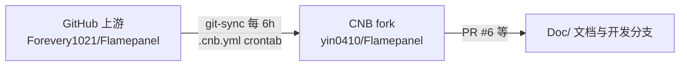

# 14 · 开发协作与发布流程

> FlamePanel 团队协作规范、分支策略、PR/评审流程、CI、版本发布与文档同步流程

## 1. 仓库与同步模型

本仓库 `yin0410/Flamepanel` 是 GitHub 上游 `Forevery1021/Flamepanel` 的 **fork**：



- 上游同步：`.cnb.yml` 中 `crontab: 0 */6 * * *` 定时从 GitHub 拉取 main 并推送到本仓库。
- ⚠️ **注意**：若上游转为私有，需在 `.cnb.yml` 中启用 `imports` 注入 `GIT_USERNAME/GIT_ACCESS_TOKEN` 密钥。
- 文档/开发在 CNB 仓库进行，功能代码改动如需回馈上游，另行提交 GitHub PR。

## 2. 分支策略

| 分支 | 用途 | 规则 |
|------|------|------|
| `main` | 稳定主线 | 只接受合并请求（PR），禁止直接 push（CI 保护） |
| `auto/*` | NPC/自动任务分支 | CodeBuddy 等自动化任务使用，如 `auto/dev-docs-b4f9` |
| `feature/*` | 人工功能开发 | 从最新 main 切出，完成后 PR |
| `fix/*` | 缺陷修复 | 关联 issue 编号，如 `fix/issue-5` |

**基本原则**：

- 任何改动（文档、代码、配置）都通过 **PR** 合入 main，保证可追溯、可评审、可回滚。
- 分支命名携带语义（`docs/`、`feat/`、`fix/`、`chore/`）。
- PR 关联对应 Issue（如本次 ISSUE #5 → PR #6）。

## 3. PR 流程规范

### 3.1 创建 PR checklist

- [ ] 标题遵循 `type: 简述`（docs/feat/fix/chore/refactor/test）。
- [ ] 描述列出：背景、改动清单、测试结果、影响范围、关联 Issue。
- [ ] 变更最小化：一次 PR 聚焦一个主题。
- [ ] 本地验证通过（见 §5 质量门禁）。
- [ ] 指派评审人（至少 1 人），CI 通过后再合入。

### 3.2 评审关注点

| 维度 | 检查项 |
|------|--------|
| 正确性 | 边界条件、错误分支、并发安全 |
| 安全 | 输入校验、路径穿越、注入、敏感信息泄露 |
| 架构 | 是否遵循分层依赖（API→App→Domain，严禁绕过 Service） |
| 兼容 | 数据库迁移是否向后兼容；API 是否破坏性变更（需版本化） |
| 测试 | 是否补充/更新单测与集成测试 |
| 文档 | 是否同步更新 Doc/ 与 README |

### 3.3 合入规则

- CI 全部通过（`cargo test`、`npm run build`、lint）。
- 无未解决的评审意见（或已确认可忽略）。
- 使用 **Squash Merge** 保持 main 历史干净（建议）。

## 4. CI/CD 流水线

### 4.1 当前 CI（.cnb.yml）

当前流水线仅有上游同步任务。建议为 PR 增加 CI 阶段：

```yaml
pr-check:
  "on: pull_request":
    stages:
      - name: backend-check
        image: rust:1.85
        script:
          - cd flame-kernel && cargo check
          - cargo clippy -- -D warnings
          - cargo test
      - name: frontend-check
        image: node:20
        script:
          - cd frontend && npm ci
          - npm run lint
          - npm run build
```

> 也可同步配置 GitHub Actions（`.github/workflows/`，仓库已有 GitHub sync workflow 的先例）。

### 4.2 建议的质量门禁（本地 `just` 命令）

| 命令 | 内容 | 何时运行 |
|------|------|----------|
| `just check` | 后端 `cargo check` | 提交前 |
| `just test` | 全量 `cargo test` | 提交前 |
| `just lint` | 前端 ESLint + 后端 Clippy `-D warnings` | 提交前 |
| `just typecheck` | `vue-tsc --noEmit` | 提交前 |
| `just build` | 前端 build + 后端 release | 发布前 |

完整流程：

```bash
just check && just lint && just test && just typecheck
# 全绿后再 commit & PR
```

## 5. 开发流程（六步）速查

后端新增功能（详见 05 文档）：

```
Domain → Infrastructure → Application → API → Test → Verify
```

前端新增页面（详见 04 文档）：

```
types → api 封装 → views → router → locales(zh/en/ja) → 联调验证
```

## 6. 版本发布流程

### 6.1 版本号规范

采用语义化版本 `MAJOR.MINOR.PATCH`：

- **MAJOR**：破坏性 API/存储变更。
- **MINOR**：向后兼容的新功能。
- **PATCH**：缺陷修复。

当前：内核 `v0.5.0`，前端 `0.1.0`。发布前需更新 `Cargo.toml`、`frontend/package.json`、README 版本信息、Doc/README 版本基线。

### 6.2 发布 checklist

- [ ] 从 `main` 切 `release/vX.Y.Z` 分支。
- [ ] 更新版本号 + `CHANGELOG.md`（如有）或 Doc 更新日志。
- [ ] 全量验证：`just check && just lint && just test && just typecheck && just build`。
- [ ] 回归文档：更新 Doc/README 中"测试基线/路由规模/版本信息"。
- [ ] 在 release 分支创建 Tag（`vX.Y.Z`），触发发布构建。
- [ ] 生成安装包/镜像（install.sh 产物 + Docker 镜像）并发布到 Releases。
- [ ] 更新部署文档 06 的版本号与环境变量变化。
- [ ] 合并回 main，清理 release 分支。

### 6.3 数据库迁移规范

- 所有表结构变更通过 `run_migrations()` 的幂等 `CREATE TABLE IF NOT EXISTS` 或新增 `ALTER TABLE` 步骤实现。
- **禁止**删除/重命名既有列（会破坏旧版本二进制启动）；确需变更时：
  1. 增加新列（带默认值）。
  2. 代码兼容读写新旧字段。
  3. 下个大版本再清理废弃列。

## 7. 文档同步规范

| 变更类型 | 必须同步的文档 |
|----------|----------------|
| 新增/修改 API | `02-API接口文档.md`、`README.md`（路由规模） |
| 新增表/字段 | `03-数据库设计.md` |
| 新增模块 | `01-架构设计.md`、`05-后端开发指南.md`（如适用） |
| 前端新增页面 | `04-前端开发指南.md`（路由表） |
| 权限变化 | `07-权限体系设计.md` |
| 部署变化 | `06-部署运维指南.md` |
| 测试变化 | `09-测试指南.md`（测试基线） |
| 跨系统协议 | `11-Agent节点通信协议.md` |
| 事件/通知 | `12-事件与通知系统.md` |
| 规划/债 | `13-开发路线图与后续规划.md` |

> 原则：**代码合入前，文档必须同步更新**（可在 PR 中一并提交）。

## 8. 协作约定（团队）

- 提交信息规范：`type: 描述`（如 `docs: 新增 Agent 协议文档`、`feat: 实现节点心跳`）。
- Issue 驱动：功能/缺陷先建 Issue，再关联 PR（如 ISSUE #5 → PR #6）。
- 每周同步：对照 13 文档的里程碑清单更新完成状态。
- 关键决策记录：新增 ADR 到 `01-架构设计.md` 第 6 节。
- 安全敏感改动：必须双人评审（安全/后端）。
