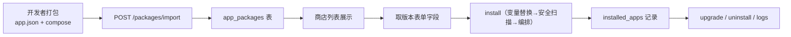
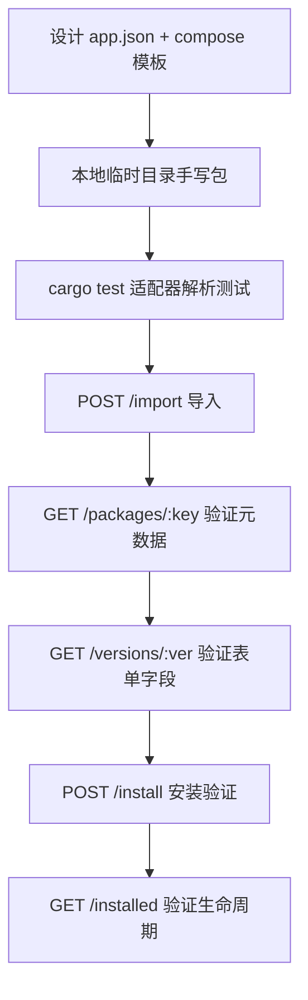

# 15 · 应用商店 SDK 开发指南

> 面向应用开发者与插件开发者的完整 SDK 文档：应用包格式规范、清单 Schema、SDK 工具链、WASM 插件 SDK、API 对接与最佳实践。

## 1. SDK 概览

FlamePanel 应用商店提供**"一次打包、多模式安装"**的应用分发体系。开发者只需按本指南规范打包应用，即可让应用被商店识别、导入、安装与升级。

### 1.1 支持的格式与模式

| 维度 | 选项 | 说明 |
|------|------|------|
| 应用包格式 | `flame` / `onepanel` / `baota` | 三种生态格式，导入时自动识别（`select_adapter`） |
| 安装模式 | `container` / `native` / `wasm` | 容器 Compose / 宿主原生 / WASM 沙箱 |

### 1.2 一个应用包的生命周期



## 2. 应用包格式规范（Flame 格式）

Flame 格式是商店的**原生格式**，同时兼容 1Panel / 宝塔包（见 [16-兼容性开发指导](./16-1Panel与原生软件兼容性开发指导.md)）。

### 2.1 目录结构

```
apps/<app-key>/
├── app.json                 # 应用元数据（必填）
├── icon.png                 # 图标（可选）
├── readme.md                # 说明文档（可选）
└── <version>/               # 版本目录（如 1.0.0 / 6.7 / latest）
    ├── docker-compose.yml   # 容器模式模板（与 install.sh 二选一或并存）
    ├── install.sh           # 原生模式安装脚本
    ├── app.wasm             # WASM 模式字节码
    └── data.yml             # 该版本表单字段（可选，也可写在 app.json 的 form_fields）
```

> 版本目录名必须**不含 `v` 前缀**（`v2.1` 会被跳过），且需包含数字或 `beta`/`rc` 特征；`logo`/`readme`/`data`/`scripts` 等目录名会被忽略。

### 2.2 `app.json` Schema

```json
{
  "key": "gitea",
  "name": "Gitea",
  "category": "devops",
  "short_desc_zh": "轻量 Git 服务",
  "short_desc_en": "Lightweight Git hosting",
  "tags": ["git", "devops"],
  "mode": "container",
  "default_port": 3000,
  "icon": "icon.png",
  "versions": ["1.21.0", "1.20.0"],
  "form_fields": [
    {
      "env_key": "PORT",
      "label_zh": "服务端口",
      "label_en": "Port",
      "field_type": "port",
      "default": "3000",
      "required": true
    }
  ],
  "readme": "readme.md"
}
```

字段说明：

| 字段 | 类型 | 必填 | 说明 |
|------|------|------|------|
| `key` | string | ✅ | 应用唯一键，全小写字母数字与 `-`，与目录名一致 |
| `name` | string | ✅ | 展示名称 |
| `category` | string | 推荐 | 分类（CMS / DevOps / Web / 缓存 / 监控…） |
| `short_desc_zh` / `short_desc_en` | string | 推荐 | 中英文简介 |
| `tags` | string[] | 否 | 标签，用于检索 |
| `mode` | string | 推荐 | `container` / `native` / `wasm`，默认 `container` |
| `default_port` | int | 推荐 | 默认端口（容器模式预填 `PORT` 字段） |
| `icon` | string | 否 | 图标文件路径 |
| `versions` | string[] | 否 | 版本列表；缺省时自动扫描版本目录 |
| `form_fields` | FormField[] | 否 | 全局表单字段；容器模式无字段时自动补 `PORT` |
| `readme` | string | 否 | README 文件路径 |

### 2.3 FormField 表单字段定义

| 字段 | 类型 | 说明 |
|------|------|------|
| `env_key` | string | 环境变量键（Compose 中通过 `${ENV_KEY}` 引用） |
| `label_zh` / `label_en` | string | 标签（中/英） |
| `field_type` | string | `text` / `number` / `password` / `select` / `port` / `switch` / `path` |
| `default` | string | 默认值 |
| `required` | bool | 是否必填 |
| `pattern` | string | 正则校验（仅 `app.json` 的 Flame 全局字段支持；1Panel 的 `regex` 会映射到此） |
| `min` / `max` | number | 数值范围 |
| `min_length` / `max_length` | number | 字符串长度范围 |
| `options` | `[{label, value}]` | `select` 类型的下拉选项 |
| `description` | string | 帮助说明（宝塔的 `placeholder` 会映射到此） |
| `group` | string | 表单分组 |

> 源码对应：`domain/entity.rs` 的 `FormField` 结构体。前端根据这些字段动态渲染安装向导。

### 2.4 Compose 模板变量

容器模式模板支持三种占位符，由 `VariableMapper` 统一渲染：

| 语法 | 示例 | 说明 |
|------|------|------|
| `${VAR}` | `${PANEL_APP_PORT_HTTP}` | 推荐，标准形式 |
| `$VAR` | `$HOST_IP` | 兼容形式 |
| `{var}` | `{port}` | 遗留形式（内置应用模板在用） |

**内置可用变量**（由安装编排自动注入）：

| 变量 | 说明 |
|------|------|
| `CONTAINER_NAME` | 生成的容器名（`<key>-<8位随机>` 或用户指定） |
| `NAME` | 实例名称 |
| `PORT` | 端口（用户输入或 default_port） |
| `PANEL_APP_PORT_HTTP` | = PORT |
| `PANEL_APP_PORT_HTTPS` | = PORT+1 |
| `HOST_IP` | 默认 `0.0.0.0` |
| `APP_PATH` | 安装目录绝对路径（`data/apps/<key>/<container>`） |

**用户表单值**优先级最高（`values` 覆盖内置变量）。未识别变量会**保留原样并告警**，不会导致安装失败。

**端口变量约定**（适配器 `known_port_vars()`，前端据此预填端口字段）：

| 格式 | 端口变量 |
|------|----------|
| Flame | `PORT` |
| 1Panel | `PANEL_APP_PORT_HTTP` / `_HTTPS` / `_API` / `_ADMIN` / `_PROXY` / `_DB` |
| 宝塔 | `HOST_IP` / `CPUS` / `MEMORY_LIMIT` / `APP_PATH` / `CONTAINER_NAME` |

### 2.5 网络兼容

- 1Panel 包中的 `1panel-network` → 自动替换为 `flamepanel-network`
- 宝塔包中的 `baota_net` → 自动替换为 `flamepanel-network`
- 应用应使用独立 compose project（`-p <container_name>`）部署，网络隔离、互不干扰

### 2.6 安全扫描要求

所有容器包安装前都会过 `SecurityScanner`：

| 风险 | 触发条件 | 处理 |
|------|----------|------|
| Block | `privileged: true` | 默认**拒绝安装**；`confirm_risky=true` 才放行（降为 High） |
| High | 挂载 `/etc` `/root` `/boot` `/var/run/docker.sock` | 需用户确认 |
| Medium | `network_mode: host` | 需用户确认 |
| Low | 镜像来自非白名单仓库 | 警告 |
| Info | 无 `restart:` 策略 | 自动补充 `restart: unless-stopped` |

> 白名单仓库：`docker.io` `ghcr.io` `quay.io` `registry.cn-hangzhou.aliyuncs.com`。请优先使用这些仓库，否则出现 Low 级警告。

## 3. 安装模式详解

### 3.1 容器模式（container）

Compose 模板 → 变量替换 → 安全扫描 → 写入安装目录 `docker-compose.yml` → `docker compose -p <name> up -d`。

**安装目录**：`data/apps/<key>/<container_name>/`

### 3.2 原生模式（native）

按 `package_key` 分派：

| key | 分派目标 | 说明 |
|-----|----------|------|
| `mysql` / `mariadb` | `DatabaseService::install_mysql` | apt/dnf/apk 原生安装 |
| `redis` | `DatabaseService::install_redis` | 原生安装 + requirepass |
| `nginx` / `apache` / `openlitespeed` / `openresty` / `caddy` | `WebServerService` | 包安装 + 引擎注册 |
| 其他 | `install.sh` 逐行执行 | 见下方原生脚本规范 |

**原生脚本规范（install.sh）**：每行是一条 bash 命令，按序执行，任一失败即中止并报错（源码按行过滤空行与 `#` 注释后 `sh -c` 逐行执行）。

```
apt-get install -y php-fpm
systemctl enable php-fpm
systemctl start php-fpm
```

> 注意：面板按**行**执行，不支持多行块；复杂逻辑建议写成单行脚本或拆分为多步。

### 3.3 WASM 模式（wasm）

1. 版本目录包含 `app.wasm`（或请求 `values.wasm_base64` 直接传字节码）
2. 后端 base64 解码 → SHA-256 指纹
3. `PluginSandbox` 沙箱加载（wasmtime，fuel 计量 + 超时）
4. `PluginRegistry` 注册 + `PluginRepository` 持久化（`plugins` 表）
5. 面板重启后 `restore_wasm_plugins` 自动恢复

WASM SDK 详见第 5 节。

## 4. SDK 工具链

### 4.1 本地开发包验证

```bash
# 1. 在仓库根目录放置应用包
mkdir -p apps/gitea/1.21.0
cat > apps/gitea/app.json <<'EOF'
{ "key": "gitea", "name": "Gitea", "category": "devops", "mode": "container", "default_port": 3000, "versions": ["1.21.0"] }
EOF
cat > apps/gitea/1.21.0/docker-compose.yml <<'EOF'
services:
  gitea:
    image: gitea/gitea:1.21.0
    ports:
      - "${PANEL_APP_PORT_HTTP}:3000"
    restart: unless-stopped
EOF

# 2. 启动面板，导入
curl -X POST http://localhost:8080/api/app-store/packages/import \
  -H "Authorization: Bearer $TOKEN" -H "Content-Type: application/json" \
  -d '{"path": "/abs/path/to/apps/gitea"}'
```

### 4.2 推荐开发流程（TDD 参照）



新增适配器或修改解析逻辑时，参照 `flame-kernel/src/infrastructure/app_store/adapter/*.rs` 中 `#[cfg(test)]` 的 29 个单元测试写法（`temp_dir` + 手写包 → `parse_metadata`/`parse_version` 断言）。

## 5. WASM 插件 SDK

### 5.1 支持的导出函数签名

当前沙箱支持以下签名（`WasmSandbox::execute`）：

| 签名 | 说明 |
|------|------|
| `() -> i32` | 返回 32 位整数（内置 `wasm-hello` 采用） |
| `() -> ()` | 无返回值 |
| `(i32, i32) -> i32` | 两个 i32 参数（当前参数固定传 `(0,0)`，**建议优先用无参或仅用返回值**） |

### 5.2 生命周期钩子

沙箱在以下时机调用同名导出函数（可选，缺失不影响加载）：

| 钩子 | 时机 |
|------|------|
| `on_load` | 插件加载后 |
| `on_reload` | 热重载时（`reload_plugin`，失败自动回滚旧字节码） |
| `on_enable` / `on_disable` | 启用/禁用时 |
| `on_unload` | 卸载前 |

### 5.3 用 Rust 编写 WASM 插件

```bash
# Cargo.toml
# [lib]
# crate-type = ["cdylib"]
# 目标: wasm32-wasip1（或 wasm32-unknown-unknown）
```

```rust
// src/lib.rs — 编译为 WASM
#[no_mangle]
pub extern "C" fn run() -> i32 {
    42
}

#[no_mangle]
pub extern "C" fn on_load() {}

#[no_mangle]
pub extern "C" fn on_unload() {}
```

```bash
cargo build --target wasm32-wasip1 --release
# 编码 base64 后经 API 加载
base64 -w0 target/wasm32-wasip1/release/my_plugin.wasm
```

### 5.4 直接用 WAT 编写（无编译环境）

```wat
;; hello.wat
(module
  (func (export "run") (result i32)
    i32.const 42)
  (func (export "on_load"))
  (func (export "on_unload"))
  (memory (export "memory") 1))
```

```bash
wat2wasm hello.wat -o hello.wasm
base64 -w0 hello.wasm
```

### 5.5 沙箱限制

| 项 | 默认值 | 可配置 |
|----|--------|--------|
| 内存限制 | 64 MB | `memory_limit_bytes` |
| 执行超时 | 30 s | `timeout_ms` |
| 燃料（fuel） | 每次执行 1,000,000 | 源码固定 |
| 栈大小 | 1 MB | `max_stack_size` |

插件无 host 函数导入（deny-by-default，无文件/网络权限），适合**纯计算/校验/指标类**工具。后续路线图中的"插件市场"将扩展 host API。

### 5.6 WASM 插件 API

| 端点 | 说明 |
|------|------|
| `POST /api/plugins` | 加载插件（body: `id, name, wasm_base64, memory_limit_bytes, timeout_ms`） |
| `GET /api/plugins` | 插件列表（状态/指标） |
| `POST /api/plugins/:id/execute/:function` | 执行导出函数 |
| `POST /api/plugins/:id/reload` | 热重载 |
| `POST /api/plugins/:id/enable` / `disable` | 启用/禁用 |
| `GET /api/plugins/:id/metrics` | 执行指标 |
| `GET/POST /api/plugins/:id/settings` | KV 设置 |
| `POST /api/plugins/:id` | 卸载 |

权限：`plugin:read/create/execute/config/delete`。

## 6. 对接面板 API（SDK 集成）

应用商店完整端点（权限 `app_store:*`）：

| 方法 | 路径 | 说明 |
|------|------|------|
| GET | `/api/app-store/packages?category=` | 应用列表 |
| POST | `/api/app-store/packages/import` | 导入本地包 `{path}` |
| GET | `/api/app-store/packages/:key` | 应用详情 |
| GET | `/api/app-store/packages/:key/versions/:version` | 版本详情（表单字段/模板） |
| POST | `/api/app-store/packages/:key/install` | 安装 |
| GET | `/api/app-store/installed` | 已安装列表 |
| GET | `/api/app-store/installed/:id` | 已安装详情 |
| POST | `/api/app-store/installed/:id/upgrade?target_version=` | 升级 |
| POST | `/api/app-store/installed/:id/uninstall` | 卸载 |
| GET | `/api/app-store/installed/:id/logs?tail=` | 日志 |
| GET | `/api/app-store/wasm-builtins` | WASM 内置工具 |

**install 请求体完整字段**：

```json
{
  "package_key": "wordpress",
  "version": "6.7",
  "mode": "container",
  "name": "my-wp",
  "port": 8081,
  "container_name": "wp-01",
  "values": {
    "PANEL_APP_PORT_HTTP": "8081",
    "DB_PASSWORD": "secret"
  },
  "confirm_risky": false
}
```

**升级语义**：
- 容器模式：按新版本模板重新渲染（保留 `params_json` 与端口）→ `compose down` → `compose up -d`
- 原生模式：卸载旧版 → 重新安装（`values.force_reinstall=true`）
- WASM 模式：`reload_plugin` 更新字节码

## 7. 最佳实践与 FAQ

### 7.1 最佳实践

1. **key 命名**：全小写 + 连字符（`gitea`、`php-fpm`），与目录名一致，避免与内置应用冲突（wordpress/portainer/nginx/redis/uptime-kuma）。
2. **版本目录**：语义化版本号，不加 `v` 前缀；`latest` 目录（宝塔风格）会被识别但 `default_version` 优先取非 latest 的第一个。
3. **表单字段下沉**：容器模式的字段建议放 `app.json.form_fields`（全局）；1Panel 放版本目录 `data.yml.additionalProperties.formFields`。
4. **端口可配置**：模板用 `${PANEL_APP_PORT_HTTP}`，避免硬编码端口冲突。
5. **声明 restart**：模板显式写 `restart: unless-stopped`（否则自动补充，建议显式声明）。
6. **镜像仓库**：优先 docker.io / ghcr.io / quay.io / 阿里云镜像。
7. **原生脚本幂等**：install.sh 应可重复执行（先卸载残留、`|| true` 容错）。
8. **升级兼容**：Compose 模板中服务名保持不变，环境变量键不轻易变更，避免升级后配置丢失。

### 7.2 FAQ

**Q1：导入报"无法识别的应用包格式"？**
A：确认目录含 `app.json`（Flame/宝塔）或 `data.yml`（1Panel）；宝塔 `app.json` 需含 `appname`/`apptitle`/`apptype` 之一，否则会被当作 Flame。

**Q2：安装时提示"字段 [xx] 为必填项"？**
A：该字段 `required=true` 且 `values` 未传值。查看 `GET /packages/:key/versions/:version` 返回的 `form_fields` 逐一补齐。

**Q3：Compose 中 `${PANEL_APP_PORT_HTTP}` 没被替换？**
A：检查拼写（变量名大小写不敏感但需在 `values` 或内置变量中存在）；未识别变量保留原样并打警告日志，可查看后端日志确认。

**Q4：安装失败提示"安全扫描未通过"？**
A：模板含 `privileged: true`。移除特权，或前端/API 调用时带 `confirm_risky: true`。

**Q5：WASM 插件执行报"Function not found or unsupported signature"？**
A：导出函数签名必须是 `()->i32` / `()->()` / `(i32,i32)->i32` 之一；检查编译目标与 `#[no_mangle]`。

**Q6：如何让 1Panel 应用原样跑在 FlamePanel？**
A：见 [16-兼容性开发指导](./16-1Panel与原生软件兼容性开发指导.md) —— 面板已内置 `data.yml` 解析、`1panel-network` 替换、表单字段映射；需重点检查安全扫描与变量。

## 8. 相关源码索引

| 功能 | 源码位置 |
|------|----------|
| 领域实体（FormField/AppMetadata/AppVersionInfo） | `flame-kernel/src/domain/entity.rs` |
| 适配器 trait 与格式识别 | `flame-kernel/src/infrastructure/app_store/adapter/mod.rs` |
| Flame 格式解析 | `flame-kernel/src/infrastructure/app_store/adapter/flame.rs` |
| 1Panel 格式解析 | `flame-kernel/src/infrastructure/app_store/adapter/onepanel.rs` |
| 宝塔格式解析 | `flame-kernel/src/infrastructure/app_store/adapter/baota.rs` |
| 变量映射 | `flame-kernel/src/infrastructure/app_store/variable_mapper.rs` |
| 安全扫描 | `flame-kernel/src/infrastructure/app_store/security_scanner.rs` |
| 安装编排（三模式/升级/卸载） | `flame-kernel/src/application/app_store_service.rs` |
| 商店 API | `flame-kernel/src/api/handler/app_store/mod.rs` |
| 权限映射 | `flame-kernel/src/api/types.rs` |
| WASM 沙箱 | `flame-kernel/src/plugin/sandbox.rs` |
| 插件注册表/持久化 | `flame-kernel/src/plugin/registry.rs`、`plugins` 表 |
| 前端封装 | `frontend/src/api/appStore.ts` |
| 前端商店视图 | `frontend/src/views/AppStoreView.vue` |
