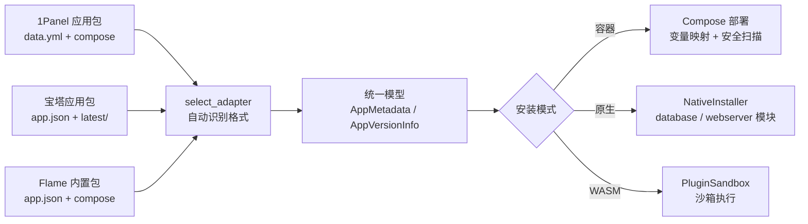

# 16 · 1Panel 与原生控制软件兼容性开发指导

> 面向"从 1Panel 应用生态迁移"与"原生软件接入控制"的开发者，说明 FlamePanel 的兼容层现状、差异点、迁移清单与后续扩展方向。

## 1. 兼容性目标

FlamePanel 的应用商店设计目标是**三生态互通**：



同时，原生软件（MySQL/Redis/Nginx/Web 引擎等）由面板的 `database` / `webserver` / `os` 模块统一编排，形成"面板可控制"的原生软件体系。

## 2. 1Panel 应用包兼容现状

### 2.1 已实现的解析（OnePanelAdapter）

**目录结构**：

```
apps/<app-key>/
├── data.yml          # 元数据（key/name/tags/shortDescZh/shortDescEn/type/icon）
├── logo.png
└── <version>/        # 如 2.21.0（不加 v）
    ├── data.yml      # additionalProperties.formFields（安装表单）
    ├── docker-compose.yml
    └── scripts/      # init.sh / upgrade.sh / uninstall.sh
```

**字段映射**：

| 1Panel 字段 | FlamePanel 字段 | 说明 |
|-------------|-----------------|------|
| `data.yml.key` | `AppMetadata.key` | 缺省用目录名 |
| `data.yml.name` | `AppMetadata.name` | |
| `data.yml.type` | `AppMetadata.category` | 如 website/php/数据库 |
| `data.yml.shortDescZh/En` | `short_desc_zh/en` | |
| `data.yml.tags` | `tags` | |
| `data.yml.icon` | `logo` | |
| `additionalProperties.formFields[].type` | `FormField.field_type` | `input→text`、`password→password`、`select→select`、`number→number`、`radio/checkbox→select` 等 |
| `formFields[].envKey` | `env_key` | |
| `formFields[].label` | `label_zh` | |
| `formFields[].regex` | `pattern` | 正则校验 |
| `formFields[].selectValue` | `options` | |
| `formFields[].default` / `required` | 同名 | |
| compose 中 `1panel-network` | `flamepanel-network` | **自动替换** |

**已自动处理的兼容点**：
- 版本目录扫描（排除 `logo`/`readme`/`data`/`scripts` 等）
- 端口变量 `PANEL_APP_PORT_HTTP/HTTPS/API/ADMIN/PROXY/DB` 识别（前端预填）
- 生命周期脚本 `scripts/init.sh|upgrade.sh|uninstall.sh` 被识别为 `native_scripts`

### 2.2 1Panel → FlamePanel 迁移清单（Checklist）

从 1Panel 官方商店下载应用包后，建议逐项检查：

- [ ] **数据目录/命名**：1Panel 包常依赖 `/opt/1panel/apps/<key>/<version>/` 绝对路径；FlamePanel 的 `APP_PATH` 指向 `data/apps/<key>/<container>`，模板中硬编码的 `/opt/1panel/...` 需改为 `$APP_PATH` 或相对卷。
- [ ] **环境变量**：1Panel 表单里用户输入的 `PANEL_APP_PORT_HTTP` 等由面板注入，可直接使用；额外需要的变量（如数据库密码）要在表单字段声明 `envKey`。
- [ ] **网络**：`1panel-network` 已被自动替换，无需手工改；若 compose 还引用其他自定义网络（如 `mynet`），需确认能自动创建或改为 bridge。
- [ ] **安全扫描**：1Panel 部分包用了 `privileged: true`（如部分监控/备份工具）会被**默认阻断**，需在 UI 确认风险或移除特权。
- [ ] **镜像仓库**：1Panel 默认镜像源 `docker.1panel.live` 非白名单，会触发 Low 级警告；建议改为 `docker.io` 或阿里云镜像。
- [ ] **脚本**：`scripts/*.sh` 目前仅登记文件名到 `native_scripts`，容器模式下**不会自动执行**（编排只走 compose）；如需容器初始化请用 compose 的 `command` / `entrypoint` / init 容器。
- [ ] **多服务编排**：1Panel 包通常一个 compose 包含 app + db，FlamePanel 直接整体部署，无拆包机制。

### 2.3 迁移示例：以 1Panel WordPress 包为例

```
# 迁移后目录
apps/wordpress/
├── data.yml              # key/name/type=website/shortDescZh...
└── 6.7/
    ├── data.yml          # formFields: PANEL_APP_PORT_HTTP / DB_PASSWORD ...
    └── docker-compose.yml
```

需修改的点：

```yaml
# 原 1Panel compose 中
services:
  wordpress:
    image: docker.1panel.live/library/wordpress:6.7   # ← 改 docker.io/library/wordpress:6.7
    ports:
      - "${PANEL_APP_PORT_HTTP}:80"
    networks:
      - 1panel-network                                  # ← 自动替换为 flamepanel-network
    volumes:
      - /opt/1panel/apps/wordpress/6.7/data:/var/www/html  # ← 改为 $APP_PATH:/var/www/html
```

## 3. 宝塔（aaPanel）应用包兼容现状

`BaotaAdapter` 支持宝塔 Docker 应用格式：

```
apphub/<app-name>/
├── app.json             # appname/apptitle/appdesc/apptype + field[]
├── icon.png
├── latest/              # 默认最新版本
│   └── docker-compose.yml
└── <version>/docker-compose.yml
```

**自动处理**：`baota_net` → `flamepanel-network`；`field[].placeholder` → `description`；`field[].type`（select/number/password）映射；`latest` 目录识别。

## 4. 原生控制软件兼容

FlamePanel 对"原生软件"（非容器）提供**两类控制途径**：

### 4.1 内置原生安装器（面板原生编排）

通过应用商店原生模式（`mode=native`）安装，由面板统一记录与管理：

| 软件 | package_key | 编排 | 数据/配置路径 |
|------|-------------|------|----------------|
| MySQL / MariaDB | `mysql` / `mariadb` | `DatabaseService::install_mysql` | `/var/lib/mysql`、`/etc/mysql/...` |
| Redis | `redis` | `DatabaseService::install_redis` | `/var/lib/redis`、`/etc/redis/redis.conf` |
| Nginx | `nginx` | `WebServerService` + `PackageManager` | `/etc/nginx` |
| Apache | `apache` | 同上 | `/etc/apache2` |
| OpenLiteSpeed | `openlitespeed` | 同上 | `/usr/local/lsws` |
| OpenResty | `openresty` | 同上 | `/usr/local/openresty` |
| Caddy | `caddy` | 同上 | `/etc/caddy` |
| 通用脚本软件 | 自定义 key | `install.sh` 逐行执行 | 由脚本决定 |

> 关键点：`package_key` 决定原生分派。**想复用面板原生编排，应用 key 必须与上表一致**（或自行在 `app_store_service.rs` 的 `install_native` 中新增分支）。

### 4.2 通用 install.sh（自定义原生软件）

任何 Flame 格式原生应用（`mode=native`）均可通过 `install.sh` 接入：

```
apps/myapp/
├── app.json          # {"key":"myapp","mode":"native","versions":["1.0.0"]}
└── 1.0.0/
    └── install.sh    # 逐行 bash
```

**升级语义**：原生模式升级 = 卸载旧版 + 重装（`values.force_reinstall=true`）。
**卸载语义**：按 package_key 调用 `PackageManager::uninstall`。

### 4.3 直接使用面板原生模块 API

若不想走应用商店，原生软件也可直接对接面板既有模块：

| 模块 | API 前缀 | 能力 |
|------|----------|------|
| 数据库 | `/api/databases` | 安装/卸载/启停/建库/建用户（MySQL/Redis） |
| Web 服务器 | `/api/web-servers` | 引擎安装/启停/配置/预设/引擎切换；原生控制（`/native/detect|install|uninstall|autostart`：包管理器安装/卸载、systemd 开机自启、安装状态/版本/监听端口检测） |
| 文件 | `/api/files` | 远程文件管理 |
| 防火墙 | `/api/firewall` | 端口/规则管理 |
| 终端 | `/ws/terminal` | 浏览器 Shell |
| Agent | Agent 协议 | 远程节点命令（见 11 文档） |

## 5. 已知差异与限制（gap 清单）

| # | 差异 | 影响 | 建议 |
|---|------|------|------|
| 1 | 1Panel `scripts/*.sh` 在容器模式**不自动执行** | 依赖 init/upgrade 脚本的包升级可能不完整 | 后续在 compose 模板支持 `x-flame-hooks` 或容器 init |
| 2 | 原生编排仅 7 个内置 key + 通用 install.sh | 自定义软件无生命周期管理（启停/状态） | 扩展 `NativeInstaller` 抽象：install/start/stop/status/uninstall |
| 3 | WASM 沙箱无 host 函数 | 插件无法访问文件/网络 | 后续按 capability 白名单开放 host API |
| 4 | `1panel-network`/`baota_net` 硬替换 | 其他自定义网络名不会被替换 | 建议模板显式用 `flamepanel-network` |
| 5 | 表单校验在服务端 `validate_fields` | 部分 1Panel `regex` 为 JS 风格 | 用 Rust regex 兼容子集，前端校验保持一致 |
| 6 | 原生卸载按包名粗粒度 | 同名多版本/多实例难区分 | `installed_apps.install_path` 已记录，可细化卸载脚本 |
| 7 | 无应用包签名/校验 | 导入任意目录即可执行脚本（高风险） | 增加包签名 + 可信来源校验 |

## 6. 后续开发指导（Roadmap 细化）

### 6.1 P1：原生安装器抽象（NativeInstaller trait）

将 `install_native` 中的 `match key` 分支重构为 trait 注册表：

```rust
pub trait NativeInstaller: Send + Sync {
    fn keys(&self) -> &'static [&'static str];
    async fn install(&self, req: &InstallRequest, version: &str) -> Result<InstalledApp, AppError>;
    async fn uninstall(&self, app: &InstalledApp) -> Result<(), AppError>;
    async fn status(&self, app: &InstalledApp) -> Result<String, AppError>;
}
```

收益：第三方软件可通过配置/插件注册原生安装器，无需改内核代码；补齐启停/状态能力。

### 6.2 P1：Compose 生命周期钩子

在 `AppVersionInfo` 增加 `hooks: {pre_install, post_install, pre_upgrade, post_upgrade, pre_uninstall}`，容器模式在对应阶段执行宿主机脚本，覆盖 1Panel `scripts/` 语义。

### 6.3 P2：应用包签名与可信来源

- `app.json` 增加 `signature`（Ed25519）
- `import` 时校验签名与公钥白名单
- 支持远程商店源（Git/HTTP 索引）拉取 + 验签

### 6.4 P2：在线商店源

`app_packages` 增加 `source` 字段（local/remote），远程包按 `data.yml` 索引懒加载，支持 1Panel 官方仓库作为远程源。

### 6.5 P2：原生软件生命周期补全

- MySQL/Redis/Nginx 等统一 `status/start/stop/restart` 暴露到应用商店"已安装"页
- `installed_apps` 增加 `healthcheck` 与 `last_health_at`

### 6.6 里程碑建议

| 里程碑 | 内容 | 版本 |
|--------|------|------|
| M-兼容A | 原生安装器抽象 + compose hooks + 迁移 3~5 个 1Panel 热门包验证 | v0.5.0 |
| M-兼容B | 包签名 + 远程商店源（1Panel 生态镜像） | v0.6.0 |
| M-生态 | 插件市场 + WASM host API + 原生生命周期 UI | v0.7.0 |

## 7. 验证方法

```bash
# 1. 单元测试（适配器解析 29 个用例）
cd flame-kernel && cargo test app_store

# 2. 集成测试（商店 API）
cargo test app_store

# 3. 手工验证导入 1Panel 包
curl -X POST http://localhost:8080/api/app-store/packages/import \
  -H "Authorization: Bearer $TOKEN" -H "Content-Type: application/json" \
  -d '{"path": "/opt/apps/wordpress"}'
curl http://localhost:8080/api/app-store/packages/wordpress
curl http://localhost:8080/api/app-store/packages/wordpress/versions/6.7
```

> 迁移一个 1Panel 包后，请检查：①元数据正确（category/desc）；②表单字段完整；③compose 变量全部被替换（无警告日志）；④安全扫描无 Block；⑤安装/升级/卸载闭环可用。
