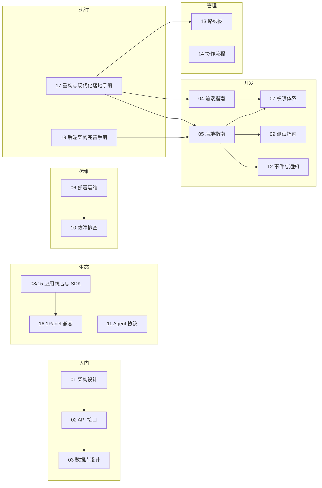

# FlamePanel 开发文档中心

> 基于 Rust + Vue 3 的服务器运维管理面板 · 本文档为开发、API 对接与部署的权威指南

## 文档导航

| 文档 | 说明 | 适用对象 |
|------|------|----------|
| [01-架构设计.md](./01-架构设计.md) | 系统架构、分层设计、核心模块与技术决策 | 架构师、后端开发 |
| [02-API接口文档.md](./02-API接口文档.md) | 全部 REST/WebSocket 接口、请求/响应示例、认证与错误码 | 前后端开发者、API 对接方 |
| [03-数据库设计.md](./03-数据库设计.md) | SQLite 表结构、字段说明、实体关系、迁移机制 | 后端开发、DBA |
| [04-前端开发指南.md](./04-前端开发指南.md) | 前端工程结构、页面路由、API 封装、i18n 与主题 | 前端开发 |
| [05-后端开发指南.md](./05-后端开发指南.md) | 后端分层开发流程、新功能标准步骤、代码规范 | 后端开发 |
| [06-部署运维指南.md](./06-部署运维指南.md) | 四种部署方式、环境变量、Nginx、Docker、systemd 运维 | 运维、部署人员 |
| [07-权限体系设计.md](./07-权限体系设计.md) | JWT 认证、RBAC 角色权限、中间件流程、权限扩展 | 后端开发、安全 |
| [08-应用商店与插件系统.md](./08-应用商店与插件系统.md) | 应用商店三格式/三模式、WASM 插件沙箱、安全扫描（入门概览） | 应用开发者、插件开发者 |
| [15-应用商店SDK开发指南.md](./15-应用商店SDK开发指南.md) | 应用包格式/清单 Schema/安装模式/WASM 插件 SDK/API 对接/FAQ（SDK 实操） | 应用开发者、插件开发者 |
| [16-1Panel与原生软件兼容性开发指导.md](./16-1Panel与原生软件兼容性开发指导.md) | 1Panel/宝塔包迁移清单、原生控制软件接入、差异与后续路线 | 应用开发者、迁移实施者 |
| [17-重构与现代化落地手册.md](./17-重构与现代化落地手册.md) | 后端重构（Stage0–3）+ 前端修复（F0–F4）+ OpenVue 现代化的统一可执行手册 | Coding Agent、全体开发者 |
| [18-兼容性与安全基线.md](./18-兼容性与安全基线.md) | 操作系统兼容矩阵、上线前安全验收清单、CI 安全门禁 | 运维、安全、全体 |
| [19-后端架构分析与完善落地手册.md](./19-后端架构分析与完善落地手册.md) | 后端架构现状/问题/性能分析 + Stage0–9 分阶段完善手册（分页下沉、鉴权缓存、限流、任务生命周期、权限元数据等） | Coding Agent、后端开发、架构师 |
| [09-测试指南.md](./09-测试指南.md) | 测试策略、集成/单元测试编写、运行命令 | 全栈开发 |
| [10-故障排查手册.md](./10-故障排查手册.md) | 常见问题排查、日志定位、健康检查 | 运维、开发 |
| [11-Agent节点通信协议.md](./11-Agent节点通信协议.md) | Agent 注册/心跳/远程命令/文件接口、安全模型与扩展 | 后端、运维、Agent 开发者 |
| [12-事件与通知系统.md](./12-事件与通知系统.md) | EventBus、DomainEvent、邮件通知与事件驱动扩展 | 后端开发 |
| [13-开发路线图与后续规划.md](./13-开发路线图与后续规划.md) | P0/P1/P2 优先级、里程碑、技术债清单 | 架构师、PM、全体 |
| [14-开发协作与发布流程.md](./14-开发协作与发布流程.md) | 分支/PR/CI/版本发布/数据库迁移/文档同步规范 | 全体 |

### 文档地图



## 快速开始

```bash
# 1. 启动后端（端口 8080）
cd flame-kernel && cargo run

# 2. 启动前端（端口 5173，自动代理 /api 与 /ws）
cd frontend && npm install && npm run dev

# 3.（可选）启动节点 Agent
cd agent && PANEL_URL=http://127.0.0.1:8080 AUTH_TOKEN=dev-token cargo run
```

访问 `http://localhost:5173`，默认账号 `admin` / `admin123`。

> 详细开发步骤见 [05-后端开发指南.md](./05-后端开发指南.md) 与 [04-前端开发指南.md](./04-前端开发指南.md)。
> Agent 协议见 [11-Agent节点通信协议.md](./11-Agent节点通信协议.md)。

## 技术栈总览

| 层面 | 技术 |
|------|------|
| 后端架构 | Clean Architecture + Hexagonal（domain → application → infrastructure → api） |
| 后端框架 | Rust + Axum 0.8 |
| 数据库 | SQLite（sqlx 0.9）+ InMemory 双模式 |
| 认证 | jsonwebtoken 9 + bcrypt |
| WASM | wasmtime 46 |
| 前端 | Vue 3.5 + TypeScript 6.0 + OpenVue 0.7 + Vite 8 |
| 状态/路由 | Pinia 3 + Vue Router 5 |
| 国际化 | vue-i18n 10（zh-CN / en-US / ja-JP） |
| 终端 | xterm.js 5.5 + @xterm/addon-fit |

## 目录结构速览

```
Flamepanel/
├── flame-kernel/          # Rust 核心后端（Axum）
│   ├── src/
│   │   ├── domain/        # 实体 + Repository trait + 领域端口（execution_mode，零依赖）
│   │   ├── application/   # 服务层（每域一文件，T8 拆分 + app_store_ports）
│   │   ├── infrastructure/# 仓库实现（InMemory/SQLite/Docker/OS + app_store/firewall 适配器）
│   │   ├── api/           # HTTP 层（22 个 handler 模块 + types/dto/permissions/pagination 拆分）
│   │   ├── plugin/        # WASM 沙箱 + 注册表
│   │   ├── webserver/     # 5 种 Web 引擎 + 性能预设 + 原生控制（包管理/systemd）
│   │   ├── database/      # MySQL/MariaDB/Redis 原生管理
│   │   ├── firewall/      # 防火墙（ufw/firewalld/iptables，FirewallManager 下沉基础设施）
│   │   ├── terminal/      # Web 终端（bash 子进程管道）
│   │   ├── event/         # 事件总线（broadcast + Outbox 落库重试 + 邮件通知）
│   │   ├── resilience/    # Circuit Breaker + Retry
│   │   └── utils/         # JWT / bcrypt / AuthCache / 校验
│   └── tests/             # 集成 + 单元测试（295 用例）
├── frontend/              # Vue 3 前端（23 个视图、3 语言 i18n、30+ Fp* 组件、vue-query）
├── agent/                 # 轻量 Rust Agent
├── Doc/                   # 本文档中心
├── install.sh / uninstall.sh / cnb-dev-setup.sh
├── Dockerfile / docker-compose.yml / nginx.conf
└── justfile
```

## 版本信息

- 当前版本：v0.7.0（内核），前端 0.1.0
- 测试基线：295 个测试全部通过（156 集成 + 139 单元 + stage/agent 等）
- 路由规模：179 条 HTTP 路由（含 `/health` + `/api/health` + `/api/openapi.json`）+ 3 条 WebSocket 路由
- 权限规模：73 项 RBAC 权限 + 3 角色（admin/operator/viewer）
- 后端架构重构（Doc/19 Stage 0–9 + P0/P1/P2/P3 T1–T16）：已全部落地（分页下沉、鉴权缓存 AuthCache、限流分级、权限元数据化+默认拒绝、错误映射 10 码、JWT 加固、Docker 门面拆分、Outbox 事件一致性、service/types 上帝文件拆分、domain 依赖方向修正、索引/panic 清理/死代码/配置化）
- 前端现代化（Doc/17 F0–F4 + M1–M11）：已全部落地（vue-query 数据层、Fp* 封装 30+ 组件、OpenAPI 类型单源、a11y/IA、CI typecheck + 单测）

## 相关链接

- [根 README](../README.md)
