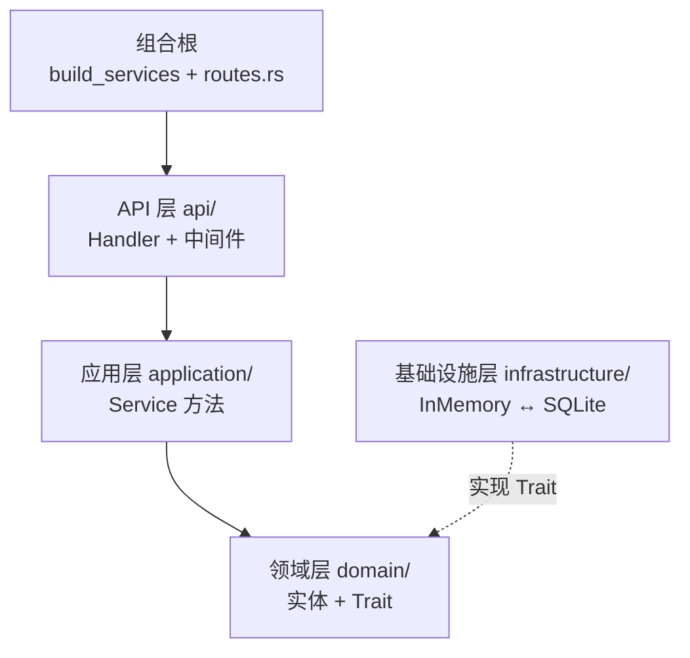
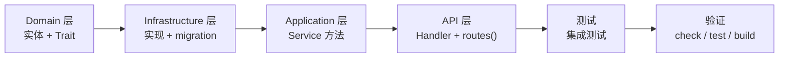
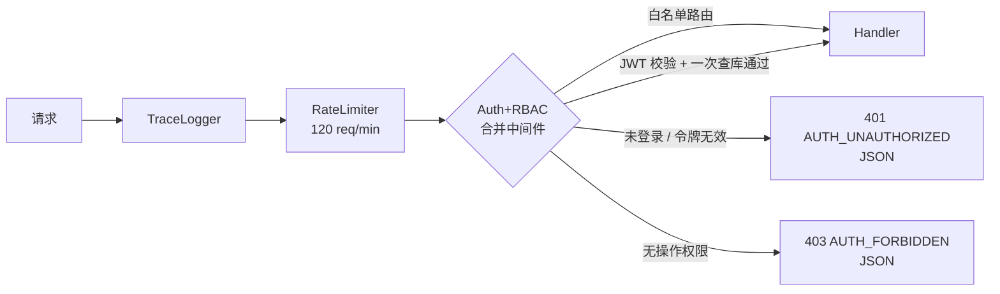
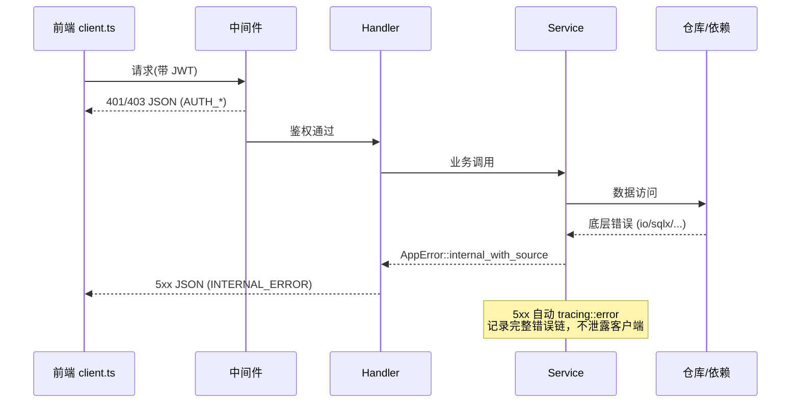
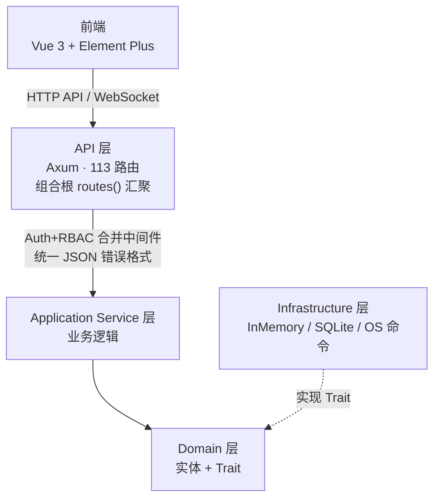

# FlamePanel 开发部署流程指南

> Rust 内核 + Vue 3 前端 · 版本 v1.14 · 更新 2026-08-02

## 目录

1. [环境要求](#1-环境要求)
2. [快速开发](#2-快速开发)
3. [项目结构](#3-项目结构)
4. [构建流程](#4-构建流程)
5. [部署方案](#5-部署方案)
6. [配置参考](#6-配置参考)
7. [开发工作流](#7-开发工作流)
8. [服务管理](#8-服务管理)
9. [多仓库同步](#9-多仓库同步)
10. [卸载](#10-卸载)
11. [常见问题](#11-常见问题)

---

## 1. 环境要求

| 组件 | 版本 | 用途 |
|------|------|------|
| Rust | 1.85+ | 编译后端内核 |
| Node.js | 20+ | 构建前端面板 |
| npm (推荐, CI 使用 npm ci) | 任意 | 前端包管理 |
| Docker (可选) | 任意 | 容器化部署 |
| just (可选) | 任意 | 快捷命令 |

**验证环境**：
```bash
rustc --version   # rustc 1.85.0+
node --version    # v20.0.0+
npm --version     # 10+
docker --version  # (可选)
```

---

## 2. 快速开发

### 2.1 克隆并启动后端

```bash
git clone https://github.com/Forevery1021/Flamepanel.git
cd Flamepanel/flame-kernel

# 默认监听 0.0.0.0:8080，SQLite 数据库自动创建
cargo run
```

首次启动自动创建 `admin` 用户（密码 `admin123`），数据库文件 `data/app.db`。

### 2.2 启动前端

```bash
cd frontend

# 安装依赖
npm install

# 启动开发服务器 (端口 5173，自动代理 /api/* 和 /ws/* 到后端)
npm run dev
```

访问 `http://localhost:5173`，默认账号 `admin` / `admin123`。

### 2.3 Vite 代理配置

`frontend/vite.config.ts`:
```ts
server: {
  port: 5173,
  proxy: {
    '/api': { target: 'http://localhost:8080', changeOrigin: true },
    '/ws':  { target: 'http://localhost:8080', ws: true }
  }
}
```

### 2.4 使用 just 命令

```bash
just dev              # 后端热重载 (需 cargo-watch)
just build-frontend   # 构建前端
just build            # 完整构建 (前端 + 后端 release)
just run              # 构建并启动
just test             # 运行后端测试
just check            # 后端 check + 前端类型检查
just lint             # 前端 ESLint + Clippy
just typecheck        # 前端 vue-tsc
just clean            # 清理构建产物和数据库
just docker-up        # Docker Compose 启动
```

---

## 3. 项目结构

```
Flamepanel/
├── flame-kernel/          # Rust 后端核心
│   ├── src/
│   │   ├── main.rs        # 入口 #[tokio::main]
│   │   ├── lib.rs         # FlameKernel 统一入口 + run()
│   │   ├── config/        # TOML 配置加载
│   │   ├── core/          # 统一错误体系 (AppError + ErrorCode)
│   │   ├── domain/        # 实体 + Repository trait
│   │   ├── application/   # 服务层 (含 app_store_service 三模式编排)
│   │   ├── infrastructure/# InMemory/SQLite/Docker 实现 + OS 抽象 + app_store 适配器(Flame/1Panel/宝塔)
│   │   ├── api/           # Handler(各带 routes()) + 组合根路由 + 中间件 + ApiJson 提取器
│   │   ├── plugin/        # WASM 沙箱
│   │   ├── webserver/     # 5 引擎配置生成 + 进程管理
│   │   ├── database/      # MySQL/Redis 原生管理
│   │   ├── firewall/      # 防火墙管理器
│   │   ├── terminal/      # Web 终端
│   │   ├── event/         # 事件总线
│   │   ├── resilience/    # 熔断 + 重试
│   │   └── utils/         # JWT/bcrypt/验证
│   └── tests/
│       └── integration_test.rs  # 86 个集成测试 (另有 55 个单元测试)
├── frontend/              # Vue 3 + Element Plus
│   └── src/
│       ├── api/           # Axios 客户端
│       ├── components/    # Layout/Sidebar/TopBar
│       ├── stores/        # Pinia
│       ├── router/        # 18 条路由
│       ├── locales/       # i18n: zh-CN/en-US/ja-JP
│       └── views/         # 17 个视图页面
├── agent/                 # 轻量 Rust Agent
├── install.sh             # Linux 一键安装脚本
├── uninstall.sh           # Linux 卸载脚本
├── Dockerfile             # 多阶段构建
├── docker-compose.yml     # Docker 编排
└── nginx.conf             # 生产反向代理配置
```

**后端架构层级**：



- `domain/` 零依赖，定义实体和 trait
- `application/` 引用 domain，实现业务逻辑
- `infrastructure/` 实现 domain 的 trait（可切换 InMemory ↔ SQLite）
- `api/` 引用 application 和 domain，暴露 HTTP 端点
- 严禁 infrastructure 或 api 绕过 service 直接访问仓库（中间件/Handler 一律经 Service 方法）
- 组合根：`FlameKernel::build_services` 组装 `Services` 聚合，路由在 `routes.rs` 汇聚各模块 `routes()`

---

## 4. 构建流程

### 4.1 仅构建后端

```bash
cd flame-kernel
cargo build              # debug
cargo build --release    # release (优化二进制体积和性能)
```

产物：`target/debug/flame-kernel` 或 `target/release/flame-kernel`（release 已启用 lto="fat" + strip，约 18MB）

### 4.2 仅构建前端

```bash
cd frontend
npm install
npm run build    # 输出到 dist/
```

产物：`frontend/dist/`（静态文件）

### 4.3 完整构建（前端 + 后端）

```bash
# 1. 构建前端
cd frontend && npm install && npm run build

# 2. 将前端产物复制到后端资源目录
# (如果后端需要内嵌静态文件)

# 3. 构建后端
cd ../flame-kernel && cargo build --release
```

### 4.4 构建检查

```bash
cargo check        # 零错误零警告
cargo test         # 141 个测试全部通过 (86 集成 + 55 单元)
cargo clippy       # (可选) lint 检查
```

---

## 5. 部署方案

### 5.1 方式一：Systemd 服务（推荐 Linux 生产环境）

使用 `install.sh` 一键安装：

```bash
# 交互式安装
sudo ./install.sh

# 静默安装（全部默认）
sudo ./install.sh -n

# 自定义安装
sudo ./install.sh -u myadmin -p 'Str0ng!P@ss' -P 9090 -s 'your-jwt-secret'
```

脚本自动完成：
- 安装系统依赖（curl/wget/openssl/nginx）
- 创建 `/opt/flamepanel/` 目录结构（含前端静态资源目录）
- 部署二进制到 `/usr/local/bin/flamepanel`，前端产物到 `/opt/flamepanel/frontend`
- 自动生成 nginx 反向代理配置（80 端口 → 后端 API + `/ws` WebSocket 透传）
- 创建 systemd 服务 `flamepanel.service`（密钥存 `/opt/flamepanel/flamepanel.env`，600 权限）
- 启动并设置开机自启

### 5.2 方式二：手动 systemd 部署

```bash
# 1. 编译
cd flame-kernel && cargo build --release

# 2. 创建目录
sudo mkdir -p /opt/flamepanel/{data,logs}

# 3. 复制二进制
sudo cp target/release/flame-kernel /usr/local/bin/flamepanel

# 4. 创建 systemd 服务
sudo cat > /etc/systemd/system/flamepanel.service << 'EOF'
[Unit]
Description=FlamePanel
After=network.target

[Service]
Type=simple
User=root
ExecStart=/usr/local/bin/flamepanel
WorkingDirectory=/opt/flamepanel
Restart=always
RestartSec=5
LimitNOFILE=65535
EnvironmentFile=/opt/flamepanel/flamepanel.env

[Install]
WantedBy=multi-user.target
EOF

# 5. 启动
sudo systemctl daemon-reload
sudo systemctl enable --now flamepanel
```

### 5.3 方式三：Docker 部署

```bash
# 构建并启动
docker compose up -d

# 查看日志
docker compose logs -f

# 停止
docker compose down
```

默认 Docker 配置（`docker-compose.yml`）：
- 映射端口 `8080:80`（容器内 nginx 提供前端静态资源 + API/WS 反向代理）
- 挂载 `./data:/app/data`（持久化数据库）
- 挂载 `/var/run/docker.sock:/var/run/docker.sock:ro`（Docker 管理功能，只读）
- 环境变量 `OP_PORT` / `OP_JWT_SECRET` 注入

### 5.4 方式四：Nginx 反向代理 + 后端

生产环境推荐使用 Nginx 作为 TLS 终结和静态资源服务：

**Nginx 配置** (`nginx.conf`)：
```nginx
server {
    listen 443 ssl;
    server_name panel.example.com;

    ssl_certificate     /etc/ssl/certs/panel.crt;
    ssl_certificate_key /etc/ssl/private/panel.key;

    # 前端静态资源
    root /opt/flamepanel/frontend/dist;
    index index.html;

    location / {
        try_files $uri $uri/ /index.html;
    }

    # API 代理到后端
    location /api/ {
        proxy_pass http://127.0.0.1:8080;
        proxy_set_header Host $host;
        proxy_set_header X-Real-IP $remote_addr;
        proxy_set_header X-Forwarded-For $proxy_add_x_forwarded_for;
        proxy_set_header X-Forwarded-Proto $scheme;
    }

    # WebSocket 代理
    location /ws/ {
        proxy_pass http://127.0.0.1:8080;
        proxy_http_version 1.1;
        proxy_set_header Upgrade $http_upgrade;
        proxy_set_header Connection "Upgrade";
    }
}
```

---

## 6. 配置参考

### 6.1 环境变量

| 变量 | 默认值 | 说明 |
|------|--------|------|
| `OP_PORT` | `8080` | 监听端口 |
| `OP_HOST` | `0.0.0.0` | 监听地址 |
| `OP_DATABASE_URL` | `sqlite:data/app.db?mode=rwc` | 数据库连接 |
| `OP_JWT_SECRET` | `flamepanel-secret` | JWT 签名密钥（生产环境务必修改） |
| `OP_ADMIN_USERNAME` | `admin` | 初始管理员用户名 |
| `OP_ADMIN_PASSWORD` | `admin123` | 初始管理员密码 |
| `OP_SMTP_HOST` | `localhost` | SMTP 服务器地址 |
| `OP_SMTP_PORT` | `25` | SMTP 端口 |
| `OP_SMTP_USERNAME` | 空 | SMTP 用户名 |
| `OP_SMTP_PASSWORD` | 空 | SMTP 密码 |
| `OP_SMTP_FROM` | `noreply@flamepanel.local` | 发件人地址 |
| `OP_SMTP_TLS` | `false` | 启用 TLS |
| `RUST_LOG` | `info` | 日志级别 (trace/debug/info/warn/error) |

### 6.2 TOML 配置文件

`config/app.toml`（可选，同环境变量，环境变量优先级更高）：
```toml
[server]
host = "0.0.0.0"
port = 8080

[database]
url = "sqlite://data/app.db?mode=rwc"

[notifications]
smtp_host = "smtp.example.com"
smtp_port = 587
smtp_username = "user"
smtp_password = "pass"
smtp_from = "noreply@flamepanel.local"
smtp_tls = true

# 安全配置
jwt_secret = "your-strong-jwt-secret"
admin_password = "your-admin-password"
```

### 6.3 面板运行时配置

通过面板设置页面（`/api/settings`）可在线修改：

| 键 | 默认值 | 说明 |
|----|--------|------|
| `panel_name` | `FlamePanel` | 面板名称 |
| `theme` | `light` | 主题 (`light` / `dark`) |
| `language` | `zh-CN` | 语言 (`zh-CN` / `en-US` / `ja-JP`) |
| `panel_port` | `8080` | 面板端口 |
| `session_timeout_minutes` | `1440` | 会话超时 (分钟) |
| `log_level` | `info` | 日志级别 |
| `log_retention_days` | `30` | 日志保留天数 |
| `two_factor_enabled` | `false` | 2FA 开关 |
| `jwt_secret` | — | JWT 密钥（修改后需重新登录） |

---

## 7. 开发工作流

### 7.1 新增功能标准流程



**步骤详解**：

**Step 1: Domain 层**
- `flame-kernel/src/domain/entity.rs` — 添加实体 struct
- `flame-kernel/src/domain/repository.rs` — 添加 `#[async_trait]` Repository trait

**Step 2: Infrastructure 层**
- `flame-kernel/src/infrastructure/db.rs` — InMemory 实现
- `flame-kernel/src/infrastructure/sqlite.rs` — SQLite 实现 + migration
- `flame-kernel/src/infrastructure/factory.rs` — 工厂方法

**Step 3: Application 层**
- `flame-kernel/src/application/service.rs` — Service 结构体和方法

**Step 4: API 层**
- `flame-kernel/src/api/handler/xxx/mod.rs` — Handler 函数 + 模块路由表 `pub fn routes()`
- `flame-kernel/src/api/types.rs` — 更新 `AppState`/`Services` + 请求/响应类型 + `route_permission()` 映射
- `flame-kernel/src/api/routes.rs` — 组合根：`.merge(模块::routes())` 汇聚路由
- 请求体提取使用 `ApiJson<T>`（`api/extract.rs`），统一 JSON 解析错误

**Step 5: 测试**
- `flame-kernel/tests/integration_test.rs` — 集成测试

**Step 6: 验证**
```bash
cargo check    # 零错误零警告
cargo test     # 全部通过
cargo build    # 编译成功
```

### 7.2 中间件栈顺序



认证与 RBAC 合并为单个中间件（`api/middleware.rs`）：一次 JWT 校验 + 一次用户查询，完成身份认证与权限校验（此前为两次查库）。

白名单路由（跳过认证）：
- `GET /health`
- `POST /api/auth/login`
- `WS /ws/*`（metrics / logs / terminal）

### 7.3 RBAC 权限映射

在 `flame-kernel/src/api/types.rs` 的 `route_permission()` 函数中添加映射：

```rust
fn route_permission(method: &Method, path: &str) -> Option<&'static str> {
    match (method, path) {
        (&Method::GET, "/api/users") => Some("user:read"),
        (&Method::POST, "/api/users") => Some("user:create"),
        // ... 60+ 组合
    }
}
```

3 个预置角色：`admin`（全部权限）、`operator`（运维操作）、`viewer`（只读）

### 7.4 命名规范

| 层面 | 命名 | 示例 |
|------|------|------|
| Entity | `名词` | `User`, `FirewallRule` |
| Repository trait | `{Entity}Repository` | `UserRepository` |
| InMemory 实现 | `InMemory{Entity}Repository` | `InMemoryUserRepository` |
| SQLite 实现 | `Sqlite{Entity}Repository` | `SqliteUserRepository` |
| Service | `{Entity}Service` | `UserService` |
| Handler 函数 | `动词` | `list`, `create`, `get`, `update`, `delete` |
| Handler 模块 | `handler/{entity}/mod.rs` | `handler/user/mod.rs` |

---

### 7.5 统一错误规范

**错误响应格式**（所有错误均为 JSON，含中间件与 404）：

```json
{ "code": 400, "error": "BAD_REQUEST", "message": "Bad request: Invalid JSON body: ..." }
```

**错误处理时序**：



| `error` 错误码 | HTTP | 含义 |
|----------------|------|------|
| `AUTH_UNAUTHORIZED` | 401 | 未登录 / 令牌无效 / 令牌过期 |
| `AUTH_FORBIDDEN` | 403 | 无操作权限（RBAC 拒绝） |
| `NOT_FOUND` | 404 | 资源或路由不存在（含全局 fallback） |
| `BAD_REQUEST` | 400 | 参数错误 / JSON 解析失败（统一 `ApiJson` 提取器） |
| `VALIDATION_ERROR` | 400 | 业务校验失败 |
| `CONFLICT` | 409 | 资源冲突（如用户名重复、端口占用） |
| `SERVICE_UNAVAILABLE` | 503 | 依赖服务不可用 |
| `INTERNAL_ERROR` | 500 | 内部错误（完整错误链仅记录日志，不暴露客户端） |

**后端规则**：
- 内部错误使用 `AppError::internal("上下文")` 或 `AppError::internal_with_source("上下文", err)`（保留 source 链，5xx 自动 `tracing::error` 记录）
- 请求体反序列化统一走 `ApiJson<T>` 提取器（`api/extract.rs`），拒绝时返回 `BAD_REQUEST` 而非 axum 默认纯文本 422
- 未知路由经 `routes::fallback_handler` 返回 JSON 404

**前端规则**：
- `api/client.ts` 拦截器将后端错误规范化为 `{ code, message, status }`，401 自动跳登录页
- `utils/error.ts` 的 `getErrorMessage(e, fallback)` 优先按错误码查 i18n `common.error.<code>` 文案（三语言已内置 8 个错误码），再回退后端 message

## 8. 服务管理

### 8.1 Systemd 服务

```bash
sudo systemctl start flamepanel     # 启动
sudo systemctl stop flamepanel      # 停止
sudo systemctl restart flamepanel   # 重启
sudo systemctl status flamepanel    # 状态
sudo systemctl enable flamepanel    # 开机自启
journalctl -u flamepanel -f        # 实时日志
journalctl -u flamepanel -n 100    # 最近 100 条日志
```

### 8.2 Docker

```bash
docker compose up -d          # 启动
docker compose down           # 停止
docker compose logs -f        # 日志
docker compose restart        # 重启
docker compose build --no-cache  # 重新构建
```

### 8.3 手动运行

```bash
# 后端（release profile 已优化：lto= fat / strip / panic=abort）
cd flame-kernel && cargo run --release

# 前端
cd frontend && npm run dev
```

### 8.4 数据库

SQLite 数据库文件默认路径：
- 开发模式：`flame-kernel/data/app.db`
- 生产模式（install.sh）：`/opt/flamepanel/data/flamepanel.db`

**备份**：
```bash
cp /opt/flamepanel/data/flamepanel.db /backup/flamepanel-$(date +%Y%m%d).db
```

**迁移**：数据库在首次启动时自动创建表结构（sqlx 运行时迁移），无需手动执行 SQL。

### 8.5 默认凭据

- 用户名：`admin`
- 密码：`admin123`（首次启动自动创建，建议立即修改）

---

## 9. 多仓库同步

GitHub 为**上游仓库**（唯一开发入口），Gitee 为只读镜像，禁止在 Gitee 直接开发提交。

### 9.1 远程仓库配置

```bash
git remote -v
# origin  https://github.com/Forevery1021/Flamepanel.git  (上游)
# gitee   https://gitee.com/Forever1021yy/Flamepanel.git  (镜像)
```

新环境运行 `scripts/sync-gitee.sh` 会自动添加 `gitee` remote，无需手动配置。

### 9.2 本地一键同步

```bash
just sync-gitee
# 等价: ./scripts/sync-gitee.sh [remote名]
```

脚本行为：拉取 GitHub 最新引用 → 全部分支 + 标签推送到 Gitee（镜像覆盖）。

### 9.3 CI 自动镜像

`.github/workflows/sync-gitee.yml`：每次 push 到 `main`/`master` 自动同步 Gitee。首次启用需配置令牌：

1. Gitee 创建个人访问令牌（`https://gitee.com/profile/personal_access_tokens`，勾选 `projects` 权限）
2. GitHub → Settings → Secrets and variables → Actions → New repository secret
3. 名称 `GITEE_TOKEN`，值粘贴令牌

未配置令牌时 CI 跳过同步并打印指引，不影响其他流水线。

### 9.4 同步工作流约定

1. 仅向 GitHub（origin）提交与推送
2. CI 已自动同步时无需手动操作；离线或需要立即同步时执行 `just sync-gitee`
3. Gitee 若出现非镜像提交，用 `git push gitee --all --tags --force` 覆盖恢复镜像一致性

---

## 10. 卸载

### 9.1 使用卸载脚本（推荐）

```bash
# 卸载（保留数据目录 /opt/flamepanel）
sudo ./uninstall.sh

# 完全卸载（删除所有数据）
sudo ./uninstall.sh -p

# 静默卸载（跳过确认）
sudo ./uninstall.sh -f
```

### 9.2 手动卸载

```bash
# 1. 停止并禁用服务
sudo systemctl stop flamepanel
sudo systemctl disable flamepanel

# 2. 删除二进制文件
sudo rm -f /usr/local/bin/flamepanel

# 3. 删除 systemd 服务文件
sudo rm -f /etc/systemd/system/flamepanel.service
sudo systemctl daemon-reload

# 4. （可选）删除数据目录
sudo rm -rf /opt/flamepanel
```

### 9.3 Docker 卸载

```bash
# 停止并删除容器
docker compose down

# 删除镜像
docker rmi flamepanel-flame-kernel

# 删除数据卷（可选，会丢失数据库）
docker volume rm flamepanel_data
# 或手动删除: rm -rf ./data
```

---

## 11. 常见问题

### 后端无法启动

```bash
# 检查端口占用
lsof -i :8080
netstat -tlnp | grep 8080

# 查看错误日志
RUST_LOG=debug /usr/local/bin/flamepanel

# 检查数据库权限
ls -la /opt/flamepanel/data/
```

### 前端无法连接到后端

1. 检查后端是否运行：`curl http://localhost:8080/health`
2. 检查代理配置：`frontend/vite.config.ts`
3. 检查浏览器控制台网络请求

### 数据库错误

```bash
# 删除数据库重新初始化（会丢失所有数据）
rm -f data/app.db
```

### 前端构建失败

```bash
cd frontend
rm -rf node_modules
npm cache clean --force
npm install
```

### Docker 管理功能不可用

- 确保挂载了 Docker socket：`-v /var/run/docker.sock:/var/run/docker.sock`
- 无 Docker 环境时自动使用 InMemory 仓库降级

### 防火墙/数据库管理需要 root

防火墙（ufw/firewalld/iptables）和数据库安装（apt/yum/apk）需要 root 权限，请以 root 用户运行面板。

---

## 附录：可用脚本

| 脚本 | 用途 |
|------|------|
| `install.sh` | Linux 一键安装（systemd） |
| `uninstall.sh` | Linux 卸载脚本（保留或删除数据） |
| `docker-compose.yml` | Docker 编排部署 |
| `Dockerfile` | 多阶段构建（前端 + 后端） |
| `nginx.conf` | 生产反向代理配置 |
| `justfile` | 快捷命令（dev/build/run/clean） |

---

## 架构全景



**模块端点统计**：
- 健康检查: 1 | 认证: 2 | 用户: 3 | 节点: 3 | 网站: 6
- Docker: 13 | 插件: 13 | 应用商店: 11 | Web 服务器: 16 | 数据库: 15
- 文件: 10 | 防火墙: 11 | 设置: 3 | 日志: 2 | WebSocket: 3

---

## 12. 更新日志

### v0.3.0 (2026-08-02)

#### 统一错误体系
- **稳定错误码** — `ErrorResponse` 新增 `error` 字段（`AUTH_UNAUTHORIZED`/`AUTH_FORBIDDEN`/`NOT_FOUND`/`BAD_REQUEST`/`VALIDATION_ERROR`/`CONFLICT`/`SERVICE_UNAVAILABLE`/`INTERNAL_ERROR`），跨版本稳定，供前端国际化
- **新增错误变体** — `Conflict`（409，用户名重复等）、`ServiceUnavailable`（503）
- **错误链保留** — `AppError::Internal` 改为 `{ message, source }`，`internal_with_source()` 保留底层错误；`From<io/serde_json/ParseInt/sqlx>` 自动转换；5xx 自动 `tracing::error` 记录完整错误链（不泄露客户端）；248 处调用点全部迁移
- **中间件 JSON 化** — auth/RBAC 中间件返回统一 JSON 错误体（此前为裸状态码）；新增 `ApiJson<T>` 提取器，JSON 解析失败返回 `BAD_REQUEST` 统一格式（此前为 axum 纯文本 422）
- **全局 404 fallback** — 未知路由返回 JSON `NOT_FOUND` 而非纯文本

#### 架构细化
- **认证+RBAC 中间件合并** — 一次 JWT 校验 + 一次用户查询完成认证与鉴权（此前两次查库）；消除中间件直通 `user_repo` 的架构违规
- **Service 方法补齐** — `UserService` 新增 `find_by_id`/`find_by_username`/`update_password`，auth handler 不再直接访问仓库（遵循「严禁绕过 service」规范）
- **Services 聚合结构体** — `AppState::new` 由 21 参数收敛为 `Services` 分组 + 6 参数；`FlameKernel::build_services` 独立组合根，构造器减半
- **路由分模块** — 113 条路由按 handler 模块拆分为各自 `routes()`，`routes.rs` 收敛为组合根（merge + fallback）

#### 编译优化
- **release profile** — `opt-level=3` + `lto="fat"` + `codegen-units=1` + `panic="abort"` + `strip="symbols"`，二进制 18MB（stripped）
- **dev profile** — `opt-level=1` 加速开发迭代

#### 前端交互
- **统一错误拦截** — `client.ts` 将后端错误规范化为 `{ code, message, status }`，401 自动跳登录页（登录页内不重复跳转）
- **错误码 i18n** — `getErrorMessage()` 按错误码查 `common.error.<code>`（zh/en/ja 三语言 8 个错误码），回退后端 message

#### 测试
- 141 个测试全部通过（86 集成 + 55 单元），新增：401/403 JSON 错误格式、全局 404 JSON、错误响应结构断言

### v0.2.0 (2026-08-01)

#### 应用商店（新增）
- **三格式应用包** — 统一支持 1Panel（`data.yml` + `scripts/`）、宝塔（`app.json` + `latest/`）、Flame 内置格式（`app.json` + `docker-compose.yml`/`install.sh`/`app.wasm`），`select_adapter` 自动检测格式
- **三模式安装编排** — `AppStoreService::install` 按 `InstallMode` 分发：容器（compose 模板 → 变量映射 → 安全扫描 → `compose_deploy`，失败自动回滚）、原生（MySQL/MariaDB/Redis/Web 引擎/通用 install.sh）、WASM（沙箱加载 → 注册 → 持久化）
- **安全扫描器** — `SecurityScanner`：Block 级（privileged 无确认）、High 级（敏感目录/Docker socket 挂载）、Medium 级（host 网络）、Low 级（非白名单仓库）；`ensure_restart_policy` 强制健康检查；不通过则拒绝安装
- **变量映射器** — `VariableMapper`：`${VAR}`/`$VAR`/`{var}` 兼容 1Panel/宝塔变量占位，内置 `CONTAINER_NAME`/`PANEL_APP_PORT_HTTP/HTTPS`/`HOST_IP` 等映射
- **WASM 内置工具** — `wasm-hello` 演示插件（真实 wasm 字节码，`run()` 返回 42）；`install_wasm` + `restore_wasm_plugins` 启动恢复，Plugin 实体新增 `wasm_base64` 持久化（新增 `plugins` 表）
- **应用生命周期** — `seed_builtin_apps`（5 内置应用幂等种子）、`import_package`（本地目录导入）、`uninstall`（compose down / 包卸载 / WASM 卸载）、`upgrade`（三模式）、`get_logs`
- **API** — `/api/app-store/packages|installed|wasm-builtins` 全套端点 + `app_store:read/create/update/delete` 权限；`app_packages`/`installed_apps`/`plugins` 三张新表迁移

#### Web 引擎统一（新增）
- **性能预设** — `PerformancePreset`（low/medium/high/ultra）：按 CPU/内存自动推荐，输出各引擎 worker 数、keepalive、gzip 配置片段
- **引擎切换** — 网站 `POST /api/websites/:id/switch-engine`、Web 服务器 `POST /api/web-servers/:id/switch-engine`（引擎信息 + 配置路径更新）
- **预设应用** — `POST /api/web-servers/:id/preset` 重新生成并写入全局配置；`GET /api/web-servers/presets` 返回推荐预设
- **前端** — 应用商店视图（商店/已安装/WASM 三个 Tab + 动态表单安装向导 + 安全风险确认 + 日志查看 + 本地导入）；Web 服务器视图新增预设/切换引擎操作；网站视图新增引擎切换；三语言（zh/en/ja）完整 i18n

#### 测试
- 139 个测试全部通过（84 集成测试 + 55 单元测试），新增应用商店 API（列表/安装/卸载/404）、WASM 安装与恢复、预设推荐/切换引擎/预设应用等覆盖

### v0.1.11 (2026-07-31)

#### 工程化
- **前端工程化** — 引入 ESLint 9 扁平配置 + Prettier + typescript-eslint + eslint-plugin-vue；62 个 lint 问题清零（含 3 个真实缺陷）
- **设计系统** — `style.css` 全面重构为 CSS 变量令牌体系（品牌色/间距/圆角/阴影/焦点环/减弱动效），侧边栏/顶栏/布局/登录/仪表盘现代化
- **按需加载** — `unplugin-auto-import` + `unplugin-vue-components` 按需引入 Element Plus，主包 1101KB→231KB (−79%)
- **echarts 按需引入** — DashboardView 改用 `echarts/core`，图表包 1098KB→505KB (−54%)
- **内联样式清零** — 66 处 `style=""` 全部收敛为 CSS 工具类
- **构建修复** — `vue-tsc` 加 `--noEmit`，修复每次构建向 `src/` 输出 84 个 `.js`/`.js.map` 残留产物的问题（已清理）

#### 部署
- **install.sh v1.1** — 补全前端静态资源部署（本地 `frontend/dist` 或 GitHub Releases）；自动生成 nginx 反向代理配置（80 端口，含 `/ws` WebSocket 透传）；密钥从 unit 文件迁入 `/opt/flamepanel/flamepanel.env`（600 权限）
- **Dockerfile 修复** — 修正目录路径（`backend/`→`flame-kernel/`、`agent`）、二进制名（`ops-panel`→`flamepanel`）、工作区构建方式，修复镜像无法构建的问题
- **docker-compose.yml** — 服务名 `ops-panel`→`flamepanel`；端口映射 `8080:8080`→`8080:80`（nginx 入口）；移除危险的主机 `/etc/nginx` 挂载
- **CI/CD 修复** — 包名 `ops-panel-backend`→`flame-kernel`；新增前端 `npm run lint` 步骤
- **uninstall.sh** — 新增 nginx 反向代理配置清理步骤
- **justfile** — 新增 `lint`（前端 ESLint + Clippy）与 `typecheck` 任务；`clean` 同步清理残留产物

### v0.1.10 (2026-07-30)

#### 新增
- **后端分页支持** — 所有列表端点（用户/节点/网站/日志/数据库/防火墙/Web服务器/设置）支持 `?page=&page_size=` 查询参数，返回 `PaginatedResponse<T>` 统一格式
- **Website 完整 CRUD** — 新增 `GET /api/websites/:id`、`PUT /api/websites/:id`、`DELETE /api/websites/:id`
- **User / Node 更新端点** — 新增 `PUT /api/users/:id`（修改用户名/角色/可选密码）、`PUT /api/nodes/:id`
- **OperationLog 删除** — `DELETE /api/operation-logs/:id`
- **Log 删除** — `DELETE /api/logs/:id`
- **优雅关闭** — SIGTERM/Ctrl+C 信号处理，服务平稳退出
- **前端分页控件** — 用户/节点/网站/数据库/Web服务器/防火墙/操作日志视图增加 `<el-pagination>` 组件
- **前端类型增强** — `PaginatedResponse<T>` 泛型接口，所有 API 模块更新为分页请求
- **前端编辑对话框** — 用户/节点/网站视图增加编辑功能；网站视图补全引擎/SSL/反向代理字段 + 删除操作

#### 修复
- **SQLite Website 查询** — 补充缺失的 `engine`/`ssl_enabled`/`proxy_enabled`/`proxy_pass` 列（所有 `SELECT` 和 `INSERT` 语句）
- **前端 Website 类型** — 补齐 `engine`/`ssl_enabled`/`proxy_enabled`/`proxy_pass` 字段（与后端实体对齐，修复创建请求反序列化失败隐患）
- **DatabasesView 类型错误** — 移除 `as unknown as` 强制类型转换，改用正确分页响应类型
- **FirewallView / SettingsView 类型错误** — 适配新的分页响应格式

#### 测试
- 88 个测试全部通过（77 集成测试 + 11 单元测试），新增 User/Node/Website 更新端点测试（含 404 分支）
- 集成测试新增 `hyper` dev-dependency 用于响应体读取
